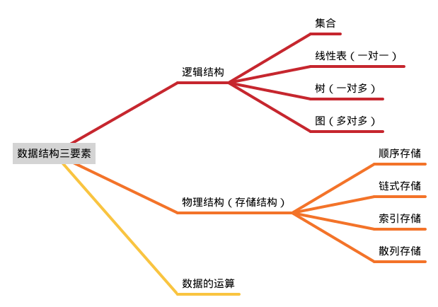

# 数据结构

# 1 绪论

> 数据结构在学什么？ 
* 如何用程序代码把现实世界的问题信息化。
* 如何用计算机高效地处理这些信息从而创造价值。
## 1.1 基本概念和术语

<mark>数据</mark>是信息的载体，是描述客观事物属性的数、字符及所有能输入到计算机中并被计算机程序识别和处理的符号的集合，是计算机程序加工的原料。

<mark>数据元素</mark>是数据的基本单位，通常作为一个整体进行考虑和处理。一个数据元素可由若干数据项组成，数据项是构成数据元素的不可分割的最小单位。  

<mark>数据对象</mark>是具有相同性质的数据元素的集合，是数据的一个子集。  

<mark>数据结构</mark>是相互之间存在一种或多种特定关系的数据元素的集合。  

<mark>数据类型</mark>是一个值的集合和定义在此集合上的一组操作的总称。  
&emsp;&emsp;原子类型：其值不可再分的数据类型；  
&emsp;&emsp;结构类型：其值可以再分解为若干成分的数据类型。  

<mark>抽象数据类型（ADT）</mark>是抽象数据组织及与之相关的操作，描述了数据的逻辑结构和抽象运算。通常用（数据对象，数据关系，基本操作集）这样的三元组进行表示，从而也就构成了一个完整的数据 结构定义。

## 1.2 数据结构的三要素



* 顺序存储：把逻辑上相邻的元素存储在物理位置上也相邻的存储单元中，元素之间的关系由存储单元的邻接关系来体现。
* 链式存储：逻辑上相邻的元素在物理位置上可以不相邻，借助指示元素存储地址的指针来表示元素之间的逻辑关系。
* 索引存储：在存储元素信息的同时，还建立一张附加的索引表。索引表中的每项称为索引项，索引项的一般形式是（关键字，地址）。
* 散列存储：根据元素的关键字直接计算出该元素的存储地址，又称哈希（Hash）存储。

## 1.3 算法的相关概念

## 1.4 算法效率的度量

# 2 线性表

## 2.1 线性表的定义和基本操作

### （1）定义

&emsp;&emsp;线性表是具有相同数据类型的 $n(n\ge0)$ 个数据元素的有限序列，其中 $n$ 为表长，当 $n=0$ 时线性表是一个空表。若用 $L$ 命名线性表，则其一般表示为：
$$
L=(a_{1},a_{2},\dots,a_{i},a_{i+1},\dots,a_{n})
$$

* 线性表中每个数据元素的数据类型都是相同的，也就是说每个元素所占据的存储空间都相同。  
* 线性表一定是一个<mark>有限序列</mark>，强调有限和有次序。
* $a_{i}$ 表示线性表中的第 $i$ 个元素，$i$ 称为该元素在线性表中的**位序**，位序是从 1 开始的。
* $a_{1}$ 是表头元素，$a_{n}$ 是表尾元素。

### （2）基本操作


## 2.3 顺序表（用顺序存储的方式来实现线性表）

### （1）静态分配及各种基本操作的实现

```c
#define MAX_SIZE 10 //定义最大长度 

typedef struct{ 
    ElemType data[MAX_SIZE]; //用静态的“数组”存放数据元素 
    int length; //顺序表的当前长度（当前存放了几个数据元素） 
}SeqList; //顺序表静态分配方式的类型定义 

void InitList(SeqList *list) 
{ 
    for(int i=0;i < MAX_SIZE;i++) 
        list->data[i] = 0; //将数组中的元素的值全部初始化为 0（这其实没必要） 
    list->length = 0; //线性表的初始长度为 0（关键）
}//初始化顺序表 

int main(void) 
{ 
    SeqList list; 
    InitList(&list); 
    for(int i=0;i < MAX_SIZE;i++) 
        printf(“data[%d]=%d\n”,i,list.data[i]); 
    return 0; 
}//主函数
```

### （2）动态分配的定义、初始化和容量增减


## 2.4 链表（用链式存储的方式来实现线性表）


