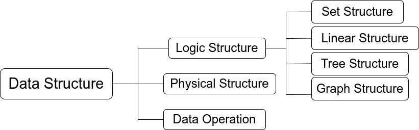

# Data Structures and Algorithms

## 1 About Data Structures and Algorithms

> Issues studied in data structure and algorithms:
* How to Informatize Real World Problems with Program Code?
* How to efficiently process this information with computers to create value?

#### 1.1 Three Elements of Data Structure

#### 1.2 Characteristics of the algorithm

> The five characteristics that algorithms must possess

* **Finiteness**: das
* **Certainty**: dfsf
* **Feasibility**: fdfasd
* **Input**: dadsad
* **Output**: dsdas

> characteristics that a "good" algorithm should possess

* **Correctness**: fdsafds
* **Readability**: fdas
* **Robustness**: adads
* **High efficiency and low storage reserve requirements**: dsadsa