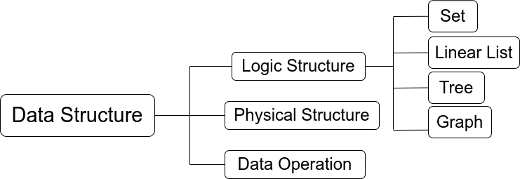

# Data Structures and Algorithms

## 1 About Data Structures and Algorithms

> Issues studied in data structure and algorithms:
* How to informatize real world problems with program code?
* How to efficiently process these information with computers to create value?

### 1.1 Three Elements of Data Structure

### 1.2 Characteristics of the Algorithms

> the five characteristics that algorithms must possess

* **Finiteness**: An algorithm must always end after executing finite steps, and each step can be completed within finite time.
* **Certainty**: Each instruction in the algorithm must have a specific meaning, and for the same input, only the same output can be obtained.
* **Feasibility**: The operations described in the algorithm can be achieved by performing a finite number of basic operations that have already been implemented.
* **Input**: An algorithm has zero or more inputs.
* **Output**: An algorithm has one or more outputs.

> characteristics that a "good" algorithm should possess

* **Correctness**: The algorithm should be able to solve the problem correctly.
* **Readability**: The algorithm should have good readability to help people understand.
* **Robustness**: When inputting illegal data, the algorithm can react or process appropriately without producing inexplicable output results.
* **High efficiency and low storage reserve requirements**: It takes less time to run and does not consume memory.

### 1.3 Measurement of Algorithm Efficiency

## 2 Linear List

### 2.1 Definition and Basic Structure of Linear List

> Definition
> &emsp;&emsp;A linear list is a finite sequence of $n(n\geq0)$ data elements with the same data type, where $n$ is the list length. When $n=0$, the linear list is an empty list.
> &emsp;&emsp;If a linear list is named with $L$, it is generally represented as: 
$$L=(a_1,a_2,\cdots,a_i,a_{i+1},\cdots,a_n)$$
* The data type of each data element in a linear list is the same, that is to say, the storage space occupied by each element is the same.
* A linear list must be a finite sequence, emphasizing order and must have a finite number of elements.

## 3 Stack and Queue

## 4 Array and Special Matrix

## 5 Tree and Binary Tree

## 6 Graph

## 7 Search

## 8 Order