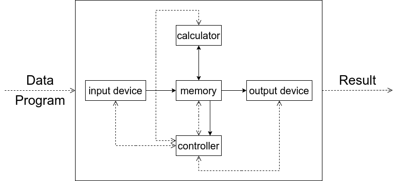
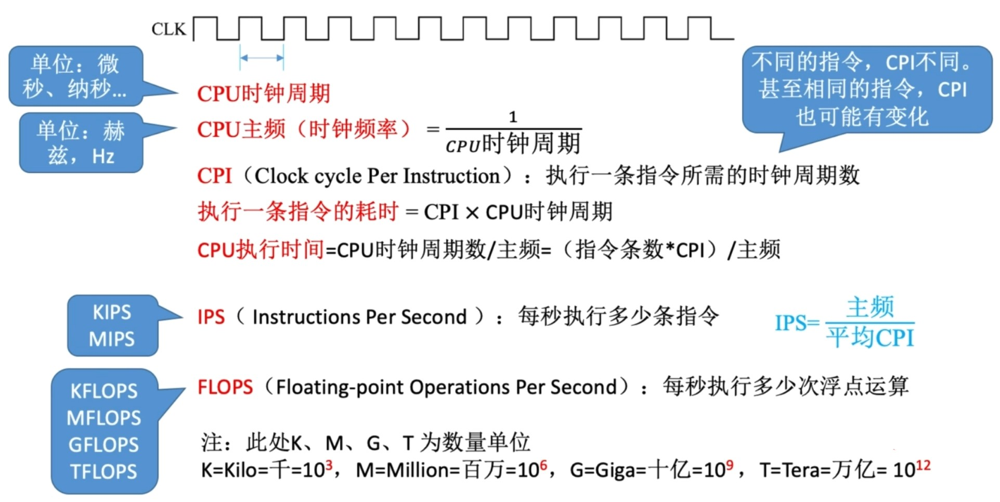

# Principles of Computer Organization

## 1 Overview of Computer System

### 1.1 Composition of Computer System

* **Instruction word length**: the total length of an instruction.
* **Machine word length**: the maximum number of binary data bits that the CPU can process in one integer operation.
* **Memory word length**: the number of bits of binary code contained in a storage unit.

### 1.2 The Delvelopment of Computer

#### 1.2.1 hardware development

> The era of electron tube

* the logic element: **electron tube**
* Large size, high power consumption, and slow computation speed.

> The era of transistor

* the logic element: **transistor**
* The volume has been greatly reduced, power consumption has been reduced, and the computational speed has been qualitatively improved, leading to the emergence of object-oriented advanced programming languages and the embryonic form of operating systems.

> The era of small and medium-sized integrated circuits

* Inherit components on the substrate.

> The era of VLSI

* The emergence of microprocessors and microcomputers.

#### 1.2.2 software development

> applicaiton software

> operational software

#### 1.2.3 two trends in computer development

* **More miniature and versatile**: Microcomputers are developing towards a more miniaturized, networked, high-performance, and versatile direction.
* **Larger and ultra fast**: Supercomputers are developing towards greater size, ultra high parallel processing, and intelligence. 

### 1.3 Basic Composition of Computer Hardware

> The Design Concept of Stored Programs:   
> &emsp;&emsp;The instructions are input into the main memory of the computer in the form of binary code, and then the first instruction of the program is executed according to its first address in the main memory, and then other instructions are executed according to the specified sequence of the program until the end of program execution.

#### 1.3.1 early von Neumann machine structure

#### 1.3.2 modern computer architecture

### 1.4 The Hierarchical Structure of Computer Systems
    
### 1.5 Mance Metrics

#### 1.5.1 the main memory

> MAR (Memory Address Register)

* Reflect the number of storage units

> MDR (Memeory Data Register)

* Reflect the length of each storage unit
* the bits of MDR == the length of each storage unit

> Total capacity

* total capacity = the number of storage units * the length of each storage unit  (bit)
* total capacity = the number of storage units * the length of each storage unit / 8  (Byte)

> Nth power of 2

#### 1.5.2 the central processing unit (CPU)

> CPU main frequency: The frequency of digital pulse signal oscillation within the CPU.

#### 1.5.3 overall performance indicators

## 2 Representation and Operation of Data in Computer

### 2.1 Carry Counting System

