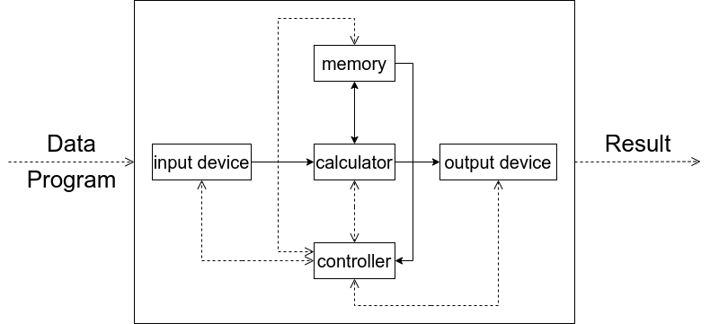
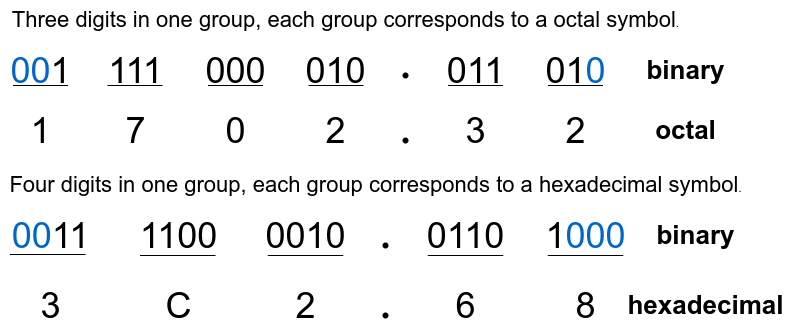
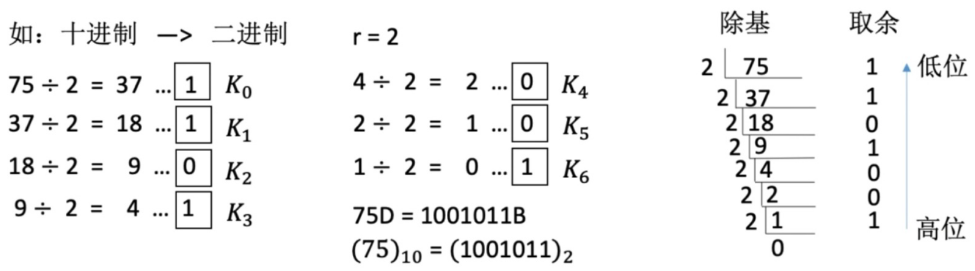
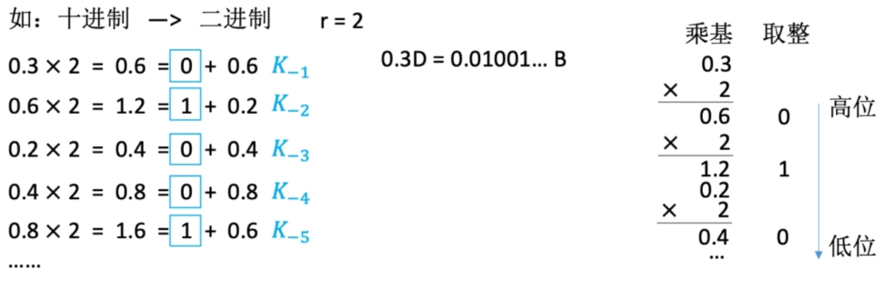
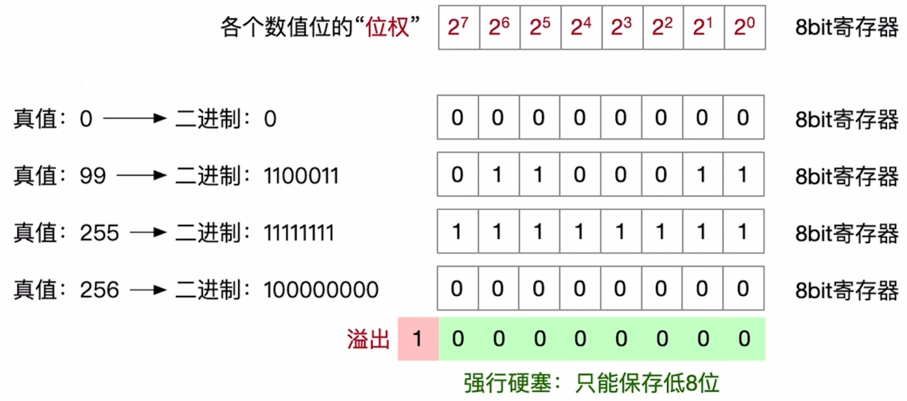
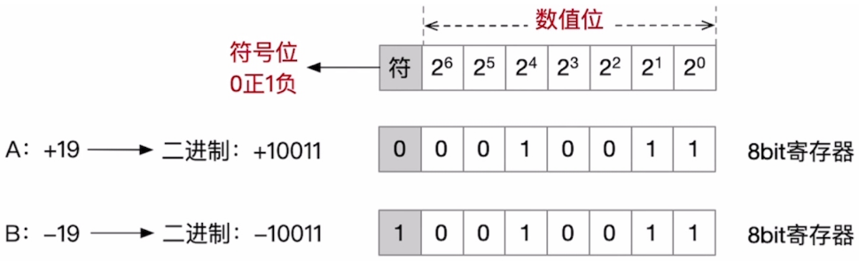
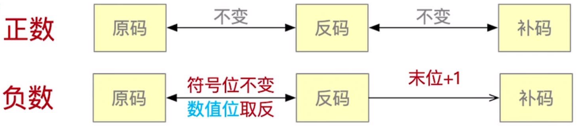
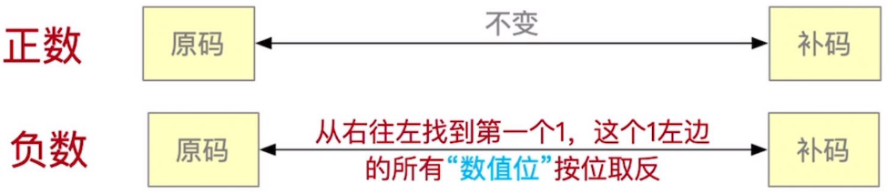
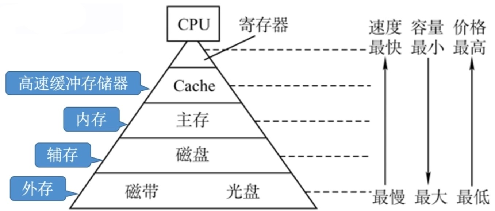
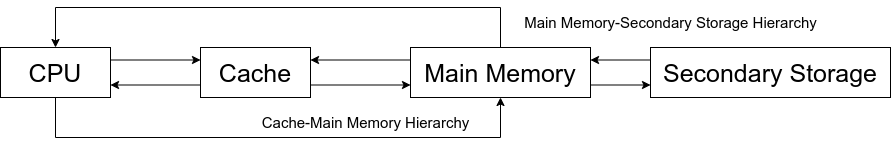

# Principles of Computer Organization

## 1 Overview of Computer System

### 1.1 Composition of Computer System

* **Instruction word length**: the total length of an instruction.
* **Machine word length**: the maximum number of binary data bits that the CPU can process in one integer operation.
* **Memory word length**: the number of bits of binary code contained in a storage unit.

### 1.2 The Development of Computer

#### 1.2.1 hardware development

> The era of electron tube

* the logic element: **electron tube**
* Large size, high power consumption, and slow computation speed.

> The era of transistor

* the logic element: **transistor**
* The volume has been greatly reduced, power consumption has been reduced, and the computational speed has been qualitatively improved, leading to the emergence of object-oriented advanced programming languages and the embryonic form of operating systems.

> The era of small and medium-sized integrated circuits

* Integrate components on a substrate

> The era of large scale integration and VLSI (Vary Large Scale Integration)

* The emergence of microprocessors and microcomputers.

#### 1.2.2 software development

> applicaiton software

> operational software

#### 1.2.3 two trends in computer development

* **More miniature and versatile**: Microcomputers are developing towards a more miniaturized, networked, high-performance, and versatile direction.
* **Larger and ultra fast**: Supercomputers are developing towards greater size, ultra high parallel processing, and intelligence. 

### 1.3 Basic Composition of Computer Hardware

> The Design Concept of Stored Programs:   
> &emsp;&emsp;The instructions are input into the main memory of the computer in the form of binary code, and then the first instruction of the program is executed according to its first address in the main memory, and then other instructions are executed according to the specified sequence of the program until the end of program execution.

#### 1.3.1 early von Neumann machine structure

Characteristics of von Neumann machines: 
* Consisting of 5 major components.
* Instructions and data are stored equally in main memory and can be accessed by address.
* Instructions and data are represented in binary.
* Instructions consist of opcode and address code.
* Stored program.
* Centered around the arithmetic unit.

#### 1.3.2 modern computer architecture

The modern computer is memory centric.

$CPU = Controller + Calculator$
$Mainframe = CPU + Memory$

### 1.4 The Hierarchical Structure of Computer Systems
    
### 1.5 Mance Metrics

#### 1.5.1 the main memory

> MAR (Memory Address Register)

* Reflect the number of storage units.

> MDR (Memeory Data Register)

* Reflect the length of each storage unit.
* The length of MDR equals to the length of each storage unit in the main memory.

> Total capacity

$$
cap = n \times len \space\space (bit)
$$
$$
cap = n \times len \div 8 \space\space (byte)
$$
$cap$: the total capacity
$n$: the number of storage units
$len$: the length of each storage unit

> i-th power of 2

#### 1.5.2 the central processing unit (CPU)

> CPU main frequency: The frequency of digital pulse signal oscillation within the CPU.

#### 1.5.3 overall performance metrics

## 2 Representation and Operation of Data in Computer

### 2.1 Carry counting system	

#### 2.1.1 reasons for using binary

* It can be represented by a physical device with two stable states, which is low-cost and easy to implement.
* 0 and 1 exactly correspond to the false and true values of logical values, making it convenient to implement logical operations.
* It is convenient to use logic gate circuits to perform arithmetic operations.

#### 2.1.2 conversion from binary to octal and hexadecimal

Left high fill 0, right low fill 0.

#### 2.1.3 convert r base number to decimal number

$$
\begin{aligned}
&K_{n} K_{n-1} \cdots K_{2} K_{1} K_{0} K_{-1} K_{-2} K_{-3} \cdots K_{-m+1} K_{-m} \\
&= K_{n} \times r^{n} + K_{n-1} \times r^{n-1} + \cdots + K_{2} \times r^{2} + K_{1} \times r^{1} + K_{0} \times r^0 + K_{-1} \times r^{-1} + K_{-2} \times r^{-2} + \cdots + K_{-m+1} \times r^{-m+1} + K_{-m} \times r^{-m}
\end{aligned}
$$

#### 2.1.4 convert decimal number to r base number

> integer part: Divide by the cardinality and take the remainder.

&emsp;&emsp;The remainder obtained by dividing by the radix each time is the lowest order of the remaining part of the target number (integer part). For example:

> fractional part: Multiply by the cardinality and take the integer.

$$
(K_{-1} \times r^{-1} + K_{-2} \times r^{-2} + \cdots + K_{-m+1} \times r^{-m+1} + K_{-m} \times r^{-m}) \times r = K_{-1} \times r^{0} + K_{-1} \times r^{-1} + \cdots + K_{-m+1} \times r^{-m+2} + K_{-m} \times r^{-m+1}
$$

&emsp;&emsp;$K_{-1} \times r^{0}$ is the integer to be taken.
&emsp;&emsp;The integer part of the result obtained by multiplying the radix each time is <mark>the highest bit</mark> of the remaining part of the target number (fractional part). For example:

### 2.2 Unsigned Integer

#### 2.2.1 representation in hardware

* All binary bits are numerical bits without sign bits, and the bit weight of the i-th bit is $2^{i-1}$.
* An unsigned integer with n bits represents a range of $0$ to $2^{n}-1$. 
    * If it exceeds the range, it will overflow, indicating that the computer cannot process such a large number at once.
* The minimum value that can be represented:  $0$ (all 0)
* The maximum value that can be represented: $2^{n}-1$ (all 1)

#### 2.2.2 implementation of addition and subtraction

> Addition

* Starting from the lowest bit, add by bit and carry to the higher bit.

> Subtraction

* The 'minuend' remains unchanged, while the 'subtract' is all negated in place. After negating, one is added, and subtraction becomes addition.
* Starting from the lowest bit, add by bit and carry towards the higher bit.

### 2.3 Signed Integer

#### 2.3.1 true form

* The sign bit "0/1" corresponds to "positive/negative", and the remaining numerical bits represent the absolute value of the true value.
* If the machine word length is n+1 bits, the source code of the signed integer represents the range: $-(2^{n}-1)\sim2^{n}-1$.
* The true form of the true value "0" has two forms: +0 and -0 ( $[+0]_{原}=0,0000000;\space[-0]_{补}=1,0000000$ )
* Disadvantage: The symbol bits represented by the true form cannot participate in operations and require complex hardware circuits to be designed to handle them, resulting in higher costs.

#### 2.3.2 complement

The sign bits of all three representations above are represented by 0 for positive and 1 for negative.  
Here is a simple way to convert the true form into a complement: 

> Addition

Starting from the lowest bit, add by bit (the sign bit participates in the operation) and carry to higher bits.

> Subtraction

$$
[A]_{补}-[B]_{补}=[A]_{补}+[-B]_{补}
$$

#### 2.3.3 frame shift

### 2.4 Signed Fraction

### 2.5 Implementation of Arithmetic Operations

#### 2.5.1 multiplication and division of fixed-point numbers

### 2.6 Storage and Arrangement of Data

### 2.7 Representation and Operation of Floating-point Numbers

## 3 Storage System

### 3.1 Basic concepts

#### 3.1.1 hierarchical structure

#### 3.1.2

## 4 Instruction Set

## 5 Central Processing Unit

## 6 Bus

## 7 I/O System