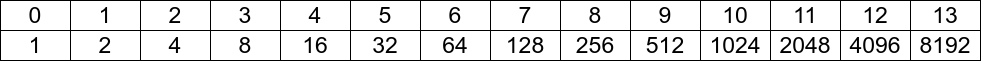
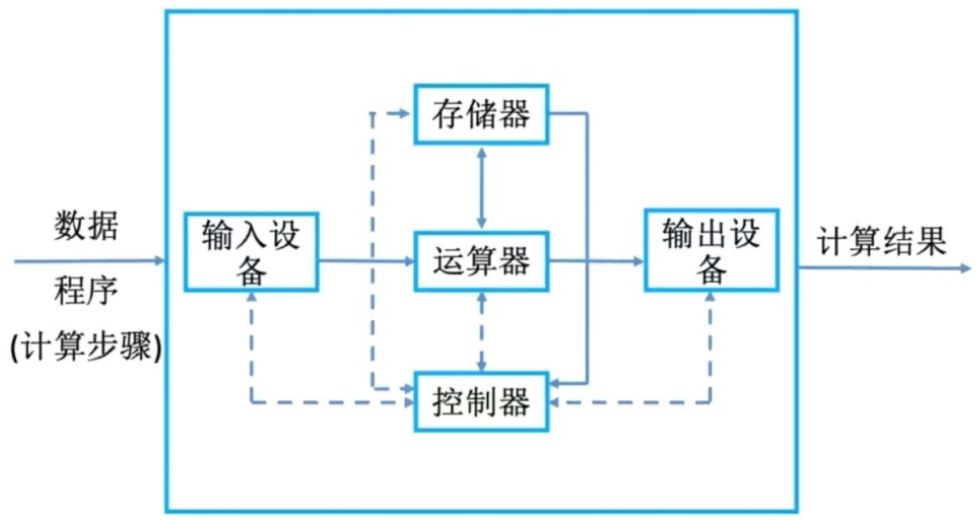
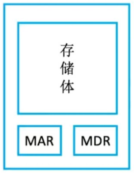
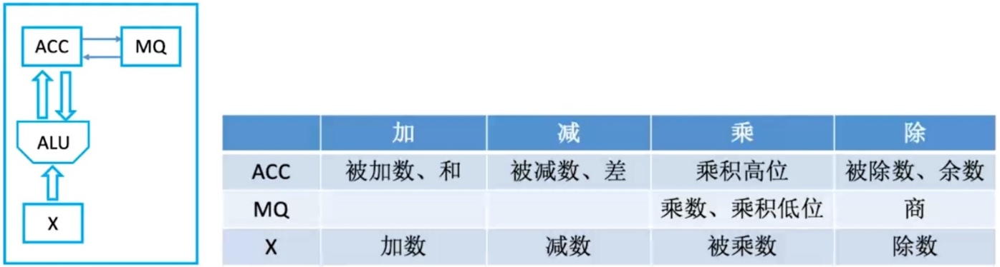
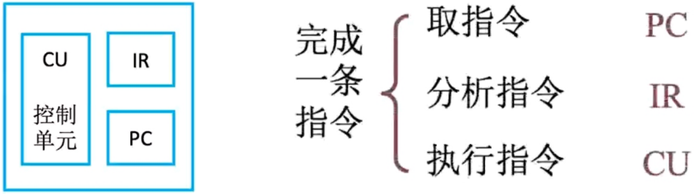
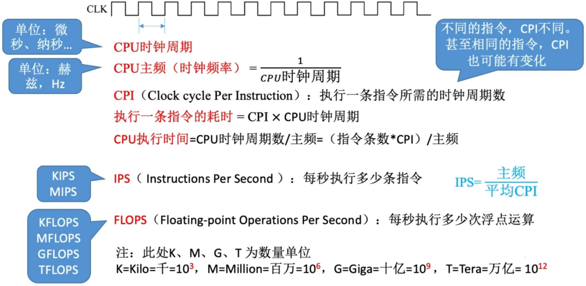
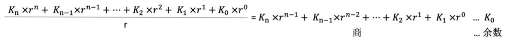

# 计算机组成原理

> 2 的 n 次幂

## 1 计算机系统概述

### 1.1 计算机系统的组成

> 在计算机系统中，软件和硬件在逻辑上其实是等效的。

> 软件分为系统软件和应用软件。

* <mark>系统软件</mark>是用来管理整个计算机系统的软件
    * 操作系统
    * 数据库管理系统
    * 标准程序库
    * 网络软件
    * 语言处理程序（编译程序）
    *  服务程序（如代码调试工具）
* <mark>应用软件</mark>是按照任务需要编制成的各种程序
    * 办公软件
    * 电子游戏
    * 社交工具

### 1.2 计算机的发展过程

> 第一代：电子管时代

* 逻辑元件：<mark>电子管</mark>
* 体积超大、耗电量超大；运算速度慢。 

> 第二代：晶体管时代

* 逻辑元件：<mark>晶体管</mark>
* 体积得到大幅度减小、功耗降低；运算速度得到质的飞跃；出现了面向过程的高级编程语言；有了 操作系统的雏形。

> 第三代：中小规模集成电路时代

* 将逻辑元件集成在基片上
* 可靠性得到提高；高级语言迅速发展；开始有了分时操作系统；主要用于科学计算等专业用途，但 是还没有进入当时人们的日常生活。
 
> 第四代：大规模、超大规模集成电路时代

* 基片上单位面积内能够容纳的晶体管数量取得了一个质的飞越
* 开始出现“微处理器”和微型计算机，个人计算机（PC）开始萌芽，并逐渐进入人们的生活；开始诞生 Windows、MacOS 和 Linux 等操作系统。

> 计算机的发展趋势——“两极分化”

* 微型计算机向更微型化、网络化、高性能、多用途方向发展。（更微型、多用途）
* 巨型机向更巨型化、超高并行处理、智能化方向发展。（更巨型、超高速）

### 1.3 计算机硬件的基本组成

存储程序的设计思想：
&emsp;&emsp;**将指令以二进制代码的形式<mark>事先输入到计算机的主存储器中</mark>**，然后按其在主存储器中的首地址执行程序的第一条指令，以后就按该程序的规定顺序执行其他指令，直至程序执行结束。

#### （1）早期 John von Neumann 计算机结构

* 输入设备：将用户输入的信息转化成机器能识别的形式。
* 输出设备：将运算的结果转化成人类能看懂的形式。
* 存储器：存放数据和程序指令。
* 运算器：实现算术运算和逻辑运算，I/O 设备与存储器之间的数据传送通过运算器完成（<mark>以运算器为核心</mark>）。
* 控制器：指挥程序的执行。

#### （2）现代计算机结构（<mark>以存储器为核心</mark>）

#### （3）主要部件的工作原理

> 主存储器

* MAR：存储地址寄存器，反应存储单元的个数。
* MDR：存储数据寄存器，$MDR位数=存储字长$。
* 存储体：存放数据的物理器件，数据在存储体内按照地址顺序进行存储。（核心部件）

> 运算器

* ACC：累加寄存器，用于存放操作数或运算结果。 
* MQ：乘商寄存器，在乘、除运算时，用于存放操作数或运算结果。 
* X：通用的操作数寄存器，用于存放操作数。 
* ALU：算术逻辑单元，通过内部复杂的电路实现算术运算和逻辑运算。（核心部件）

> 控制器

* CU：控制单元，分析指令，给出控制信号。（核心部件） 
* IR：指令寄存器，存放当前正在执行的指令，<mark>对于用户来说是完全透明的</mark>，即用户不能对 IR 进行任何操作。 
* PC：程序计数器，存放下一条指令地址，有自动加 1 的功能。

### 1.4 计算机系统的多级层次结构

* 从高级语言程序到汇编语言程序
    * 编译程序：将高级语言编写的源程序全部语句一次全部翻译成机器语言程序，而后再执行机器语言程序。（只需翻译一次，以后执行不再需要翻译） 
    * 解释程序：将源程序的一条语句翻译成对应于机器语言的语句，并立即执行。紧接着再翻译下一 句。（每次执行都要翻译） 
* 汇编程序：将汇编语言翻译成机器语言。

### 1.5 性能指标

#### （1）主存储器

* MAR 的位数反映存储单元的个数。（CPU 的寻址范围，即最多支持多少个存储单元）
* $MDR位数 = 存储字长 = 每个存储单元的大小$
* $总容量 = 存储单元个数 \times 存储字长 (bits) = 存储单元个数 * 存储字长 / 8 (Bytes)$
* 研究存储器时的单位前缀，$K=2^{10}$，$M=2^{20}$，$G=2^{30}$，$T=2^{40}$。

#### （2）中央处理器

CPU 主频：CPU 内数字脉冲信号震荡的频率。

#### （3）系统整体性能指标

## 2  数据的表示和运算

### 2.1 进位计数制

#### （1）使用二进制的原因

* 可使用有两个稳定状态的物理器件表示，成本低，便于实现。（成本低）
* 0 和 1 正好对应着逻辑值的假和真，方便实现逻辑运算。（便于逻辑运算）
* 可以很方便地使用逻辑门电路实现算术运算。（便于算术运算）

#### （2）二进制和八进制、十六进制的转换

注：小数点左侧高位补零，右侧低位补零。

#### （3）任意进制数转换为十进制数

$$
\begin{aligned}
&K_{n} K_{n-1} \cdots K_{2} K_{1} K_{0} K_{-1} K_{-2} K_{-3} \cdots K_{-m+1} K_{-m} \\
&= K_{n} \times r^{n} + K_{n-1} \times r^{n-1} + \cdots + K_{2} \times r^{2} + K_{1} \times r^{1} + K_{0} \times r^0 + K_{-1} \times r^{-1} + K_{-2} \times r^{-2} + \cdots + K_{-m+1} \times r^{-m+1} + K_{-m} \times r^{-m}
\end{aligned}
$$

#### （4）十进制数转换为任意进制数

> 整数部分

> 小数部分

