# 计算机组成原理

> 2 的 n 次幂

## 1 计算机系统概述

### 1.1 计算机系统的组成

> 在计算机系统中，软件和硬件在逻辑上其实是等效的。而一个完整的计算机系统是由软件和硬件共同构成的。

> 软件分为系统软件和应用软件。

* <mark>系统软件</mark>是用来管理整个计算机系统的软件
    * 操作系统
    * 数据库管理系统
    * 标准程序库
    * 网络软件
    * 语言处理程序（编译程序）
    * 服务程序（如代码调试工具）
* <mark>应用软件</mark>是按照任务需要编制成的各种程序
    * 办公软件
    * 电子游戏
    * 社交工具

### 1.2 计算机的发展过程

> 第一代：电子管时代

* 逻辑元件：<mark>电子管</mark>
* 体积超大、耗电量超大；运算速度慢。 

> 第二代：晶体管时代

* 逻辑元件：<mark>晶体管</mark>
* 体积得到大幅度减小、功耗降低；运算速度得到质的飞跃；出现了面向过程的高级编程语言；有了操作系统的雏形。

> 第三代：中小规模集成电路时代

* 将逻辑元件集成在基片上
* 可靠性得到提高；高级语言迅速发展；开始有了分时操作系统；主要用于科学计算等专业用途，但是还没有进入当时人们的日常生活。
 
> 第四代：大规模、超大规模集成电路时代

* 基片上单位面积内能够容纳的晶体管数量取得了一个质的飞越
* 开始出现微处理器和微型计算机，个人计算机（PC）开始萌芽，并逐渐进入人们的生活；开始诞生 Windows、MacOS 和 Linux 等操作系统。

> 计算机的发展趋势——“两极分化”

* 微型计算机向更微型化、网络化、高性能、多用途方向发展。（更微型、多用途）
* 巨型机向更巨型化、超高并行处理、智能化方向发展。（更巨型、超高速）

### 1.3 计算机硬件的基本组成

存储程序的设计思想：  
&emsp;&emsp;**将指令以二进制代码的形式<mark>事先输入到计算机的主存储器中</mark>**，然后按其在主存储器中的首地址执行程序的第一条指令，以后就按该程序的规定顺序执行其他指令，直至程序执行结束。

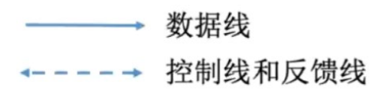

#### （1）早期 John von Neumann 计算机结构

* 输入设备：将用户输入的信息转化成机器能识别的形式；
* 输出设备：将运算的结果转化成人类能看懂的形式；
* 存储器：存放数据和程序指令；
* 运算器：实现算术运算和逻辑运算，I/O 设备与存储器之间的数据传送通过运算器完成（<mark>以运算器为核心</mark>）；
* 控制器：指挥程序的执行。

#### （2）现代计算机结构（<mark>以存储器为核心</mark>）

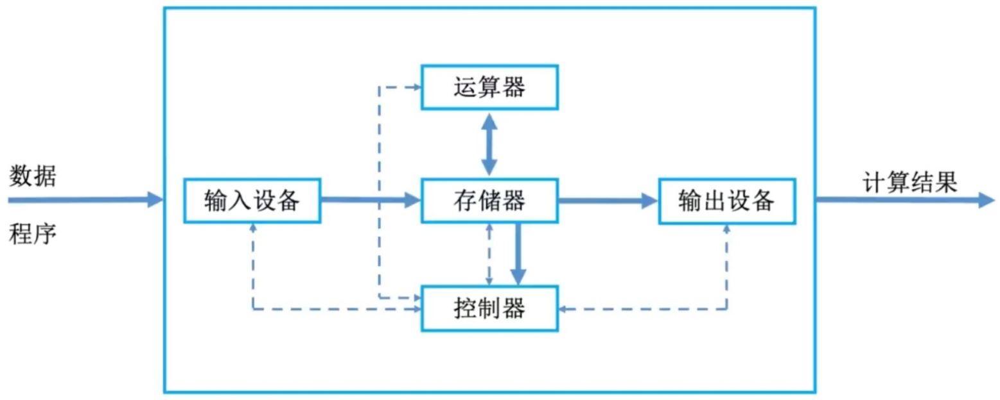

#### （3）主要部件的工作原理

> 主存储器

* MAR：存储地址寄存器，反应存储单元的个数。
* MDR：存储数据寄存器，MDR位数 = 存储字长。
* 存储体：存放数据的物理器件，数据在存储体内按照地址顺序进行存储。（核心部件）

> 运算器

* ACC：累加寄存器，用于存放操作数或运算结果；
* MQ：乘商寄存器，在乘、除运算时，用于存放操作数或运算结果； 
* X：通用的操作数寄存器，用于存放操作数；
* ALU：算术逻辑单元，通过内部复杂的电路实现算术运算和逻辑运算。（核心部件）

> 控制器

* CU：控制单元，分析指令，给出控制信号。（核心部件） 
* IR：指令寄存器，存放当前正在执行的指令，<mark>对于用户来说是完全透明的</mark>，即用户不能对 IR 进行任何操作。 
* PC：程序计数器，存放下一条指令地址，有自动加 1 的功能。

### 1.4 计算机系统的多级层次结构

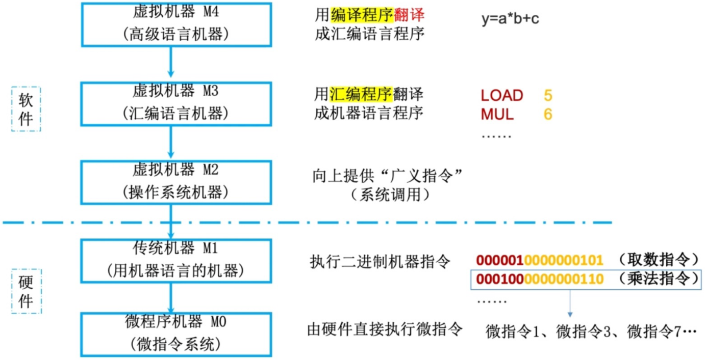

* 从高级语言到汇编语言
    * 编译程序：将高级语言编写的源程序全部语句一次全部翻译成机器语言程序，而后再执行机器语言程序。（只需翻译一次，以后执行不再需要翻译） 
    * 解释程序：将源程序的一条语句翻译成对应于机器语言的语句，并立即执行。紧接着再翻译下一句。（每次执行都要翻译一次） 
* 汇编程序：将汇编语言翻译成机器语言。

### 1.5 性能指标

#### （1）主存储器

* MAR 的位数反映存储单元的个数。（CPU 的寻址范围，即最多支持多少个存储单元）
* MDR 位数 = 存储字长 = 每个存储单元的大小
* 总容量 = 存储单元个数 $\times$ 存储字长（bits） = 存储单元个数 $\times$ 存储字长 $\div$ 8（Bytes）
* 研究存储器时的单位前缀：$K=2^{10}$，$M=2^{20}$，$G=2^{30}$，$T=2^{40}$

#### （2）中央处理器

CPU 主频：CPU 内数字脉冲信号震荡的频率。

#### （3）系统整体性能指标

* 数据通路带宽：数据总线一次所能并行传送信息的位数。（各硬件部件通过数据总线传输数据）
* 吞吐量：系统在单位时间内处理请求的数量。
* 响应时间：从用户向计算机发送一个请求，到系统对该请求做出响应并获得它所需要的结果的等待时间。
* 基准程序：其实就是跑分软件。

### 说明：

* 数据库管理系统（DBMS） != 数据库系统（DBS）
* CPU 区分指令和数据的依据：指令周期的不同阶段。
* MAR 和 MDR 在逻辑上是属于主存的，但是现代工业制造通常会把这两个寄存器集成在 CPU 的内部。
* 主频高的 CPU 不一定就快，因为不同 CPU 的 CPI 可能会不同，即使 CPI 相同，不同 CPU 的指令集和内部结构也可能会不同，这也会造成速度上的差异。
* 基准程序中的语句存在频度差异，运行结果也不能完全说明问题。

## 2 数据的表示和运算

### 2.1 进位计数制

#### （1）使用二进制的原因

* 可使用有两个稳定状态的物理器件表示，成本低，便于实现。（成本低）
* 0 和 1 正好对应着逻辑值的假和真，方便实现逻辑运算。（便于逻辑运算）
* 可以很方便地使用逻辑门电路实现算术运算。（便于算术运算）

#### （2）二进制和八进制、十六进制的转换

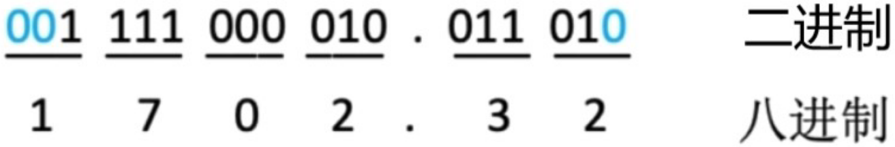
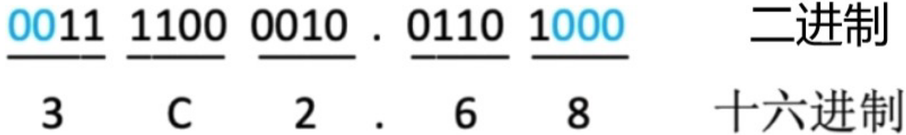

注：小数点<mark>左侧高位补零，右侧低位补零</mark>。

#### （3）任意进制数转换为十进制数

$$
\begin{aligned}
& \space\space\space\space\space K_{n} K_{n-1} \cdots K_{2} K_{1} K_{0} K_{-1} K_{-2} K_{-3} \cdots K_{-m+1} K_{-m} \\
&= K_{n} \times r^{n} + K_{n-1} \times r^{n-1} + \cdots + K_{2} \times r^{2} + K_{1} \times r^{1} + K_{0} \times r^0 \\
&+ K_{-1} \times r^{-1} + K_{-2} \times r^{-2} + \cdots + K_{-m+1} \times r^{-m+1} + K_{-m} \times r^{-m}
\end{aligned}
$$

#### （4）十进制数转换为任意进制数

> 整数部分：除基取余法

> 小数部分：乘基取整法

### 2.2 无符号整数的表示和运算

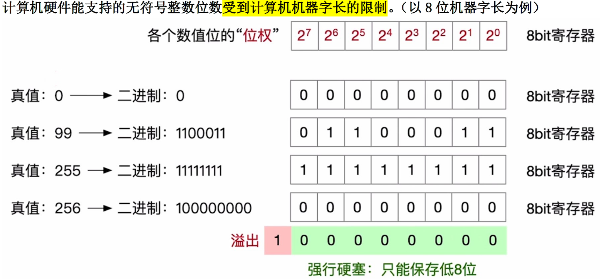

* 无符号整数的全部二进制位都是数值位，没有符号位，第 $i$ 位的位权是 $2^{i-1}$。
* $n$ bit 无符号整数表示范围是 $0\sim2^{n}-1$，超出则溢出，意味着该计算机无法一次处理这么大的数值。

> 加减运算的实现

* 加法运算
    * 从最低位开始，按位相加，并往更高位进位。
* 减法运算
    * “被减数”不变，“减数”全部按位取反、末位+1，减法变加法；
    * 从最低位开始，按位相加，并向更高位进位。

### 说明

## 3 存储系统

### 3.1 存储器的相关概念

#### （1）存储器的层次结构 

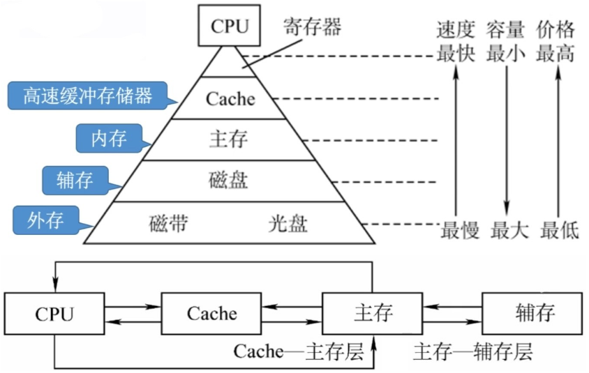

&emsp;&emsp;CPU 的速度很快，但是辅存的速度相对来说就很慢，我们说它们之间存在着**速度不匹配**的矛盾。所以 CPU 不能直接访问辅存，辅存中的数据要在调入主存之后才能被 CPU 访问。  
&emsp;&emsp;同理，主存和 CPU 之间也存在着这样的矛盾，即 CPU 的速度比主存快得多。因此，我们**将经常访问的程序代码和数据从主存中复制一份到 Cache 中**，再由 CPU 访问 Cache，从而缓解主存和 CPU 之间的速度矛盾。

* 主存-辅存层：实现虚拟存储系统，解决了系统主存容量不够的问题，主存和辅存之间的数据交换<mark>是需要系统程序员关心的</mark>。  
* Cache-主存层：解决了主存和 CPU 速度不匹配的问题，主存和 Cache 之间的数据交换<mark>是由硬件自动完成的</mark>。

#### （2）存储器的分类

> 按照<mark>层次结构</mark>分类

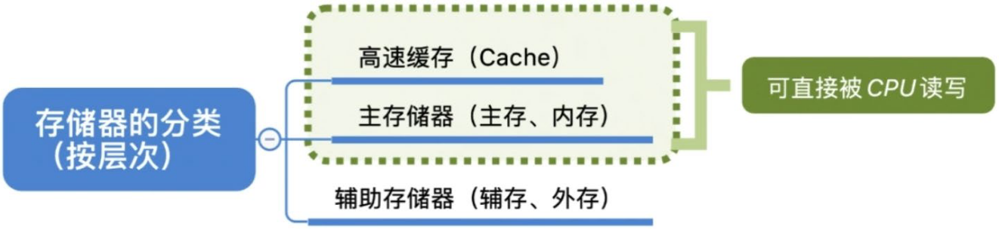

> 按照<mark>存储介质</mark>分类

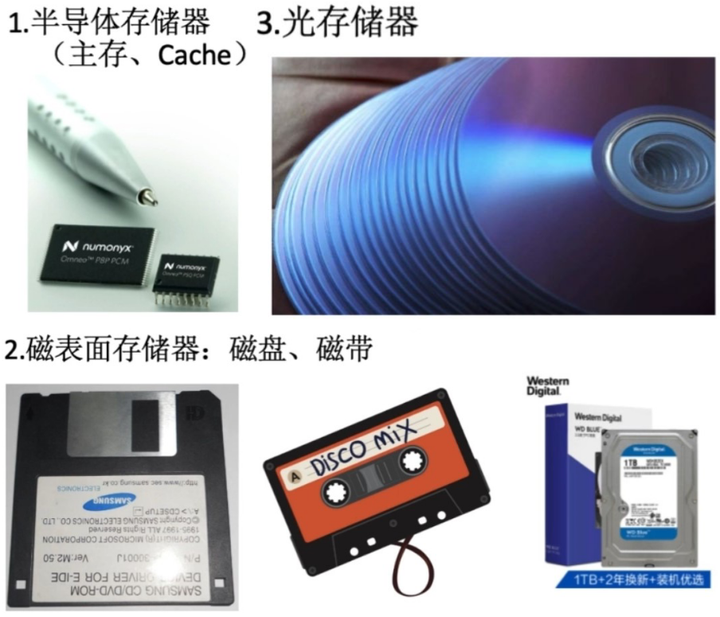

> 按照<mark>存取方式</mark>分类

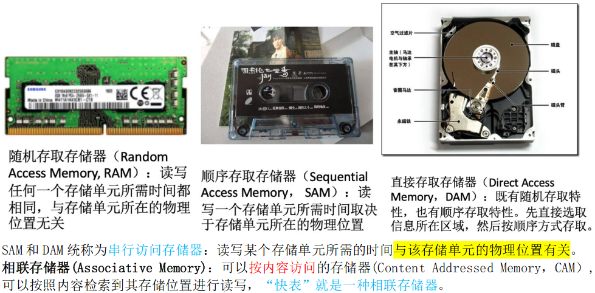

#### （3）存储器的性能指标

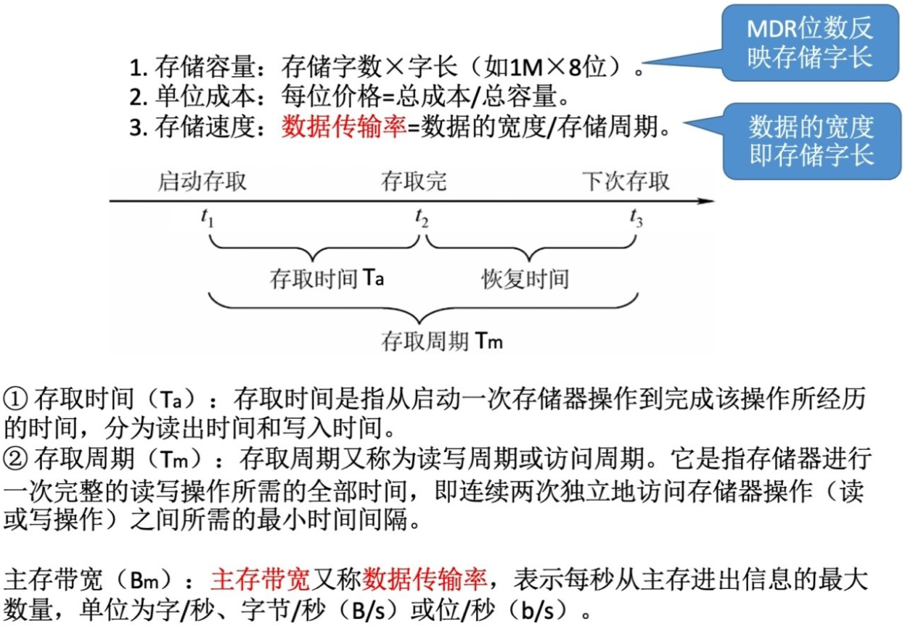

### 3.2 主存储器的基本组成

#### （1）主存储器结构和半导体元件

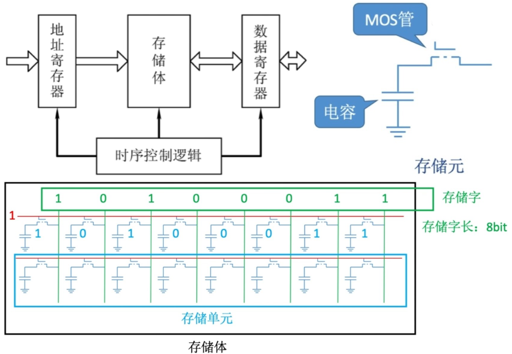

#### （2）主存芯片结构

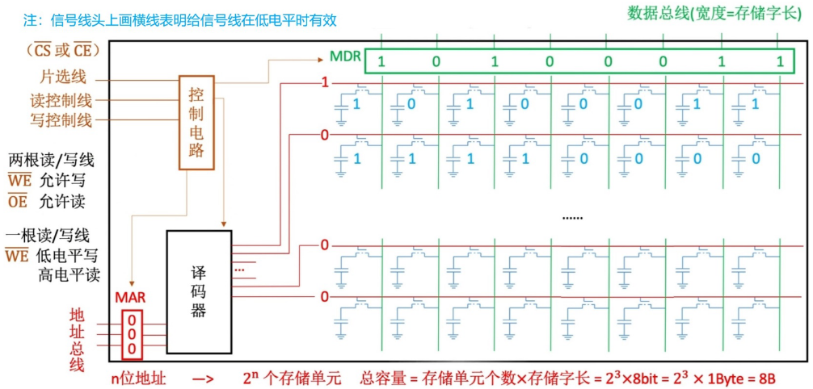

* 控制电路的作用
    * 保证 MAR 和 MDR 中的电信号**在稳定之后才允许被目标元件读取**；
    * 提供**读/写控制信号**和**片选信号**。
* 注意看<mark>问题中是一条读/写线，还是两条读/写线</mark>。（若题目没给，则默认是两条）
* 每块存储芯片上一定都会有一条片选线。

#### （3）比较 DRAM 和 SRAM

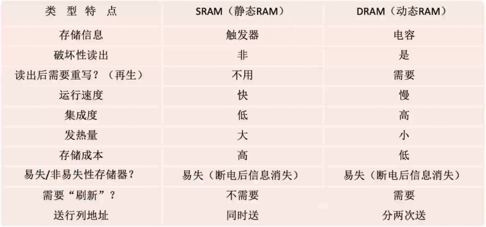

* Dynamic Random Access Memory，即动态 RAM，用于主存。
* Static Random Access Memory，即静态 RAM，用于 Cache。

> 存储元件（两种存储芯片的和核心区别就在于<mark>存储元件的不同</mark>）

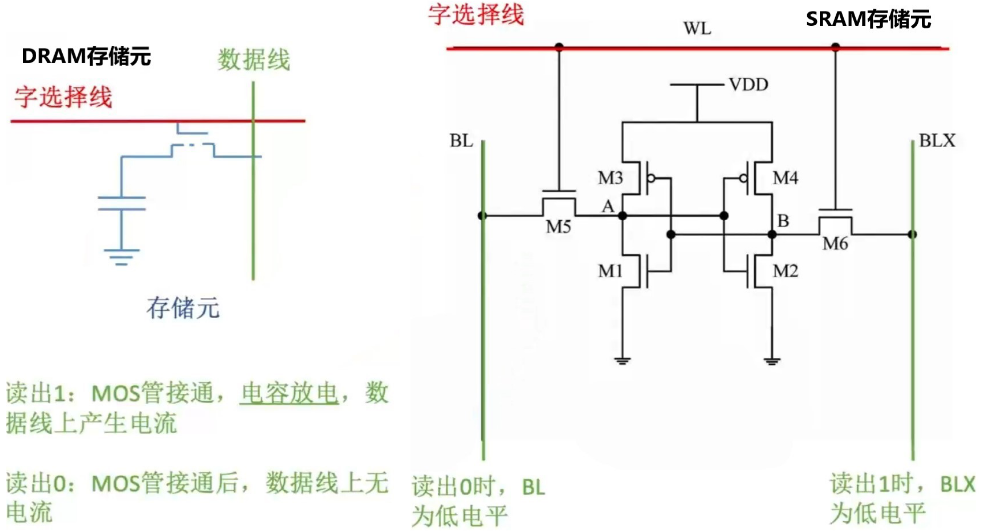

#### （4）DRAM 刷新

&emsp;&emsp;SRAM 芯片的存储元只要不断电，触发器的状态就不会改变，不需要进行刷新操作。但是 DRAM 芯片的存储元——栅极电容所存储的电荷只能保持 2ms，即便不断电，2ms 后里面的信息也会消失。因此，每隔 2ms，我们就需要为 DRAM 进行一次刷新。

* 刷新周期：一般为 2ms。（题目未指明时，默认就是 2ms）
* <mark>以行为单位</mark>，每次刷新一行存储单元。
* 使用行列地址线可以减少选通线的数量（大约是开一个 2 次根号）

#### （5）

