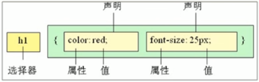

# 一、CSS 如何使用

## 1.语法规范



```css
/*
    为所有的 h1 标签设置
    文字颜色为 红色
    字体大小为 25 像素
*/
h1 {
    color: red;
    font-size: 25px;
}
```

* 选择器选择页面中要设定样式的元素，在后面紧跟的花括号内设定具体的样式（属性）
* 属性和属性值以 “键值对” 的形式书写，**每一组** “键值对” 后面都以英文分号 `;` 结尾
* 空格规范
    * 在属性值的前面，冒号的后面，保留一个空格
    * 在选择器的后面，花括号的前面，保留一个空格

## 2.三种引入方式

> 内联样式

> 

## 3.CSS 初始化

# 二、CSS 选择器

## 1.基础选择器

> 标签选择器

&emsp;&emsp;用 HTML 标签名称作为选择器，按标签名分类，为页面中某一类标签**全部**指定统一的样式。

```css
标签名 {
    属性1: 属性值1;
    属性2: 属性值2;
    ...
}
```

> 类选择器

&emsp;&emsp;为多个元素设置相同的 class 属性，使用类选择器，同时选中页面中所有具有相同 class 属性的元素。**这在开发中最为常用。** 

```css
.类名 {
    属性1: 属性值1;
    属性2: 属性值2;
    ...
}
```

* 多个不同的 html 标签可以设置相同的 class 属性，被同时选中
* 一个 html 标签可以同时设置多个 class 属性，多个样式同时在这个标签上发挥作用

```html
<html>
    <head>
        <style>
            .red {
                color: red;
            }
            .bold {
            }
            .font35 {
                font-size: 35px;
            }
            .green {
                color: green;
            }
            .porn-star {
                color: yellow;
            }
        </style>
    </head>
    <body>
        <ul>
            <li class="red">薛之谦</li>

            <!-- 为多个标签设置相同的类名 -->
            <li class="green">理塘丁真</li>
            <li class="green">知识雪豹</li>
            <li class="green">新疆阿力木</li>

            <!-- 为一个标签指定多个类名，不同类名之间用一个空格隔开 -->
            <li class="red bold font35">刘德华</li>
            <li class="red bold">周杰伦</li>
            <li class="red bold">陈奕迅</li>

            <!-- 多个词组成的长名称，各个词之间使用减号连接 -->
            <li class="porn-star">深田泳美</li>
            <li class="porn-star">三上优亚</li>
            <li class="porn-star">苍井空</li>

            <!-- 类名 不要使用纯数字或中文，尽量使用英文字母 -->
        </ul>
    </body>
</html>
```

> id 选择器

&emsp;&emsp;为具有特定的 id 属性值的元素设定样式。

```css
#id名 {
    属性1: 属性值1;
    属性2: 属性值2;
    ...
}
```

* 在同一个页面中，每个 id 名最多都只能出现一次，不存在多个元素共用相同的 id 名。
* 一个元素最多可设置一个 id 名。
* id 选择器一般用于页面中唯一的元素上，经常和 JavaScript 搭配使用。

> 通配符选择器

&emsp;&emsp;选中页面中的**所有元素**。

```css
* {
    属性1: 属性值1;
    属性2: 属性值2;
    ...
}
```

* 不需要调用，自动就给所有元素应用了其所设定的样式。
* 只有在特殊的情况下才会使用。

```css
/* 清除所有元素的内外边距 */
* {
    margin: 0;
    padding: 0;
}
```

## 2.复合选择器

> 

# 三、元素样式

## 1.字体（大小、粗细和文字样式）

```css
/* font-family */
/*
    可以设置多个字体，不同的字体之间用英文逗号 , 隔开
    设置多个字体可以提高兼容性，浏览器解析时会选择最靠前的已安装字体
    如果设置的所有字体都没有安装，则使用默认字体
*/
p {
    font-family: "微软雅黑";
}
div {
    font-family: Arial,"Microsoft Yahei","微软雅黑";
}
body {
    font-family: "Microsoft Yahei", tahoma, arial, "Hiragino Sans GB";
}

/* font-size */
/*
    Chrome 浏览器默认的文字大小为 16px
    不同浏览器默认显示的字号可能是不一样的，因此我们应当给一个明确的值，不要使用默认大小
*/
p {
    font-size: 20px;
}
body {
    /* 注意：
        我们可以使用 body 设置整个页面的字号大小
        但是为 body 设置的字号属性，不会对标题 `h1` - `h5` 起作用
        这是一个优先级的问题，标题标签的字号需要单独设置 
    */
    font-size: 16px;
}
h1 {
    font-size: 16px;
}

/* font-weight */
/*
    可选的值：normal | bold | bolder | lighter | number
*/
.bold {
    font-weight: bold;    
}
h2 {
    /* number 
        这里的数字后面没有单位
        可取的值包括：100 | 200 | 300 | 400 | 500 | 600 | 700 | 800 | 900
            400 等价于 nromal
            700 等价于 bold
    */
    font-weight: 400;
}

/* font-style */
/*
    主要用于让倾斜的文字变得正常，很少用于给文字加斜体
*/
p {
    font-style: italic;
}
em {
    font-style: normal;
}

/* 字体的复合属性 */
/* 语法格式：
    font: font-style font-weight font-size font-family;
    顺序不可颠倒
    不需要的设置可以省略，但是必须保留 font-size 和 font-family，否则 font 属性将不起作用
*/
body {
    font: nromal 400 16px "Microsoft Yahei";
}
```

## 2.文本

```css


```

## 3.图片

## 4.

## 元素显示模式

# 四、背景

# 五、三大特性

# 六、盒子模型

# 七、浮动

# 八、定位

