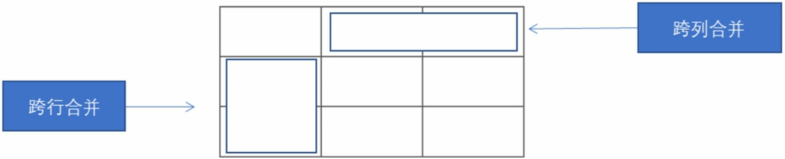
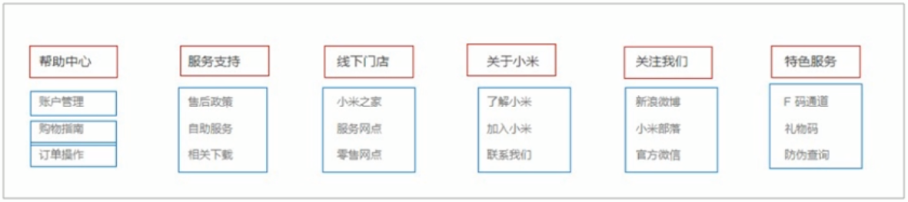

# 一、关于 HTML

## 1.HTML 标签

```html
<!-- 双标签 -->
<html></html>
<!-- 单标签 -->
<br />

<!-- 包含关系 -->
<head>
    <title></title>
</head>
<!-- 并列关系 -->
<head></head>
<body></body>
```

## 2.基本标签结构

```html
<html> <!-- 页面中最大的标签，我们称之为根标签 -->
    <head> <!-- 文档的头部 -->
        <title>标签页标题中显示的内容</title> <!-- 网页的标题，在 head 标签中必须要设置 title  标签 -->
    </head>
    <body> <!-- 文档的主体 -->
        网页的主体内容
    </body>
</html>
```

## 3.DOCTYPE 和 lang 以及字符集的作用

```html
<!DOCTYPE html>  <!-- 文档类型声明标签，必须写在文档的最开头，告诉浏览器使用哪种 html 版本来解析网页，此表示处为 html5 版本的 html 文档 -->
<html lang="en">
    <head>
        <title>标签页标题中显示的内容</title>
        <meta charset="UTF-8" /> <!-- 指定网页的字符集，一般采用 UTF-8 -->
    </head>
    <body>
        网页的主体内容
    </body>
</html>
```

* `<!DOCTYPE>` 标签并不属于 html 标签
* lang 属性，定义网页的语言
    * en 定义网页语言为英文
    * zh-CN 定义网页语言为中文
* 网页中的内容的语言和定义的 lang 属性不一致，则打开时会触发浏览器的翻译功能

## 4.注释

```html
<!-- 注释内容 -->
<!--
    注释
    内容
-->
```

* 不会显示在界面中
* 不允许嵌套

## 5.特殊字符

```html
<!-- 空格 -->
&nbsp;
<!-- 制表符 -->
&emsp;

<!-- 大于号 -->
&gt;
<!-- 小于号 -->
&lt;

<!-- & -->
&amp;
```

# 二、HTML 常用标签

## 1.标题标签

> HTML5 共提供了 `<h1>` - `<h6>` 共六级标签

```html
<h1>一级标题</h1>
<h2>二级标题</h2>
<h3>三级标题</h3>
<h4>四级标题</h4>
<h5>五级标题</h5>
<h6>六级标题</h6>
```

* 语义：作为标题使用，并且依据重要性递减
    * 加了标题标签的文字会加粗，字号也会依次变大，**一个标题独占一行**

## 2.段落标签和换行标签

```html
<p>段落中的内容</p>
<br /> <!-- 换行一次 -->
```

* p 标签语义：把 HTML 文档分割为若干段落
    * 文本在一个段落中会根据浏览器窗口的大小自动换行，不同的段落之间保有空隙
* br 标签语义：在到达浏览器窗口右端之前强制换行
    * 只是简单的开始新的一行，和原来的行之间不会有空隙，这与段落之间是不同的

## 3.文本格式化标签：使文字以特殊的方式显示

|  语义  |                标签                |                说明                |
|:------:|:----------------------------------:|:----------------------------------:|
|  加粗  | `<strong></strong>` 或者 `<b></b>` | 更推荐使用 `<strong>` ，语义更强烈 |
|  倾斜  |     `<em></em>` 或者 `<i></i>`     |   更推荐使用 `<em>` ，语义更强烈   |
| 删除线 |    `<del></del>` 或者 `<s></s>`    |  更推荐使用 `<del>` ，语义更强烈   |
| 下划线 |    `<ins></ins>` 或者 `<u></u>`    |  更推荐使用 `<ins>` ，语义更强烈   |

## 4.div 和 span 标签

```html
<div> 这是头部 </div>
<span> 今日价格 </span>
```

* div 标签和 span 标签是没有语义的，就是一个盒子，用来装内容
* div 属于_块元素_，单独占一行，大盒子
* span 属于_行内元素_，行内还可以放其他元素，小盒子

## 5.图像标签

```html


  <!-- 设置突袭那个宽度为 200 像素 -->

```

|  属性  |     属性值     |               说明               |
|:------:|:--------------:|:--------------------------------:|
|  src   | 图片文件的位置 |             必须属性             |
|  alt   |      文本      | 当图片无法显示出来时，显示的文字 |
| title  |      文本      |  当鼠标放在图片上显示的图片信息  |
| width  |      像素      |          设置图像的宽度          |
| height |      像素      |          设置图像的高度          |
| border |      像素      |        设置图像边框的粗细        |

> 标签属性的注意点：

* 图像标签可以拥有多个属性，必须写在标签名的后面
* 属性之间不分先后顺序，标签名与属性、属性与属性之间均以空格分开
* 属性采用键值对的格式，即 `key="value"` 的格式

## 6.链接标签

> 从一个页面链接到另一个页面。

```html
<a href="跳转目标 url" target="目标窗口的弹出方式"> 文字或图像 </a>

<!-- 外部链接 -->
<a href="http://www.qq.com" target="_blank"> 腾讯 </a>

<!-- 内部链接 -->
<a href="person_page.html" target="_blank"> 个人主页 </a>

<!-- 空链接 -->
<a href="#" target="_blank"> 公司地址 </a>

<!-- 下载链接 -->
<a href="./image.zip"> 点击下载 </a>

<!-- 任何网页元素都可以作为链接 -->
<a href="http://www.baidu.com" target="_blank">  </a>

<!--锚点链接，快速定位到页面中的某个位置
    在链接文本的 href 属性中，设置属性名为 #名字 的形式，如 <a href="#two"> 第二集 </a>
    找到目标位置标签里面添加一个属性 id="刚才设置的名字"，如 <h3 id="two"> 第二集介绍 </h3>
-->
<a href="./image.zip"> 点击下载 </a>
```

|  属性  |                                          作用                                           |
|:------:|:---------------------------------------------------------------------------------------:|
|  href  |                            必须属性，指定跳转目标的 url 地址                            |
| target | 指定链接界面的打开方式，其默认值为 _self，即在本窗口中打开，_blank 为在新窗口中打开方式 |

# 三、表格（用于存放数据）

```html
<table>
    <tr>
        <th>第一行 第一列</th>
        <th>第一行 第二列</th>
    </tr>
    <tr>
        <td>第二行 第一列</td>
        <td>第二行 第二列</td>
    </tr>
    <tr>
        <td>第三行 第一列</td>
        <td>第三行 第二列</td>
    </tr>
</table>
```

* `<tr></tr>`，用于定义表格中的行，必须嵌套在 `<table></table>` 标签中
* `<td></td>`，用于定义每一行中的单元格，必须嵌套在 `<tr></tr>` 标签中
    * 字母 td 指的是 table data，即数据单元格内容
* `<th></th>` 表头单元格标签，用于存放表头的数据
    * 内部的文字会加粗居中显示
    * 字母 th 指的是 table head
* 每个单元格内可以放任何元素（图片、链接）

> 表格（`<table></table>` 标签）的相关属性

|   属性名    |       属性值        |                      描述                       |
|:-----------:|:-------------------:|:-----------------------------------------------:|
|    align    | left、center、right |         规定表格相对周围元素的对齐方式          |
|   border    |       1 或 ""       | 规定表格单元是否拥有边框，默认为 ""，即没有边框 |
| cellpadding |       像素值        | 规定单元格边缘与其内容之间的空白，默认为 1 像素 |
| cellspacing |       像素值        |       规定单元格之间的空白，默认为 2 像素       |
|    width    |  像素值 或 百分比   |             规定表格（整体的）宽度              |
|   height    |  像素值 或 百分比   |             规定表格（整体的）高度              |

> 表格结构标签：为了更好的分清表格结构

* `<thead></thead>` 标签表示表格的头部区域
    * 内部必须有 `<tr>` 标签，一般位于第一行
* `<tbody></tbody>` 标签表示表格的主体区域
    * 主要用于存放数据主体
* 以上两个标签都放在 `<table></table>` 标签中

```html
<table>
    <thead>
        <tr>
            <th>第一行 第一列</th>
            <th>第一行 第二列</th>
        </tr>
    </thead>
    <tbody>
        <tr>
            <td>第二行 第一列</td>
            <td>第二行 第二列</td>
        </tr>
        <tr>
            <td>第三行 第一列</td>
            <td>第三行 第二列</td>
        </tr>
    </tbody>
</table>
```

> 合并单元格



* 跨行合并 `rowspan="合并单元格的个数"`
    * 合并范围内最上侧单元格为目标单元格
* 跨列合并 `colspan="合并单元格的个数"`
    * 合并范围内最左侧单元格为目标单元格

> 合并单元格的步骤

1. 确定跨行合并还是跨列合并
2. 找到目标单元格，写上属性 `合并方式="合并的单元格数量"`，如 `<td colspan="2"></td>`
3. 删除多余的单元格

> 跨行合并单元格的实现

```html
<table>
    <tr>
        <td></td>
        <td colspan="2"></td>
    </tr>
    <tr>
        <td></td>
        <td></td>
        <td></td>
    </tr>
    <tr>
        <td></td>
        <td></td>
        <td></td>
    </tr>
</table>
```

> 跨列合并单元格的实现

```html
<table>
    <tr>
        <td rowspan="2"></td>
        <td></td>
        <td></td>
    </tr>
    <tr>
        <td></td>
        <td></td>
    </tr>
    <tr>
        <td></td>
        <td></td>
        <td></td>
    </tr>
</table>
```

# 四、列表（用于网页布局）

> 无序列表

```html
<ul>
    <li>列表项1</li>
    <li>列表项2</li>
    <li>列表项3</li>
    ...
</ul>
```

* 各个列表项之间没有顺序层级之分，是并列的
* `<ul></ul>` 标签中只能嵌套 `<li></li>` 标签，直接在 `<ul></ul>` 标签中输入其他标签或文字是不被允许的
* `<li></li>` 标签相当于一个容器，其内部可以放任何元素
* 无序列表有自己的默认样式，在实际开发时，我们一般用 CSS 类设置样式

> 有序列表

```html
<ol>
    <li>列表项1</li>
    <li>列表项2</li>
    <li>列表项3</li>
    ...
</ol>
```

* 性质类似于无序列表的后三条性质
* 有序列表使用相对较少

> 自定义列表



```html
<dl>
    <dt> 名词1 </dt>
    <dd> 名词1解释1 </dd>
    <dd> 名词1解释2 </dd>
</dl>
```

* dl 中只能包含 dt 和 dd
* 一个 dl 中的 dt 和 dd 的个数没有限制，经常是一个 dt 对应多个 dd
* dd 和 dt 是并列的兄弟关系

# 五、表单（用于收集和传递用户信息）

&emsp;&emsp;一个完整的表单通常由表单域、表单控件（表单元素）和提示信息 3 个部分构成。

## 1.表单域（包含表单控件的区域）

```html
<form action="url地址" method="提交方式" name="表单域名称">
    <!-- 表单域中的各种表单控件 -->
    ...
</form>
```

|  属性  |  属性值  |                         作用                         |
|:------:|:--------:|:----------------------------------------------------:|
| action | url 地址 |    指定接收并处理表单数据的服务器程序的 url 地址     |
| method | get/post |    设置表单数据的提交方式，包含 post 和 get 两种     |
|  name  |   名称   | 指定本表单域的名称，用以区分同一个页面中的多个表单域 |

* 说明
    * 每个表单元素都应该有表单域把它们包含
    * 表单域就是 `<form></form>` 标签内的范围
* `<form></form>` 会把它范围内的表单元素信息提交给相应的服务器程序

## 2.input 输入表单元素

> type 属性，设置不同的属性值用来指定不同的控件类型

```html
<input type="属性值" />
```

|  属性值  |                    描述                    |
|:--------:|:------------------------------------------:|
|  button  |               定义可点击按钮               |
| checkbox |                 定义复选框                 |
|   file   |   定义输入字段和“浏览”按钮，用于文件上传   |
|  hidden  |             定义隐藏的输入字段             |
|  image   |           定义图像形式的提交按钮           |
| password |     定义密码字段，字段中的字符串被掩码     |
|  radio   |                定义单选按钮                |
|  reset   | 定义重置按钮，点击会清楚本表单中的所有数据 |
|  submit  |    定义提交按钮，把表单数据发送到服务器    |
|   text   |   定义单行输入字段，默认宽度为 20 个字符   |

> 代码实践

```html
<form>
<!-- text 文本框，用户可以输入任何文字 -->
用户名：<input type="text"/> <br/>

<!-- password 密码框，用户看不见输入的密码 -->
密码：<input type="password"/> <br/>

<!-- radio 单选按钮，可以实现多选一 -->
性别：男<input type="radio" /> 女<input type="radio" /> 人妖<input type="radio" /> <br/>

<!-- checkbox 多选框，可以实现多选 -->
爱好：唱<input type="checkbox"/> 跳<input type="checkbox"/> RAP<input type="checkbox" /> 篮球<input type="checkbox"/>
</form>

<!-- submit 提交按钮，把表单数据提交到服务器 -->
<input type="submit" value="免费注册"/>
<!-- value 属性用于设置提交按钮上的文字 -->

<!-- reset 重置按钮，清空本表单内的所有用户数据 -->
<input type="reset" value="重新填写"/>
<!-- value 属性用于设置重置按钮上的文字 -->

<!-- button 普通按钮，用于通过 javascript 启动脚本 -->
<input type="button" value="获取短信验证码" name=""/>
<!-- value 属性用于设置普通按钮上的文字信息 -->

<!-- file 文件域，用于上传文件 -->
上传头像：<input type="file"/>
```

> name 和 value 属性

```html
<form>
<!-- text 文本框，用户可以输入任何文字 -->
用户名：<input type="text" name="username"/> <br/>
<!-- value 属性设置文本框中的默认内容 -->

<!-- password 密码框，用户看不见输入的密码 -->
密码：<input type="password" name="password"/> <br/>
<!-- value 属性设置密码框中的默认内容 -->

<!-- radio 单选按钮，可以实现多选一 -->
<!--
    name 是表单元素的名字，这里的性别单选按钮必须具有相同的 name 属性
    才能实现多选一
-->
性别：
    男<input type="radio" name="gender" value="male"/>
    女<input type="radio" name="gender" value="female"/>
    人妖<input type="radio" name="gender" value="shemale"/>
    <br/>
<!-- value 属性用以标识一组单选按钮中的各个选项 -->

<!-- checkbox 多选框，可以实现多选 -->
爱好：
    唱<input type="checkbox" name="hobby"/>
    跳<input type="checkbox" name="hobby"/>
    RAP<input type="checkbox" name="hobby"/>
    篮球<input type="checkbox" name="hobby"/>

<!-- 同一组单选框和复选框要有相同的 name 值 -->
```

> checked 属性

```html
<!-- 单选按钮和复选框可以设置 checked 属性，当页面打开的时候，默认选择这个按钮 -->
性别：
    男<input type="radio" name="gender" value="male"/>
    女<input type="radio" name="gender" value="female" checked="checked"/>
    <!-- 打开网页时，默认选中 女 -->
    人妖<input type="radio" name="gender" value="shemale"/>
    <br/>
    
爱好：
    唱<input type="checkbox" name="hobby"/>
    跳<input type="checkbox" name="hobby"/>
    RAP<input type="checkbox" name="hobby"/>
    篮球<input type="checkbox" name="hobby" checked="checked"/>
    <!-- 打开网页时，默认选中 篮球 -->
```

> maxlength 属性

```html
<!-- 设置输入框最多可输入 6 个字符 -->
用户名：<input type="text" name="username" maxlength="6"/>
```

## 3.label 控件（并不属于表单元素，但是常用于为 input 元素定义标注）

&emsp;&emsp;`<label></label>` 标签用于绑定一个表单元素，当点击 `<label></label>` 标签内的文本时，浏览器就会自动将焦点转到对应的表单元素上，从而增加用户体验。

```html
<label for="male">男</label>
<input type="radio" name="gender" id="male"/>
<label for="female">女</label>
<input type="radio" name="gender" id="female"/>
<label for="shemale">人妖</label>
<input type="radio" name="gender" id="shemale"/>
```

* 核心：label 标签中的 for 属性必须与相关元素的 id 属性相同

## 4.select 下拉表单元素

&emsp;&emsp;在页面中，有多个选项供用户选择，并且想要节约页面空间时，可以使用 `<select></select>` 标签定义下拉列表。

```html
<form>
<select>
    <option>--请选择--</option>
    <option>选项1</option>
    <option>选项2</option>
    <option>选项3</option>
    <option>选项4</option>
    ...
</select>
</form>
```

* `<select></select>` 中至少要有一个 `<option></option>` 标签
* 在 `<option></option>` 中定义 `selected="selected"` 属性，当前项即为默认选中项

## 5.textarea 文本域元素

&emsp;&emsp;当用户输入的内容较多时，可以使用 `<textarea></textarea>` 标签，定义多行文本输入的控件。常见于留言板、评论等有较多输入内容的输入框。

```html
<form>
<textarea rows="3" cols="20">
默认文本内容
</textarea>
</form>
```

* cols 表示每行中的字符数，rows 表示显示的行数，当然这些在实际开发中都不会使用，都用 CSS 来设置
