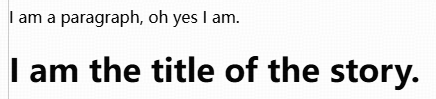

# 1 HTML5

## 1.1 Getting started with HTML

&emsp;&emsp;HTML (HyperText Markup Language) is a markup language that tells web browsers how to structure the web pages we visit.

### 1.1.1 Anatomy of an HTML element


### 1.1.2 Attributes


An attribute should have:

* A space between it and the element name. (For an element with more than one attribute, the attributes should be separated by spaces too.)
* The attribute name, followed by an equal sign.
* An attribute value, wrapped with opening and closing quote marks.

### 1.1.3 Anatomy of an HTML document

```html
<!doctype html>
<html lang="en-US">
    <head>
        <meta charset="utf-8" />
        <title>My test page</title>
    </head>
    <body>
        <p>This is my page</p>
    </body>
</html>
```

## 1.2 What's in the head? Metadata in HTML

## 1.3 HTML text fundamentals

### 1.3.1 Headings and paragraphs

In HTML, each paragraph has to be wrapped in a `<p>` element, like so:

```html
<p>I am a paragraph, oh yes I am.</p>
```

Each heading has to be wrapped in a heading element:

```html
<h1>I am the title of the story.</h1>
```



> There are six heading elements: h1, h2, h3, h4, h5, and h6. Each element represents a different level of content in the document; `<h1>` represents the main heading, `<h2>` represents subheadings, `<h3>` represents sub-subheadings, and so on.

### 1.3.2 Lists

On the web, we have three types of lists: unordered, ordered, and description.

#### Unordered

#### Ordered


