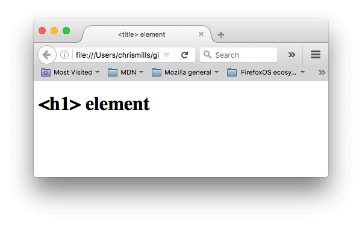

The `<title>` element however can get confused with the `<h1>` element, which is used to add a top level heading to your body content — this is also sometimes referred to as the page title. But they are different things!

The `h1` element appears on the page when loaded in the browser — generally this should be used once per page, to mark up the title of your page content (the story title, or news headline, or whatever is appropriate to your usage.)
The `<title>` element is metadata that represents the title of the overall HTML document (not the document's content.)

```html
<!DOCTYPE html>
<html lang="en-US">
    <head>
        <meta charset="utf-8">
        <meta name="viewport" content="width=device-width">
        <title>&lt;title&gt; element</title>
    </head>
    <body>
        <h1>&lt;h1&gt; element</h1>
    </body>
</html>
```




