# 一、JDBC

&emsp;&emsp;JDBC(Java DataBase Connectivity) 就是使用 Java 语言操作关系型数据库的一套 API。

```java
//0.将驱动 jar 包导入工程

//1.注册驱动（MySQL5 之后，这一句可以不写）
Class.forName(“com.mysql.jdbc.Driver”);//旧版本
Class.forName(“com.mysql.cj.jdbc.Driver”);//新版本

//2.获取连接对象
String url = “jdbc:mysql://127.0.0.1:3306/db_1?useSSL=false”;
String username = “root”;
String password = “1234”;
Connection conn = DriverManager.getConnection(url,username,password);

//3.定义 SQL 语句
String sql = “update account set money = 2000 where id= 1”;

//4.获取 SQL 的执行对象
Statement stmt = conn.createStatement();

//5.执行 SQL 语句
int count = stmt.executeUpdate(sql);

//6.处理结果
......

//7.释放资源（顺序不能变）
stmt.close();
conn.close();
```

JDBC 的本质：

* Sun 公司定义的一套标准（接口），是用于操作所有关系型数据库的规则。
* 各数据库厂商分别去实现这套接口，提供各自数据库的驱动 jar 包。

JDBC 的好处：不同的数据库厂商使用相同的接口。

## 1.DriverManager（驱动管理类）

> 注册驱动

```java
Class.forName(“com.mysql.jdbc.Driver”);

//上面 Driver 的源码
static {
	try{
		DriverManager.registerDriver(new Driver());
	}catch(SQLException var1){
		throw new RuntimeException(“Can’t register diver!”);
	}
}
```

> 获取连接

```java
//getConnection() 函数
Connection DriverManager.getConnection(Sring url,String username,String password);
/*参数
url（连接路径）
	jdbc:mysql://ip地址:端口号/数据库名称？参数键值对1&参数键值对2&...
	①可简化为jdbc:mysq:///数据库名称。
	②配置useSSL=false（等号两侧不能有空格）参数，禁用安全连接方式。
username 用户名
password 密码
*/
```

## 2.Connection

> 获取执行 SQL 的对象

```java
//普通执行 SQL 的对象
Statement createStatement(String sql)

//预编译 SQL 的执行 SQL 对象（防止 SQL 注入）
PreparedStatement prepareStatement(String sql)

//执行存储过程的对象
CallableStatement perpareCall(Sting sql)
```

> 管理事务

```java
//开启事务
setAutoCommit(boolean autoCommit)
/*
	true 为自动提交事务
	false 为手动提交事务，即为开启事务
*/

//提交事务
commit()

//回滚事务
rollback()
```

## 3.Statement

```java
//执行 DML、DDL 语句
int executeUpdate(String sql)
/*
	对于 DML 语句，返回受影响的行数，返回 0 代表执行失败
	对于 DDL 语句，执行成功也可能返回 0
*/

//执行 DQL 语句，返回 ResultSet 结果集对象
ResultSet executeQuery(String sql)
```

## 4.ResultSet

> 封装了 DQL 语句的查询结果

```java
//将光标从当前位置向前移动一行，并判断（移动后的）当前行是否为有效行
boolean next()
/*
	true：有效行
	false：无效行
*/

//获取数据
xxx resultSet.getXxx(参数)
/*
	“get”什么类型，就返回什么类型。
	参数可以是 int 或 String：
		int 时，参数为列的编号，从 1 开始
		String 时，参数为列的名称
*/
```

> ResultSet 的数据结构

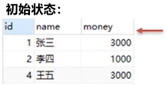

> 一贯用法

```java
while(resultSet.next()){
	result.getXxx(参数);
	......
}
```

## 5.PreparedStatement

&emsp;&emsp;预编译，提高执行效率；转义敏感字符，防止 SQL 注入。

```java
//开启预编译功能
String url = "jdbc:mysql:///atguigudb?useSSL=false&useServerPrepStmts=true";

//获取 PreparedStatement 对象
String sql = “select * from user where usename = ? and password = ?”;
PerparedStatement pstmt = conn.prepareStatement(sql);

//设置参数值
pstmt.getXxx(参数1,参数2);
/*
	Xxx：数据类型
	参数1：?的位置编号，从左向右，从 1 开始
	参数2：?的值
*/

//执行 SQL，不需要再传递 sql 语句
pstmt.executeUpdate();
pstmt.executeQuery();
```

## 6.数据库连接池


# 二、Maven

&emsp;&emsp;Maven 是用于管理和构建 Java 项目的工具，其主要功能有：

* 提供了一套标准化的项目结构，使所有 IDE 使用 Maven 构建的项目结构完全一样，不同 IDE 创建的 Maven 项目都可以通用。
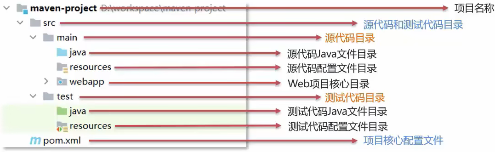
* 提供了一套标准化的构建流程（提供了一套简单的命令来完成项目的构建）。

* 提供了一套依赖管理机制，使用标准的坐标配置来管理各种依赖。
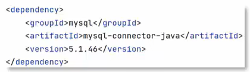

> Maven 模型

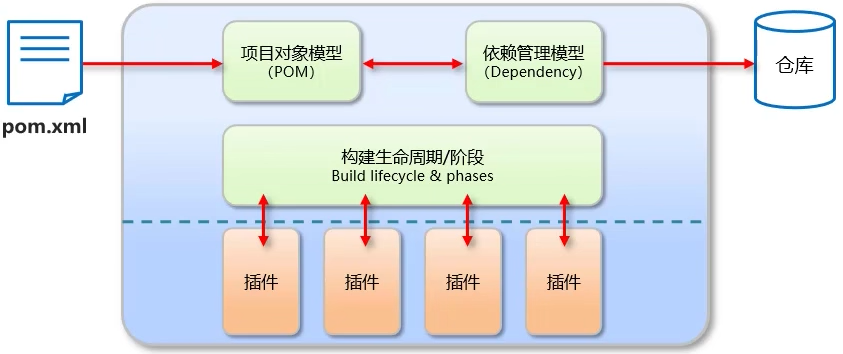

> Maven 仓库

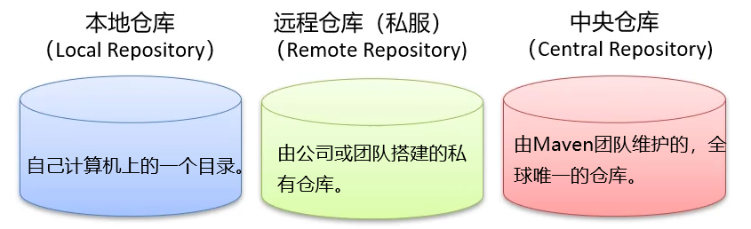

## 1.安装配置

> 环境变量

* 创建环境变量： `MAVEN_HOME = Maven 安装目录`
* 在环境变量 PATH 中添加一项： `$MAVEN_HOME/bin`

> conf/settings.xml

```xml
<!-- 在 settings 标签下加入，指定本地仓库的位置 -->
<localRepository>某个位置</localRepository>

<!-- 在 mirrors 标签下加入，阿里云远程仓库 -->
<mirror>
	<id>alimaven</id>
	<mirrorOf>central</mirrorOf>
	<name>aliyun maven</name>
	<url>http://maven.aliyun.com/nexus/content/groups/public/</url>
</mirror>
```

## 2.基本使用

> Maven 提供的命令，先进入 pom.xml 配置文件所在的目录

```sh
# 编译
mvn compile

# 清理
mvn clean

# 打包
mvn package

# 测试
mvn test

# 安装，把生成的 jar 包安装到本地仓库
mvn install
```

> Maven 项目的生命周期分为 3 套

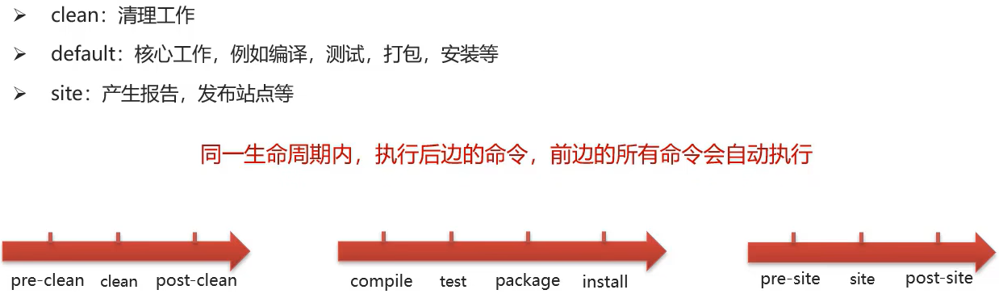

> Maven 坐标

&emsp;&emsp;坐标，即 Maven 中资源的唯一标识。我们使用坐标来定义项目或引入项目中需要的依赖。

* groupId：定义当前 Maven 项目隶属组织名称
* artifactId：定义当前 Maven 项目（模块）名称
* version：定义当前项目版本号

```xml
<!-- 定义当前项目 -->
<groupId>com.itheima</groupId>
<artifactId>maven-demo</artifactId>
<version>1.0-SNAPSHOT</version>

<!-- 解决依赖 -->
<dependency>
	<groupId>com.itheima</groupId>
	<artifactId>maven-demo</artifactId>
	<version>1.0-SNAPSHOT</version>
</dependency>
```

> 依赖管理

* 引入 jar 包

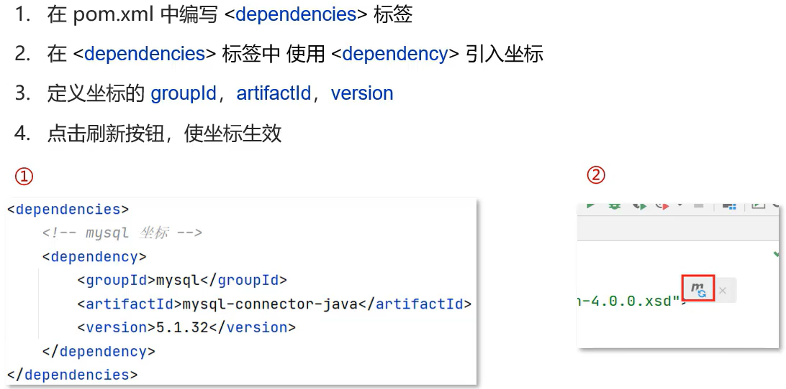

* 搜索本地 jar 包，自动引入

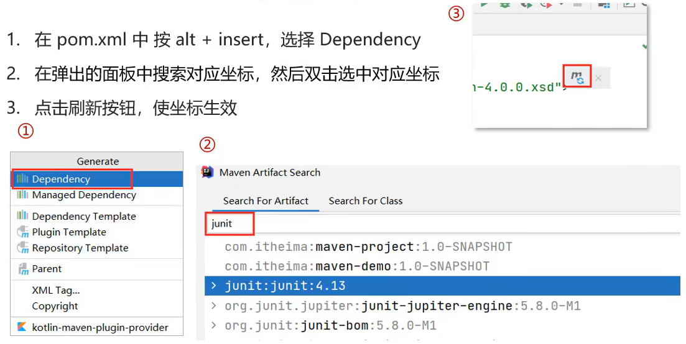

* 配置自动生效


> 依赖范围

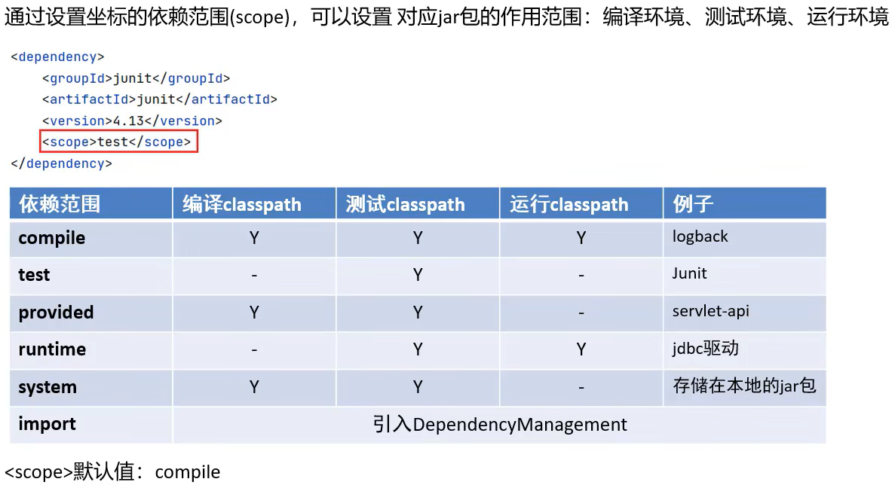

# 三、Mybatis

&emsp;&emsp;Mybatis 是一款优秀的**持久层框架**，用于简化 JDBC 开发。

## 1.MybatisDemo

> 写入依赖坐标到 pom.xml 配置文件，并同步这些依赖

```xml
<?xml version="1.0" encoding="UTF-8"?>  
<project xmlns="http://maven.apache.org/POM/4.0.0"  
         xmlns:xsi="http://www.w3.org/2001/XMLSchema-instance"  
         xsi:schemaLocation="http://maven.apache.org/POM/4.0.0 http://maven.apache.org/xsd/maven-4.0.0.xsd">  
    <modelVersion>4.0.0</modelVersion>  
  
    <groupId>org.example</groupId>  
    <artifactId>mybatis-demo</artifactId>  
    <version>1.0-SNAPSHOT</version>  
  
    <properties>  
        <maven.compiler.source>8</maven.compiler.source>  
        <maven.compiler.target>8</maven.compiler.target>  
        <project.build.sourceEncoding>UTF-8</project.build.sourceEncoding>  
    </properties>  
  
    <dependencies>
	    <!-- mybatis 核心依赖 -->
        <dependency>  
            <groupId>org.mybatis</groupId>  
            <artifactId>mybatis</artifactId>  
            <version>3.5.5</version>  
        </dependency>
        <dependency>  
            <groupId>mysql</groupId>  
            <artifactId>mysql-connector-java</artifactId>  
            <version>8.0.26</version>  
        </dependency>
        <dependency>  
            <groupId>junit</groupId>  
            <artifactId>junit</artifactId>  
            <version>4.13</version>  
            <scope>test</scope>  
        </dependency>  
		<!-- 添加 slf4j日志api -->  
        <dependency>  
            <groupId>org.slf4j</groupId>  
            <artifactId>slf4j-api</artifactId>  
            <version>1.7.20</version>  
        </dependency>  
		<!-- 添加logback-classic依赖 -->  
        <dependency>  
            <groupId>ch.qos.logback</groupId>  
            <artifactId>logback-classic</artifactId>  
            <version>1.2.3</version>  
        </dependency>  
		<!-- 添加logback-core依赖 -->  
        <dependency>  
            <groupId>ch.qos.logback</groupId>  
            <artifactId>logback-core</artifactId>  
            <version>1.2.3</version>  
        </dependency>  
    </dependencies>  
</project>
```

> 在 resources 目录下，编写 Mybatis 核心配置文件 mybatis-config.xml

```xml
<?xml version="1.0" encoding="UTF-8" ?>  
<!DOCTYPE configuration PUBLIC "-//mybatis.org//DTD Config 3.0//EN" "http://mybatis.org/dtd/mybatis-3-config.dtd">  
<configuration>  
    <environments default="development">  
        <environment id="development">  
            <transactionManager type="JDBC"/>  
            <dataSource type="POOLED">
                <!--数据库的连接信息-->
                <property name="driver" value="com.mysql.cj.jdbc.Driver"/>
                <property name="url" value="jdbc:mysql://127.0.0.1:3306/mybatis?allowPublicKeyRetrieval=true&amp;useSSL=false"/>
                <property name="username" value="root"/>
                <property name="password" value="123456"/>
            </dataSource>
        </environment>
    </environments>
    <!--加载SQL的映射文件-->
    <mappers>
        <mapper resource="UserMapper.xml"/>
        <mapper resource="org/example/mapper/UserMapper.xml" />
    </mappers>
</configuration>
```

> 在 resources 目录下，编写 logback 配置文件 logback.xml

```xml
<?xml version="1.0" encoding="UTF-8"?>  
  
<!-- 配置文件修改时重新加载，默认true -->  
<configuration scan="true">  
  
    <!--定义日志文件的存储地址 勿在 LogBack 的配置中使用相对路径-->  
    <property name="CATALINA_BASE" value="**/logs"></property>  
  
    <!-- 控制台输出 -->  
    <appender name="CONSOLE" class="ch.qos.logback.core.ConsoleAppender">  
        <encoder charset="UTF-8">  
            <!-- 输出日志记录格式 -->  
            <pattern>%d{yyyy-MM-dd HH:mm:ss.SSS} [%thread] %-5level %logger{36} - %msg%n</pattern>  
        </encoder>  
    </appender>  
  
    <!-- 第一个文件输出,每天产生一个文件 -->  
    <appender name="FILE1" class="ch.qos.logback.core.rolling.RollingFileAppender">  
        <rollingPolicy class="ch.qos.logback.core.rolling.TimeBasedRollingPolicy">  
            <!-- 输出文件路径+文件名 -->  
            <fileNamePattern>${CATALINA_BASE}/aa.%d{yyyyMMdd}.log</fileNamePattern>  
            <!-- 保存30天的日志 -->  
            <maxHistory>30</maxHistory>  
        </rollingPolicy>  
        <encoder charset="UTF-8">  
            <!-- 输出日志记录格式 -->  
            <pattern>%d{yyyy-MM-dd HH:mm:ss.SSS} [%thread] %-5level %logger{36} - %msg%n</pattern>  
        </encoder>  
    </appender>  
  
    <!-- 第二个文件输出,每天产生一个文件 -->  
    <appender name="FILE2" class="ch.qos.logback.core.rolling.RollingFileAppender">  
        <file>${CATALINA_BASE}/bb.log</file>  
        <rollingPolicy class="ch.qos.logback.core.rolling.TimeBasedRollingPolicy">  
            <fileNamePattern>${CATALINA_BASE}/bb.%d{yyyyMMdd}.log</fileNamePattern>  
            <maxHistory>30</maxHistory>  
        </rollingPolicy>  
        <encoder charset="UTF-8">  
            <pattern>%d{yyyy-MM-dd HH:mm:ss.SSS} [%thread] %-5level %logger{36} - %msg%n</pattern>  
        </encoder>  
    </appender>  
  
    <appender name="CUSTOM" class="ch.qos.logback.core.rolling.RollingFileAppender">  
        <file>${CATALINA_BASE}/custom.log</file>  
        <rollingPolicy class="ch.qos.logback.core.rolling.TimeBasedRollingPolicy">  
            <!-- daily rollover -->  
            <fileNamePattern>${CATALINA_BASE}/custom.%d{yyyy-MM-dd}.log</fileNamePattern>  
            <!-- keep 30 days' worth of history -->  
            <maxHistory>30</maxHistory>  
        </rollingPolicy>  
        <encoder charset="UTF-8">  
            <pattern>%d{yyyy-MM-dd HH:mm:ss.SSS} [%thread] %-5level %logger{36} - %msg%n</pattern>  
        </encoder>  
    </appender>  
  
    <!-- 设置日志输出级别 -->  
    <root level="ERROR">  
        <appender-ref ref="CONSOLE" />  
    </root>
    <logger name="file1" level="DEBUG">  
        <appender-ref ref="FILE1" />  
    </logger>
    <logger name="file1" level="INFO">  
        <appender-ref ref="FILE2" />  
    </logger>
    <!-- 自定义logger -->  
    <logger name="custom" level="INFO">  
        <appender-ref ref="CUSTOM" />  
    </logger>
</configuration>
```

> 在 resources 目录下，编写 SQL 映射文件 UserMapper.xml

```xml
<?xml version="1.0" encoding="UTF-8" ?>  
<!DOCTYPE mapper  
        PUBLIC "-//mybatis.org//DTD Mapper 3.0//EN"  
        "http://mybatis.org/dtd/mybatis-3-mapper.dtd">  
<mapper namespace="test">  
    <select id="selectAll" resultType="org.example.pojo.User">  
        select * from t_user;    </select>  
</mapper>
```

> 编写 Java 代码 MyBatisDemo.java

```java
import org.apache.ibatis.io.Resources;  
import org.apache.ibatis.session.SqlSession;  
import org.apache.ibatis.session.SqlSessionFactory;  
import org.apache.ibatis.session.SqlSessionFactoryBuilder;  
import org.example.pojo.User;  
  
import java.io.IOException;  
import java.io.InputStream;  
import java.util.List;

public class MyBatisDemo {  
    public static void main(String[] args) throws IOException {  
        //获取SqlSessionFactory对象  
        String resource = "mybatis-config.xml";  
        InputStream inputStream = Resources.getResourceAsStream(resource);  
        SqlSessionFactory sqlSessionFactory = new SqlSessionFactoryBuilder().build(inputStream);  
        
        //获取SqlSession对象，用它来执行sql  
        SqlSession sqlSession = sqlSessionFactory.openSession();  
        
        //执行sql
        List<User> users = sqlSession.selectList("test.selectAll");  
        
        //输出执行结果
        System.out.println(users);  
        
		//关闭连接
        sqlSession.close();  
    }  
}
```

## 2.Mapper 代理开发

&emsp;&emsp;以上 Demo 的 Java 代码中仍然存在硬编码的问题。 我们可以通过使用 Mapper 代理的方法，彻底地解决这个问题。

> 定义与 SQL 映射文件同名的 Mapper 接口，并且将 Mapper 接口和映射文件放置在同一目录下。

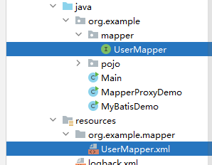

> 设置 SQL 映射文件的 namespace 属性为 Mapper 接口全限定名。

```xml
<mapper namespace="org.example.mapper.UserMapper">  
    <select id="selectAll" resultType="org.example.pojo.User">  
        select * from t_user;
    </select>
</mapper>
```

> 在 Mapper 接口中定义方法，方法名就是 SQL 映射文件中 sql 语句的 id，并保持参数类型和返回值类型与 SQL 映射文件中的一致。

```xml
package org.example.mapper;

import org.example.pojo.User;
import java.util.List;

public interface UserMapper {  
    List<User> selectAll();  
}
```

> 在 mybatis-config.xml 中配置映射文件位置

```xml
<mappers>
    <mapper resource="org/example/mapper/UserMapper.xml" />
</mappers>
```

> 编码

```java
package org.example;  
  
import org.apache.ibatis.io.Resources;  
import org.apache.ibatis.session.SqlSession;  
import org.apache.ibatis.session.SqlSessionFactory;  
import org.apache.ibatis.session.SqlSessionFactoryBuilder;  
import org.example.mapper.UserMapper;  
import org.example.pojo.User;  
  
import java.io.IOException;  
import java.io.InputStream;  
import java.util.List;  
  
//Mapper 代理  
public class MapperProxyDemo {  
    public static void main(String[] args) throws IOException {  
        //获取SqlSessionFactory对象
        String resource = "mybatis-config.xml";  
        InputStream inputStream = Resources.getResourceAsStream(resource);  
        SqlSessionFactory sqlSessionFactory = new SqlSessionFactoryBuilder().build(inputStream);  
  
        //获取SqlSession对象，用它来执行sql  
        SqlSession sqlSession = sqlSessionFactory.openSession();  
  
        UserMapper userMapper = sqlSession.getMapper(UserMapper.class);  
        List<User> users = userMapper.selectAll();  
  
        System.out.println(users);  
  
        sqlSession.close();  
    }  
}
```

## 3.Mybatis 核心配置文件 mybatis-config.xml

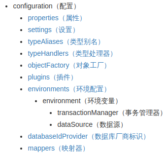

注意：配置文件中**各个配置项的先后顺序绝对不能颠倒**（xml约束）。

> environments：配置数据库的连接环境信息，可以配置多个environment，通过 default 属性切换不同的 environment

```xml
    <environments default="development">  
        <environment id="development">  
	        <!-- 事务管理 -->
            <transactionManager type="JDBC"/>
            <!-- 数据库连接池 -->
            <dataSource type="POOLED">  
                <!--数据库的连接信息-->  
                <property name="driver" value="com.mysql.cj.jdbc.Driver"/>  
                <property name="url" value="jdbc:mysql://127.0.0.1:3306/mybatis?allowPublicKeyRetrieval=true&amp;useSSL=false"/>  
                <property name="username" value="root"/>  
                <property name="password" value="123456"/>  
            </dataSource>  
        </environment>  
    </environments>
```

> mappers：注册映射文件

```xml
<mappers>
	<mapper resource="org/example/mapper/UserMapper.xml" />
</mappers>
```

> typeAlias：类型别名

```xml
<typeAlias>
	<packages name="com.itheima.pojo">
</typeAlias>
```

## 4.解决：数据库中的列名和实体的属性名不一致。

```xml
<!--
	有两个属性
    id: 唯一标识  
    type：映射的类型  
-->  
<resultMap id="brandResultMap" type="org.example.pojo.Brand">  
    <!--  
        有两种子标签  
        id：完成主键字段映射  
        result：完成一般字段的映射  
    -->  
    <result column="brand_name" property="brandName" />  
    <result column="company_name" property="companyName" />  
</resultMap>
```

## 5.参数传递

> 单个参数

* 接口

```java
public interface BrandMapper {  
    List<Brand> selectById(Integer id);  
}
```

* 对应的 Mapper 配置项

```xml
<!--两种参数占位符
	#{} 会将参数替换为 ? ，不会存在 SQL 注入问题，传递参数时使用
	${} 拼字符串，会存在 SQL 注入问题，在表名或列名不固定的情况下使用
-->
<select id="selectById" resultMap="brandResultMap">  
    select * from t_brand where id = #{id};
</select>
<!-- 参数的类型 parameterType 可以省略 -->
<!-- sql 中的特殊字符
	转义字符： &lt;
	CDATA区：<![CDATA[<]]>
	CDATA中的内容都被作为普通字符处理
-->
```

> 多个参数

```xml
<select id="selectByCondition" resultType="org.mybatis.demo.pojo.Brand">
	select * 
	from t_brand
	where 
		status = #{status}
		and company_name like #{companyName}
		and brand_name like #{brandName};
</select>
```

* 散装参数

```java
List<Brand> selectByCondition(@Param("status")int status,@Param("companyName")String companyName,@Param("brandName")String brandName);
//Param注解中的字符串与 sql 中的占位符必须分别对应一致
```

* 传递 Brand 实体

```java
List<Brand> selectByCondition(Brand brand);
//要求实体的各个属性的名称与 sql 中占位符的名称必须一致
```

* 传递 Map 集合

```java
//接口方法
List<Brand> selectByCondition(Map map);

//构造 map，要保证 map 中键的名称与 sql 中对应的占位符的名称保持一致
Map map = new HashMap();
map.put("status",status);
map.put("companyName",companyName);
map.put("brandName",brandName);

//调用查询
List<Brand> brands = brandMapper.selectByCondition(map);
```

## 6.动态条件查询


## 7.注解开发


# 四、使用 HTTP 协议


