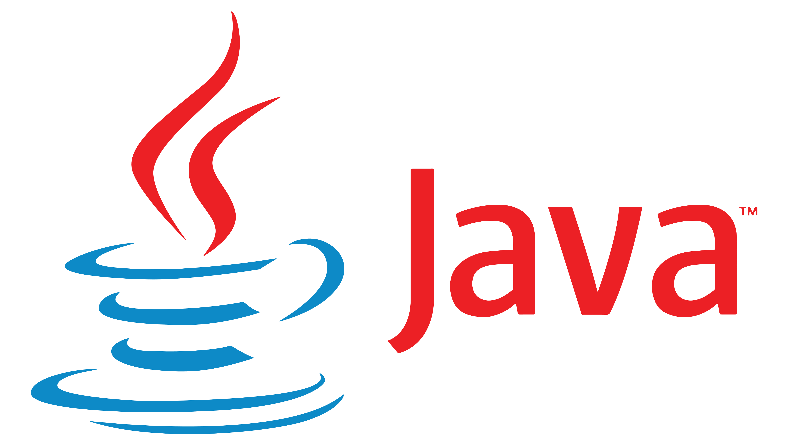

# Java语言程序设计

 

## 一、Java基础语法

### 1.Hello,World

```java
public class Hello{
    public static void main(String[] args){
        System.out.println("Hello,World!");
    }
}
```

#### （1）注释

```Java
//单行注释
/*
    多行
    注释
    多行注释不允许嵌套
*/
/**
    文档
    注释
    命令：javadoc -d dir_name -author -version hello.java  自动生成程序的帮助文档
*/
```

#### （2）标识符的命名

* 标识符命名规则
	* 只能由26个英文字母大小写、0-9、\_或$组成，且不能以数字开头
	* 不能是关键字或保留字，但是可以包含关键字或保留字
	* Java严格区分大小写，不限制标识符的长度，但是标识符内不能包含空格
* 标识符命名规范（推荐但不强制）
	* 包名：多单词组成时所字母都小写
	* 类名、接口名：多单词组成时每个单词的首字符大写
	* 变量名、方法名：多单词组成时，除第一个单词之外每一个单词的首字母都大写
	* 常量名：每一个字母都大写，多单词时每个单词之间用_连接
* 注意：一般情况下，**Java项目中类的包名不能以java.开头**，否则执行时就会抛出异常

### 2.数据类型

#### （1）变量

> 变量：其实就是内存中的一段存储区域，能够在同一个范围内不断变化，是程序的最基本的存储单元
* Java中的变量必须在声明之后使用，因为只有声明后这个变量才会在内存中被加载
* **局部变量声明之后不会被自动初始化**，因此局部变量在使用之前必须先进行显式初始化（赋初值）
* 变量都是定义在其作用域内的，只在这个作用域内有效，其作用域就是声明这个变量时所在的大括号内
* 同一个作用域内不可以声明两个同名的变量，同一个变量不可以在同一个作用域内多次定义
> 变量的分类
* 局部变量：定义在方法的形参列表或方法体内的变量
* 成员变量（属性）：定义在类的{&emsp;}内部的变量
> 成员变量 VS 局部变量
* 相同点
  * 定义变量的格式相同：数据类型 变量名 = 变量值;
  * 都要求先声明，后使用
  * 两种变量都有其对应的作用域
* 不同点
  * 在类中声明的位置不同——成员变量直接定义在类的{&emsp;}内；局部变量声明在方法内、方法形参、代码块内、构造器形参和构造器内
  * 关于权限修饰符——成员变量可以在声明时通过使用权限修饰符，指明其权限；局部变量不可以使用权限修饰符
  * 默认初始化值的情况——成员变量，根据其数据类型都有对应的默认初始化值；局部变量没有默认初始化值，我们在调用局部变量之前一定要显式赋值（形参在调用时赋值即可）
  * 在内存中加载的位置——非static的成员变量加载到堆空间中，static的成员变量加载到方法区；局部变量都加载到栈空间

#### （2）基本数据类型

> 数值型：
* 整数类型：`byte`（1个字节）、`short`（2个字节）、`int`（4个字节）、`long`（8个字节）
  * int是Java中整型数据的默认存储方式，整型的立即数值默认是int类型
  * 可以通过在立即数值的最后加上后缀（-L或-l）来指定该立即数值的数据类型为long
* 浮点类型：`float`（4个字节）、`double`（8个字节）
  * double是Java中浮点型数据的默认存储方式，浮点型的常量数值默认是double类型，所以在使用立即数常量为float型变量赋值时必须在数值的末尾加上后缀（-F或-f）
  * 浮点型数据可以利用’e’作为科学计数法中的’10’后面跟’10’的次数，来使用科学计数法的表示数值
* 注意：
	* 如果程序中给一个基本数据类型变量的值超过其数据类型的存储范围，则**编译不过** 
	* Java中并不存在所谓的无符号数
> 字符型：
* `char`(2个字节)
* `char c1 = ‘a’;`
* 注意：
	* java采用unicode编码，支持汉字、单位、数字等各种字符
	* 表示字符常量的**单引号内必须有且只有一个字符**，该字符可以是一个空格，但是**不能什么都没有，也不能有超过1个字符**，否则编译报错
	* 可以使用转义字符'\n'、'\t'等
> 布尔型
* `boolean`
* boolean类型的变量只能取两个值之一：**true** 或 **false**
* boolean类型在内存中所占的存储空间大小并没有明确的规定

#### （3）引用数据类型

* 类：`class`
* 接口：`interface`
* 数组：`[ ]`
* 注意：
	* 字符串类型（String）实际上属于类类型，也就属于引用类型
	* 引用类型的变量，只可能存储两类值：**null** 或 **地址值**

#### （4）不同基本数据类型变量之间的运算

> 自动数据类型转换：**容量较小的数据类型的数据**与**容量较大的数据类型的数据**做运算时，运算的结果**自动提升为容量较大的那个数据的数据类型**。
* 容量从小到大排序：**（byte 、char、 short） < int < long < float < double**
* 注意
	* 此处的容量大小是指**能够表示的数值范围的大小**，而不是占用的内存空间的大小
	* 当byte、char、short三个类型的变量之间进行运算时，**结果的类型都一定会是int**，这三种类型各自同类型之间进行运算时也是这样
> 强制数据类型转换
* double doubleVar = 12.9;
* int intVar = (int)doubleVar;
* 注意：
	* 浮点型向整形强制类型转换，采用的是**直接截取浮点数整数部分的方式（俗称“截断操作”）**，而不是四舍五入，转换之后数据的精度可能会降低，称为精度损失
	* 变量向数值范围不够的数据强制类型转换，并不会造成编译报错

#### （5）String变量的使用

* String属于引用数据类型
```Java
//习惯写法
String stringVar = "HelloWorld";

//完整写法
String stringVar = new String("HelloWorld");

//打印输出字符串
System.out.println(stringVar);
```
* 提取一个字符串中的某个字符：
```Java
char charVar_1 = stringVar.charAt(0);
char charVar_2 = stringVar.charAt(1);
char charVar_3 = stringVar.charAt(2);
char charVar_4 = stringVar.charAt(3);
char charVar_5 = stringVar.charAt(4);
```
* String类型值的**双引号内可以有一个或多个字符，也可以什么都没有**
* String可以分别和8种基本的数据类型进行运算，但是都只能是字符串的拼接运算

### 3.运算符

#### （1）算术运算符

|运算符   |   运算     |        范例        |     结果      |
|--------|------------|--------------------|---------------|
|   +    |    正号    |         +3         |       3       |
|   -    |    负号    |     b = 4; - b     |      -4       |
|   +    |     加     |        5+5         |      10       |
|   -    |     减     |       6 - 4        |       2       |
|   *    |     乘     |       3 * 4        |      12       |
|   /    |     除     |       5 / 5        |       1       |
|   %    |    取模    |       7 % 5        |       2       |
|   ++   |    自增    |  var = 10; var++   |      11       |
|   --   |    自减    |  var = 10; var--   |       9       |
|   +    | 字符串拼接 | "hello," + "world" | "hello,world"  |
* 整数间做除法运算会得到商，即整数之间的除法运算的结果只能是整数（就是**把实际运算结果的小数点及小数点后面的全部去掉**），并不能得到精确的结果
* 如果想要**通过整数之间的除法得到精确的结果**，那么就需要在运算之前对参加运算的整数进行手动的类型提升
* 整数间做取模运算得到余数，**结果的符号与被模数保持一致**
* 自增自减运算符
	* 左自增和左自减是在变量发挥作用之前使得变量的值增加或减去1
	* 右自增和右自减是在变量发挥作用之后使得变量的值增加或减去1
	* 最后的结果，变量的值都会增加或减去1
	* 自增与自减不会改变变量本身的数据类型

#### （2）赋值运算符

|  符号   |    运算   |        范例        |     结果      |
|--------|-----------|--------------------|----------------|
|   +    |    正号    |         +3         |       3       |
|   +=   |    负号    |     b = 4; - b     |      -4       |
|   -=   |     加     |        5+5         |      10       |
|   =    |     乘     |       3 * 4        |      12       |
|   %=   |     除     |       5 / 5        |       1       |
|   \*=   |     减     |       6 - 4        |       2       |
* 当赋值运算符两端数据类型不一致时，可以使用自动类型转换或强制类型转换原则进行处理
* 赋值运算表达式的返回值（运算结果）就是赋值号所传递的那个值，所以**赋值运算支持连续赋值**

#### （3）比较运算符

> 比较运算符： \>  <  ==  !=  >=  =<  instanceof( )
* 比较运算符的运算结果只能是布尔类型的值（**true**、**false**）
* `==` 运算符判断两个变量是否相等
  * 对于基本数据类型
  * 对于引用数据类型

#### （4）逻辑运算符

|  符号  |     运算     |        范例        |     结果      |
| ------ | ------------|--------------------|---------------|
|   &    |    逻辑与    |         +3         |       3       |
|   \|    |    逻辑或    |     b = 4; - b     |      -4       |
|   !    |    逻辑非    |        5+5         |      10       |
|   &&   |    短路与    |       6 - 4        |       2       |
|  \|\|  |    短路或    |       3 * 4        |      12       |
|    ^   |    逻辑异或  |       5 / 5        |       1       |
* 逻辑运算符只能对布尔型变量进行操作
* 短路就意味着如果仅凭运算符前面的表达式就可以准确得出本次逻辑运算的结果，那么就**不会再执行运算符右侧的表达式**来获得该表达式的返回值再用于逻辑判断
* 在实际开发之中一般优先使用短路

#### （5）位运算符

|运算符 |操作      |
|------|----------|
| \<<   | 左移     |
| \>>   | 右移     |
| \>\>>  | 无符号右移|
|  &   | 与运算    |
|  \|   | 或运算    |
|  ^   | 异或运算  |
|  ~   | 取反运算  |

#### （6）三元运算符 

* **(条件表达式) ? 表达式1 : 表达式2**
* 如果条件表达式的值为true则执行表达式1，否则执行表达式2
* 条件表达式的结果为布尔类型的值

#### （7）运算符优先级

### 4.流程控制

#### （1）if—else分支

* 结构1：
```java
if(条件表达式){
  程序语句块1;
}
```
* 结构2：
```java
if(条件表达式){
  程序语句块1;
}else{
  程序语句块2;
}
```
* 结构3：
```java
if(条件表达式1){
  程序语句块1;
}else if(条件表达式2){
  程序语句块2;
}else{
  程序语句块3;
}
```
* 注意事项：
	* else结构是可选的
	* 如果多个条件表达式之间是 “互斥的关系”（或没有交集的关系），那个判断或执行语句声明在上面还是下面，是无所谓的

#### （2）switch—case分支

```java
switch(表达式){
  case 常量1: 当条件表达式的值为常量1时执行的语句;break;
  case 常量2: 当条件表达式的值为常量2时执行的语句;break;
  .
  .
  .
  case 常量N: 当条件表达式的值为常量1时执行的语句;break;
  default: 当条件表达式的值不是以上的任何一个常量值时执行的语句;
}
```
* 如果想要实现多选一的操作，那么应该在每一个case中都使用break;语句
* 表达式的值**只能是这6种类型之一**：byte、short、char、int、枚举类型(JDK5.0开始枚举类型才允许作为表达式)、String类型(JDK7.0开始String类型才允许作为表达式)
* case关键字后面绝对**禁止写范围**
* default结构是可选的，可以选择不写
* 如果结构中的多个case的执行语句相同，则可以考虑合并
* 同一个结构中不同的case下**不可以重复定义同名的变量**

#### （3）循环结构

* for循环
```java
for(初始化条件;循环条件;迭代条件){
    循环体;
}
```
* while循环
```java
while(条件表达式){
    程序语句块;
}
```
* do-while循环
```java
do{
  循环体;
  迭代条件;
}while(循环条件);
//循环体至少会被执行一次
```
* 特殊关键字的使用
	* break：用于switch-case结构和循环结构，作用是**直接跳出所处的switch语句或立即结束当前循环**
	* continue：仅用于循环结构，作用是**立即结束当前循环并直接开始下一次循环**
	* 这两个关键字语句的后面**都不能有需要执行的语句**
* 说明：
	* for循环和while循环完全可以相互转化
	* for循环和while循环的初始化条件的作用范围不一样
		* for循环：初始化条件只在循环内有效
		* while循环：可以对循环控制变量在整个程序范围内产生影响（因为其循环控制变量是在循环结构外部定义的，其生命周期为从变量生命声明开始到整个方法体的末尾结束）
	* 结束循环的方法
		* 在循环体内执行break;语句
		* 使循环条件为false
	* 嵌套循环：将一个循环结构A声明在另一个循环结构B的循环体中
		* A称为内层循环，B称为外层循环
		* 内层循环遍历1遍，则外层循环执行一次

### 5.数组

#### （1）关于Java数组

* 数组属于引用数据类型，数组的元素既可以是基本数据类型也可以是引用数据类型。
* 创建数组对象会在内存中开辟一整块连续空间，而数组名中引用的是这块连续空间的首地址。
* Java数组的长度一旦确定，就不能修改。
* 数组的分类: 
	* 按照维度&emsp;一维数组、二维数组、三维数组......
	* 按照数据类型&emsp;基本数据类型元素的数组、引用数据类型元素的数组（即对象数组）

#### （2）一维数组的使用

* 声明和初始化
```java
//声明：
int[] arrayVar;

//声明并初始化：
int[] arrayVar = new int[]{1123,3432,34343,23232};//静态初始化，数组的初始化和数据元素的赋值同时进行
int[] arrayVar = new int[4];//动态初始化，数组的初始化和数据元素的赋值分开进行

/*注意事项：
	1.声明并初始化操作，只有上面的两种情况是正确的，不能把两种方式混合在一起使用
	2.数组一旦初始化完成，其长度就确定了，再也不能更改
*/
```
* 调用指定位置的元素
```java
arrayVar[0] = 10;
arrayVar[1] = 20;
arrayVar[2] = 30;

/*注意事项：
	1.数组的下标是从 0 开始的，到 “数组的长度-1” 结束
	2.如果访问数组元素的角标超出 “数组的长度-1” 时，编译时不会报错，但是运行时会报错
*/
```
* 获取数组长度
```java
//数组有一个属性叫做length，表示当前这个数组的长度
System.out.println("arrayVar.length");//打印出数组的长度
```
* 遍历数组
```Java
for(int i=0;i < arrayVar.length;i++){
	visit(arrayVar[i]);
}
```
* 不同数据类型数组元素的默认初始化值
	* 整型：0
	* 浮点型：0.0
	* 字符型：0或\u0000而非'0'，输出时空格效果，但是实际上并非空格
	* 布尔类型：false
	* 字符串型：null（而**不是"null"**，包括字符串型数据元素在内的**所有引用类型的数据元素的默认初始化值都是null**）
* 内存解析  
&emsp;&emsp;作为局部变量的数组名变量存储在栈(stack)中，数组的数据元素存储在堆里组成一段连续的内存空间。数组名变量通过指向这段连续的内存空间首地址值，而与这段内存空间产生联系。  
&emsp;&emsp;对于一个已经经过了初始化了的数组名变量，它原先关联于一段内存空间A，我们再开辟一段新的内存空间B，并将它赋值给这个数组名变量，那么这个数组名变量就会关联于这段新的内存空间B，而不再关联于原来的那一段内存空间A，B中的数组元素可以通过这个数组名调用，A中的数组元素不再能通过这个数组名进行调用，这段内存空间A就会是一段没有被指针指向的内存空间也就成为了垃圾，从而会在某一个不确定的时间被Java的垃圾回收机制自动销毁。

#### （3）二维数组的使用

> &emsp;&emsp;**数据元素的数据类型为数组的数组**称为二维数组。其本质上是一维数组A作为另一个一维数组B的元素而存在，从Java数组底层的运行机制来看，其实并没有什么多维数组。
* 声明和初始化
```Java
//声明：
int[][] arrayVar;

//静态初始化：
int[][] arrayVar = new int[][]{{1,3,2,1},{3,42,1,2,23},{1,2},{2,5,5}}; // 正确

//动态初始化:
	//二维数组每个子数组的长度可以互不相同
	//二维数组在进行动态初始化时子数组的长度可以不指定，但是必须指定外层数组的数组长度
int[][] arrayVar = new int[3][];  //正确
int[][] arrayVar = new int[][4];  //错误
```
* 调用数组的指定位置的元素
```Java
//调取外层数组元素：
arrayVar[行下标];

//调取内层数组元素：
arrayVar[行下标][列下标];
```
* 通过length属性获取数组的长度
  * 二维数组的数组名变量的length属性存储的是外层数组的数组长度，与内层数组无关
  * 因为二维数组在本质上是数据元素为一个又一个数组名变量的一维数组，所以二维数组的长度指的就是这个二维数组的外层数组的长度，而**不是指其所能存储的数据元素的最大个数**。 
* 数组元素的遍历
```Java
//使用二层嵌套循环结构
```
* 二维数组元素的默认初始化值
	* 情况一：指定了内层数组的长度
		* 外层数组元素：地址值
			* \[I@7ea987ac : 1个"\["代表这是一个一维数组，@后面就是16进制形式的地址值
			* \[\[I@12a3a380 ：2个"\["代表这是一个二维数组，@后面就是16进制形式的地址值
		* 内层数组元素：默认初始化值的情况与一维数组元素的默认初始化值的情况一致
	* 情况二：未指定内层数组的长度
		* 外层数组元素：null，无论是什么类型的二维数组，只要内层数组的长度在数组初始化时没有指定，那么外层数组的默认初始化值就一定是null
		* 内层数组元素：没有默认初始化值，不能调用，强行使用的话，编译不会报错，但是执行会报错：使用了一个空指针
* 二维数组的内存解析
  * 静态初始化
  * 动态初始化

声明了一个二维数组名变量之后

#### （4）Arrays工具类的使用：

```Java
import java.util.Arrays;

boolean equalsJudge = Arrarys.equals(arraysVar_1,arrayVar_2);
//比较两个数组是否相同，相同则返回true,不相同则返回false

String detials = Arrays.toString(arrayVar);
//输出指定数组内的所有元素

Arrays.fill(arrayVar,10);
//把指定数组中的所有元素都替换成10

Arrays.sort(arrayVar);
//实现将数组内的元素从左到右按照从小到大进行排列

int index = Arrays.binarySearch(arrayVar,23);
//二分法查找，只针对于有序的数组，输出所查的元素的对应的角标，如果说这个数组内存在多个相同的目标值则会返回最左侧的目标值的地址，如果数组内没有目标值则会返回一个负数
```

#### （5）数组常见异常：

* 数组下标越界：ArrayIndexOutOfBoundsExcetion
```Java
int[] arrayVar =  new int[10];
System.out.println(arrayVar[10]);
```
* 空指针异常：NullPointerException
```Java
//情况一：
int[] arrayVar = new int[]{1,2,3};
arrayVar[0] = null;
System.out.println(arrayVar[0]);

//情况二：
int[][] arrayVar = new int[4][];
System.out.println(arrayVar[0][0]);

//情况三：
String[] arrayVar = new String[]{"AA","BB","CC"};
arrayVar[0] = null;
System.out.println(arrayVar[0].toString());
```

## 二、Java面向对象

> 学习面向对象的三大主线
* Java类及类的成员：**属性**、**方法**、**构造器**；代码块、内部类
* 面向对象的三大特征：封装性、继承性、多态性（、抽象性）
* 其它关键字：this、super、static、final、abstract、interface、package、import等

### 1.Java基本元素：类和对象

#### （1）类的设计，也就是对类的成员的设计

```java
class TestClass{
	//属性（成员变量、field、域、字段）
	String field1;
	int field2;

	//方法（成员方法、函数、method）
	public void method1(){
		System.out.println("这是方法1");
	}
	public void method2(){
		System.out.println("这是方法2");
	}
}
```
|属性的数据类型                |默认初始化值   |
|-----------------------------|--------------|
|整型（byte、short、int、long）|0             |
|浮点型（float、double）       |0.0           |
|字符型（char）                |0（或'\u0000'）|
|布尔型（boolean）             |false          |
|引用数据类型（类、数组、接口）  |null          |

#### （2）类和对象的使用

```java
public class OOPTest{
	public static void main(String[] args){
		//创建TestClass的对象，即实例化TestClass类，也就是对TestClass类的实例化
		TestClass testObject = new TestClass();

		//访问TestClass类中的属性
		testObject.field1 = "hello,object";
		testObject.field2 = 20;

		//调用TestClass类中的方法
		testObject.method1();
		testObject.method2();
	}
}
```

#### （3）对象的内存解析
 

* 如果创建了同一个类的多个对象，那么**每个对象都独立的拥有一套类的非 static 属性**，不同对象的非static属性之间**互不影响**
* 对象变量中存放的是一个地址值，可以理解为是**指向存储在堆空间中的对象的实际存储位置的一个指针**

#### （4）匿名对象的使用

> 在Java语言中，我们创建对象时可以**不显式地赋给它一个变量名**，即匿名对象。
```java
public class OOPTest{
	public void static void main(String[] args){
		new TestClass().field1 = "你好，对象";
		new TestClass().field2 = 10;
		new TestClass().method1();
		new TestClass().method2();

		//这种用法在开发中使用较多
		testMethod(new TestClass());
	}

	//使用以下方法可以将同一个匿名对象调用多次，但是本质上是给匿名对象起了一个名，转化为了普通的局部变量
	public void testMethod(TestClass testObject){
		//这里的testObject在本质上已经不再是匿名变量
		testObject.field1 = "hello,object";
		testObject.field2 = 20;
		testObject.method1();
		testObject.method2();
	}
}
```
* 匿名对象**只能调用一次**，程序中出现的任意两个同类型的匿名对象都是不同的对象，彼此之间相互独立

#### （5）this关键字的使用

> &emsp;&emsp;代表由该类创建的那个对象本身，可以用来调用类的**属性、方法和构造器**。理解为 “当前对象” 或 “当前正在创建的对象（在构造器中使用时）”。
* this调用属性或方法
  * 在类的方法中，我们可以使用 “this.属性” 或 “this.方法” 的方式，调用当前对象的属性或方法，但是**通常情况下我们都省略 “this.”**；特殊情况下，当方法的形参和类的属性同名时，我们必须显式地使用 “this.变量” 的方式表明此变量是属性，而不是当前方法的形参
  * 在类的构造器中，我们可以使用 “this.属性” 或 “this.方法” 的方式，调用当前正在创建的对象的属性或方法，但是**通常情况下我们都省略 “this.”**；特殊情况下，当构造器的形参和类的属性同名时，我们必须显式地使用 “this.变量” 的方式表明此变量是属性，而不是构造器的形参
* this调用构造器
  * 我们在类的构造器中，可以显式地使用 “this(形参列表)” 的方式，调用本类中指定的**其他构造器**（构造器不能自己调自己）
  * 构造器中**不能**通过 “this(形参列表)” 的方式**调用自己**
  * 如果通过 “this(形参列表)” 的方式调用了类的多个构造器，那么依然**只创建了一个对象**
  * 在创建对象的过程中，类中的每个构造器最多都只能被调用一次，如果一个类中有n个构造器，则最多有n-1个构造器中使用了 “this(形参列表)”
  * 规定：语句 “this(形参列表);” **必须写在当前构造器中的首行**，也就是说，在构造器的内部**最多只能写一个 “this(形参列表);” 语句**，用来调用其他的构造器
```java
class Person{
	private int age;
	private String name;

	public Person(){
		//400行需要执行的代码
	}
	public Person(int age){
		this();//调用本类的空参构造器，执行空参构造器内部的所有语句
		this.age = age;//属性和构造器的形参重名，用this关键字进行区分
	}
	public Person(int age,String name){
		this(age);//调用本类中参数类型为整型的构造器，执行该构造器内部的所有语句
		this.name = name;
	}

	public int getAge(){
		return age;
	}
	public void setAge(int age){
		this.age = age;//属性和方法的形参重名，用this关键字进行区分
	}
	public String getName(){
		return name;
	}
	public void setName(String name){
		this.name = name;
	}
}
```

### 2.方法的声明和使用

#### （1）方法的声明

```java
/*
	权限修饰符 返回值类型 方法名([形参列表]){
		方法体;
	}
*/
```
|     |无返回值               |有返回值                      |
|-----|-----------------------|----------------------------|
|无形参|void 方法名( ){ }      |返回值类型 方法名( ){ }      |
|有形参|void 方法名(形参列表){ }|返回值类型 方法名(形参列表){ }|
* 权限修饰符
  * 4种权限修饰符private、缺省、protected、public
  * 规定该方法在多大范围内能够被调用
* 返回值类型
  * 有返回值——在方法声明时指定返回值的类型，同时方法体中**需要使用“return”关键字来返回指定数据类型的数据变量、常量或结果为指定数据类型的表达式**，且必须保证**无论如何都会执行一条返回指定数据类型（或可以向指定数据类型进行自动类型提升）的变量或常量的return语句**，否则编译报错
  * 没有返回值——在方法声明时使用void来表示没有返回值；此时不需要写return语句，但是也可以在方法体内使用语句“ return; ”，用于结束当前方法
* 方法名：注意遵循**Java标识符的命名规则和规范**以及**见名知义**
* 形参列表
  * 方法可以声明0个、1个或多个形参
  * 格式：数据类型1 形参1,数据类型2 形参2,...
* 方法体：方法功能的具体体现

#### （2）方法的重载

> 重载（overload）：在一个类当中，允许存在一个以上的同名方法，只要它们的形参列表不同即可。同一个类中的多个同名的方法彼此之间就是重载的关系。
* 重载的特点
  * **与返回值类型无关**，只看参数列表，且参数列表必须不同（参数的个数或对应位置参数的类型）
  * 调用时根据**方法参数列表的不同**来区别各个重载的方法
* “ 两同一不同 ”
  * 同一个类、同一个方法名
  * 形参列表不同（**参数个数不同**或**对应位置参数类型不同**）
* 示例：
```java
//返回两个整数的和
int add(int x,int y){
	return x + y;
}

//返回三个整数的和
int add(int x,int y,int z){
	return x + y + z;
}

//返回两个小数的和
double add(double x,double y){
	return x+y;
}
```
* 对各种情况是否构成重载的判断
  * 必须严格根据定义进行判断
  * 跟方法的权限修饰符、返回值类型、形参变量名和方法体的内容都没有关系
```java
public int test(int i,int j,String s){
	s = "hi";
	return i+j;
}//编写的第一个方法

public int test(int i,int j){
	return i+j;
}//参数的个数发生了变化，构成重载

public double test(double i,double j,String s){
	s = "hi";
	return i + jl
}//参数的类型发生了变化，构成重载

public int test(int i,String s,int j){
	s = "hi";
	return i+j;
}//对应位置的参数类型发生了变化，构成重载

public int test(String s,int i,int j){
	s = "hi";
	return i+j;
}//对应位置的参数类型发生了变化，构成重载

public int test(int j,int i,String s){
	s = "hi";
	return i+j;
}//仅更换形参变量名，不构成重载

public int test(int m,int n,String p){
	p = "hi";
	return m+n;
}//仅更换形参变量名，不构成重载

public void test(int i,int j,String s){
	s = "hi";
	i = i+j;
}//修改了方法的返回值类型，并不构成重载

private int test(int i,int j,String s){
	s = "hi";
	return i+j;
}//修改了权限修饰符，并不构成重载

public int test(int i,int j,String s){
	s = "hi";
	int res = i + j;
	return res;
}//修改了方法体，并不构成重载
```
* 在通过对象调用方法时，应当**先看方法名，再看形参列表**，从而唯一地确定某一个指定的方法

#### （3）可变个数的形参

* 可变个数的形参是JDK5.0新增的内容
* 格式：数据类型&emsp;**...**&emsp;变量名
* 当调用可变个数形参的方法时，传入的参数个数可以是0个、1个或任意多个
* 注意：
  * 如果存在参数个数确定且刚好和实际传入的参数的个数相同的方法（且数据类型一致），则优先执行这个方法，而不会去执行可变个数参数的方法
  * 可变个数形参的方法与本类中方法名相同、形参不同的方法之间构成重载
  * 可变个数形参的方法与本类中方法名相同、形参列表**对应位置为类型相同的数组**（其余位置形参都相同）的方法之间不构成重载，不可共存
  * 可变个数的形参在方法的形参中，**必须声明在形参列表的末尾**，且最多只能声明一个可变个数的形参
```java
public int test(int ... numbers){
	int res = 0;
	for(int i = 0;i < numbers.length;i++){
		res += numbers[i];
	}
	return res;
}
```

#### （4）方法参数的值传递机制

> Java中方法的参数传递方式只有一种：**值传递**，即将实参的值的副本复制粘贴到对应的方法形参的存储空间之内，形参和实参对应不同的存储空间，**方法体内形参的值的变化并不会使得实参的值受到任何影响**
* 形参与实参
  * 形参：方法定义时声明在小括号内的参数
  * 实参：方法调用时实际传递给形参的数据值
* 参数为基本数据类型：实参赋给形参的是**实参所存储的数据值**
```java
class ValueTransferTest{
	public static void main(String[] args){
		int m = 10;
		int n = 20;

		//第一次输出m和n的值
		System.out.println("m= " + m + "n= " + n);

		//尝试交换
		ValueTransferTest valueTransferTest = new ValueTransferTest();
		valueTransferTest.swap(m,n);
		
		//输出发现，m和n的值并没有发生交换
		System.out.println("m= " + m + "n= " + n);
	}
	public void swap(int m,int n){
		int temp = m;
		m = n;
		n = temp;
	}
}
```
* 参数为引用数据类型：实参赋给形参的是**实参所存储数据的地址值**，传参的结果是使得形参中存储着和实参中相同的地址值，**形参和实参指向堆空间中的同一块的地址空间**
```java
class ValueTransferTest{
	public static void main(String[] args){
		Data data = new Data();
		data.m = 10;
		data.n = 20;

		//第一次输出m和n的值
		System.out.println("m= " + m + "n= " + n);

		//尝试交换
		ValueTransferTest valueTransferTest = new ValueTransferTest();
		valueTransferTest.swap(Data data);

		//输出发现，m和n的值并没有发生交换
		System.out.println("m= " + m + "n= " + n);
	}
	public void swap(Data data){
		int temp = data.m;
		data.m = data.n;
		data.n = temp;
	}
}
class Data{
	public int m;
	public int n;
}
```

#### （5）递归方法的使用（了解）

> 递归方法：在一个方法体内**调用它自身**
* 方法的递归包含了**一种隐式的循环**，它会重复执行某段代码，但是这种重复执行无需循环控制
* 递归**一定要向已知的方向去递归**，否则这种递归就变成了无穷递归，类似于死循环

#### （6）说明

* 在方法体内的return语句之后，绝对**不能再写任何其它的执行语句**，否则编译报错
* 方法体中可以调用当前类的属性或方法，但是不能在方法体中再定义方法

### 3.封装与隐藏（封装性）

> 封装性：隐藏对象内部的复杂性，只对外公开简单的接口。便于外界调用，从而提高系统的可扩展性、可维护性。通俗来讲，封装性的设计思想就是**把该隐藏的隐藏起来，该暴露的暴露出来**。

#### （1）封装性的体现

* 我们将类的属性私有化（private），同时提供公共的（public）方法来获取（getXxx）和设置（setXxx）此属性的值。
```java
class Animal{
	//私有属性，不能通过“对象.属性”的方式直接访问
	private String name;
	private int age;
	private int legs;

	//关于属性name的get和set方法
	public String getName(){
		return name;
	}
	public void setName(String n){
		name = n;
	}

	//关于属性age的get和set方法
	public int age getAge(){
		return age;
	}
	public void setName(int a){
		age = a;
	}

	//关于属性legs的get和set方法
	public int getLegs(){
		return legs;
	}
	public void setLegs(int l){
		legs = l;
	}
}
```
* 不对外暴露的私有方法
* 单例模式
* **. . .**

#### （2）四种访问权限修饰符

|修饰符   |类的内部 |同一个包 |不同包的子类 |同一个工程 |
|--------|---------|--------|------------|----------|
|private |Yes      |        |            |          |
|（缺省） |Yes      |Yes     |            |          |
|protected|Yes     |Yes     |Yes         |          |
|public  |Yes      |Yes     |Yes         |Yes       |
> 封装性的体现，需要这4种权限修饰符的配合
* Java规定了4种权限修饰符（权限从小到大排列）：private、default（缺省）、protected、public
* 这4种权限修饰符都可以用来修饰的类的这几个内部结构（其实就是不包括代码块）：属性、方法、构造器和内部类
* 类（class）的权限修饰**只可以用public或default（缺省）这两种**
  * public类可以在任意地方被访问（通过import关键字引入即可）
    * public类的类名必须和其所处的java文件的文件名（**“.java” 前面的部分**）保持一致，即一个java文件中最多只能有一个public类
    * main方法所处的类并没有要求是public类
  * default（缺省）类只可以被同一个包内部的类访问，其他包内的java文件不能通过import关键字引入这个类
* default（缺省）就是什么都不写，直接不写权限修饰符，**不是写 “default”**

#### （3）package和import关键字

> package：声明类或接口所属的包，**必须声明在源文件中的首行**
* 为了更好的实现项目中类的管理，Java提供了包的概念
* 包名属于标识符，需要遵循标识符的命名规则和规范（xxxyyyzzz），以及“见名知义”
* 在包名中，每 “ . ” 一次，就代表一层文件目录
* 同一个包下不能定义多个同名的类或接口，不同的包下可以命名同名的类或接口
> import：在源文件中，显式地使用import结构，导入指定包下的类、接口
* import语句**声明在package语句和第一个类的声明之间**
* 如果需要导入多个结构，则逐行并列的写出各条import语句即可
* 使用` import xxx.* `的方式表示可以导入xxx包下的所有结构
* Java中的核心类和接口都定义在 java.lang 包下，例如` String `和` System `，如果使用的类或接口是在 java.lang 包下定义的，则可以省略import语句
* 如果使用的类或接口是本包下定义的，则也可以省略import语句
* 如果在源文件中，使用了不同包下的同名类，则必须至少有一个类需要以全类名的方式显式编写出来
  * 示例：`edu.ncst.study.Person`
* 使用` import xxx.* `的方式表明可以调用xxx包下的所有结构。但是如果使用的是xxx子包下的结构，则仍然需要显式导入
* `import static`：导入指定类或接口下的静态结构
```java
package edu.ncst.xxx;
import static java.lang.System.*;

class Main{
	public static void main(String[] args){
		out.println("import static关键字的使用");
	}
}
```

### 4.构造器（构造方法、constructor）的使用

* 构造器的特征
  * 具有与类相同的名称
  * 不声明返回值类型（并**不是声明为void**，而是什么都不写，什么都不声明）
  * 不能被static、final、synchronized、abstract、native修饰，不能有return语句
* 构造器的作用
  * 创建对象
  * 初始化对象的属性
* 定义构造器的格式：`权限修饰符 类名(形参列表){ }`

```java

```

* 说明：
  * 在同一个类中定义的多个构造器，它们彼此之间构成重载
  * 如果没有显式地定义类的构造器的话，则系统默认提供一个空参构造器；一旦我们显式地定义了构造器之后，无论我们自己定义的那个构造器是不是空参构造器，系统都不再提供那个默认的空参构造器了
  * Java中的任何一个类，不管它被什么修饰，内部都**至少有一个构造器**（显式或隐式的）
  * 系统提供的**默认构造器的权限与类的权限相同**，显式自定义构造器的权限一般也应当与类的权限相同，**构造器的权限比类的权限大是没有意义的**
  <!-- 如果自定义了类的构造器，那么**系统将不会再默认提供空参构造器**（如果自定义的是空参构造器，那么调用空参构造器时，会调用自定义的空参构造器；如果显式定义了构造器，但是没有定义空参构造器，那么就不能调用类的空参构造器），也就是说在显式的定义了构造器之后，系统**提供默认构造器的机制就取消了** -->

### 5.继承性

#### （1）继承性的概念

> &emsp;&emsp;使用extends关键字，定义一个新类，继承于已经存在的某个类，**新定义的类天生就拥有被继承类内部定义的所有结构**，我们还可以在这个新类中定义父类里面没有的新的结构，新定义的结构可以和父类中原有的结构一起被调用。
* 继承性的好处
  * 减少了代码的冗余，提高了代码的复用性
  * 便于功能的扩展
  * 为多态性的使用提供了前提
* 继承性的实现格式：`class A extends B{}`
  * A：子类、派生类、subclass
  * B：父类、超类、基类、superclass
  * 体现：一旦子类A继承父类B以后，子类A中就获取了父类B中声明的结构：主要是**属性**和**方法**
* 说明：
  * 子类在继承了父类之后，**父类中的private属性或方法，我们认为子类是获取到了的**，只是因为封装性的缘故，这些private的结构在子类中是不能直接被访问的（需要通过父类中的public方法来访问）
  * 子类在继承父类以后，还可以定义或声明自己特有的属性或方法，实现功能的拓展
  * 子类和父类的关系，不同于子集和集合的关系（相反的，父类可以理解为是子类的子集）
* Java中关于继承性的规定
  * Java类只支持单继承和多层继承，**不允许多重继承**（即一个类同时具有多个父类）	
    * 一个父类可以派生出多个子类
    * 一个子类只能有一个父类（类的单继承性）
    * 子父类是相对的概念，子类还可以有子类（多层继承）
  * 子类直接继承的父类称为 “直接父类” ，子类间接继承的父类称为 “间接父类” 
  * 子类继承父类以后，就获取了直接父类以及所有间接父类中声明的所有属性和方法
* Object类
  * 如果我们没有显式地声明一个类的父类的话，则此类隐式地继承于`java.lang.Object`类
  * 所有的类（除`java.lang.Object`类之外）都直接或间接地继承于`java.lang.Object`类，这就意味着，所有的java类中都具有`java.lang.Object`类声明过的功能（属性和方法）

#### （2）方法的重写（override 或 overwrite）

> 方法的重写：子类继承父类以后，可以对父类中同名同参数的方法进行覆盖操作
* 重写以后，当创建子类的对象以后，通过子类对象调用子父类中同名同参数的方法时，实际执行的是子类重写之后的方法。
  * 通过父类中的原方法（在子类中没有被重写的父类方法）调用父类中被重写的方法（在子类中被重写了）时，实际调用得也是子类中重写之后的方法
```java
//方法的声明
权限修饰符 返回值类型 方法名(形参列表) throws 异常的类型{
	//方法体
}
```
* 方法重写的规定（约定：子类中的叫 “重写的方法”，父类中的叫 “被重写的方法”）
  * 子类重写的方法必须和父类被重写方法具有相同的方法名称和形参列表（**形参变量名可以不同，但是参数个数和对应位置的参数类型必须相同**）
  * 子类重写的方法的访问权限**不能小于父类被重写方法的访问权限**，且**不能重写父类中声明为private权限的方法**
    * “强行重写”不会报错，通过子类对象调用时，实际调用得也是子类中的那个“强行重写”后的新方法，但是**在本质上并不构成重写**，不会覆盖父类中的方法（父类中的那个方法仍然存在，当子类调用一个父类中的非private方法时，如果这个被调用的方法中调用了那个private方法，那么实际调用的是父类中的private方法，而不是子类中的“强行重写后的方法”）。
    * 在子类中将父类中的private方法声明为default权限，并不构成重写。
  * 关于返回值类型
    * 无返回值：父类被重写方法的返回值类型是void，子类重写方法的返回值类型只能是void
    * 引用数据类型：父类被重写方法的返回值类型是A类型，则子类重写的方法的返回值类型可以是**A类或A类的子类**
    * 基本数据类型：父类被重写方法的返回值类型是基本数据类型（如：double），则子类重写的方法的返回值类型**必须是相同的基本数据类型**（必须也是double，绝对不能是int或float）
  * 子类方法抛出的异常类型A不大于父类被重写方法抛出的异常类型B（A就是B，或者A是B的子类）
* 代码
```java
class Person{
	String name;
	int age;

	public Person(){ }
    public Person(String name,int age){
        this.age = age;
        this.name = name;
    }

	public void eat(){
		System.out.println("吃饭，都可以吃！");
	}
	public void walk(int distance){
		System.out.println("走路");
	}
}

class Student extends Person{
	String major;

	public Student(){

    }
    public Student(String major){
        this.major = major;
    }

    public void eat(){
        System.out.println("学生应该吃食堂的食物");
    }//重写父类里的方法
    public void study(){
        System.out.println("学习的专业是：" + major);
    }
}

class PersonTest{
	Student student = new Student();

	student.eat();//进行了重写，执行子类中重写的方法
	student.walk(100);//未重写，执行父类中的方法

	student.study();
}
```
* 说明：
  * 子类和父类中的同名同参数的方法，要么都声明为非static（考虑重写）的，要么都声名为static的（不是重写，static方法无法被重写）
  * 只有方法能够重写，**属性是不能重写的**，子父类中的同类型同名属性是两个不同的属性，可分别用“this.属性名”和“super.属性名来进行调用”

#### （3）protected权限修饰符

> protected关键字

#### （4）super关键字

> super可以理解为 “父类的”，用于调用属性、方法和构造器
* 我们可以在子类或构造器中，通过使用“super.属性”或“super.方法”的方式，显式的调用父类中声明的属性或方法。通常情况下，我们都习惯省略“super.”
  * 当子类和父类中定义了同名属性时，我们要想在子类中调用父类中声明的属性，则必须显式的使用“super.属性”的方式，表明调用的是父类中声明的属性
  * 当子类重写了父类中的方法以后，我们想在子类的方法中调用父类中被重写的方法时，则必须显式的使用“super.方法”的方式，表明调用的是父类中被重写的方法
* super调用构造器
  * 我们可以在子类的构造器中显式地使用 “super(形参列表)” 的方式，调用父类中声明的指定构造器
  * “super(形参列表)”的使用，必须声明在子类构造器的首行
  * 我们在类的构造器中，可以使用 “this(形参列表)” 或 “super(形参列表)” ，他们都需要作为构造器的第一行语句，所以只能二选一
  * 如果子类的构造器内不写super语句，那么默认调用父类中的空参构造器：“super();”
    * 这就**要求父类中必须有提供空参构造器**（显式或隐式），否则就会报错
    * 在为构造器显式地编写了 “this(形参列表)” 或 “super(形参列表)” 语句之后，这个默认提供的构造器都不再存在了 
  * 在类的多个构造器中，至少有一个类的构造器中使用了 “super(形参列表)”的方式（显式或隐式地），调用了父类的构造器
```java
class Studnet{
	Student(){
		super();//调用父类中的空参构造器
	}
	Student(String name;int age){
		super(name,age);//调用父类中相同参数列表的构造器
	}
}
```
```java
class Base{
	int count = 10;

	public void display(){
		System.out.println(this.count);
	}
}
class Sub{
	int count = 20;
	public void display(){
		System.out.println(this.count);
	}
}
public class FieldMethodTest{
	public static void main(String[] args){
		Sub s = new Sub();
		System.out.println(s.count);//输出结果为20，因为声明的时Sub的对象，这里采用就近原则	
		s.display();
	}
}
```

#### （5）子类对象的实例化过程

> 从结果上看：
* 子类继承父类以后，就获得了父类中声明的属性或方法
* 创建子类的对象，在堆空间中就会加载所有在父类中声明过的属性
> 从过程上看：
* 当我们通过子类的构造器创建子类对象时，我们一定会直接或间接地调用其父类的构造器，进而调用父类的父类的构造器...直到调用到了`java.lang.Object`类中的空参构造器为止。
* 正是因为加载过所有的父类中的结构，所以才可以看到内存中有父类中的结构，子类对象才可以考虑对这些结构进行调用
* 注意：虽然创建子类对象时，调用了父类的构造器（调用了多个构造器），但是在这个过程最终也总共**只在内存中创建过一个对象**

### 6.多态性

> 对象的多态性：父类的引用指向子类的对象  
> 通过多态的对象，在编译时被认为是父类的对象，不能调用子类特有的方法、属性

#### （1）关于多态性

* 多态：可以理解为是一个事物的多种形态
* 对象的多态性：父类的引用指向子类的对象（或子类的对象赋给父类的引用）
* 多态的使用：虚拟方法调用
  * 在使用了多态性之后，在编译期只能调用父类中声明的方法，但是在运行期，我们实际是子类重写父类的方法
    * 编译时看左边：看的是父类的引用（父类中不具备子类所特有的方法）
    * 运行时看右边：看的是子类的对象（实际执行的是子类重写的父类中的方法）
  * 当调用子父类同名同参数方法时，实际执行的是子类重写父类的方法（虚拟方法调用）
  * 不能调用子类所特有的方法
* 使用前提
  * 要有类的继承关系，多态性的前提
  * 要有方法的重写，否则就没必要去new子类对象了
* 对象的多态性只适用于方法，不适用于属性，对于属性而言，编译和运行都看左边

#### （2）虚拟方法的调用（Virtual Method Invocation）

* 正常的方法调用
```java
Person e = new Person();
e.getInfo();
Student e = new Student();
e.getInfo();
```
* 虚拟方法调用：子类中定义了与父类同名同参数的方法，在多态情况下，将此时父类的方法称为虚拟方法，父类根据赋给它的不同子类对象，动态调用属于子类的的该方法。这样的方法调用在编译期间是无法确定的。
```java
Person e = new Student();
e.getInfo();
```
* 编译时类型和运行时类型：编译时e为Person类型，而方法的调用是在运行时确定的，所以实际调用的是Student类的getInfo()方法——动态绑定

#### （3）向下转型

> &emsp;&emsp;有了对象的多态性以后，内存中实际上是加载了子类特有的属性和方法的，但是由于声明为父类类型，导致编译时只能调用父类中所声明的属性和方法
* 问题：如何才能通过多态对象实体调用子类中特有的属性和方法？
* 答：使用强制类型转换，进行向下转型
  * `Student s = (Student)e`
* 在多态性对象向下转型之后，得到的对象就是一个普通的子类对象，这个新的对象和之前的多态对象是同一个存储空间
> 使用强制向下转型时可能会出现ClassCastException异常，向下转型转化不成功。
* instanceof关键字的使用
  * `a instanceof A`&emsp;判断对象a是否是类A的示例。如果是，返回true；如果不是，返回false
  * 使用情景：为了避免在向下转型时出现ClassCastException的异常，我们在向下转型之前，先进行instanceof的判断，一旦返回true，就进行向下转型。返回false，则不进行向下转型。
> 向下转型的几个问题（Woman和Man都是Person的子类，Person时Object类的子类）
* 编译通过运行不通过
```java
Person p = new Women();
Man m = (Man)p;
//p时Women的对象，和Man没有任何关系
```
* 编译通过运行也通过
```java
Object o = new Woman();
Person p = (Person)o;
```
* 编译不通过
```java
Man m = new Woman();//类型不匹配
```

#### （4）多态性练习

```java
class Base{
	int count = 10;

	public void display(){
		System.out.println(this.count);
	}
}
class Sub{
	int count = 20;
	public void display(){
		System.out.println(this.count);
	}
}
public class FieldMethodTest{
	public static void main(String[] args){
		Sub s = new Sub();
		System.out.println(s.count);//输出结果为20，因为声明的时Sub的对象，这里采用就近原则	
		s.display();

		Base b = s;
		System.out.println(b == s);//结果为true，应为对于引用数据类型，==判断的时地址值是否相等
		System.out.println(b.count);//结果为10，因为多态性不适用于属性，对于多态性对象而言，子类中的属性都是不可见的
		b.display();//由于多态性，执行的是子类（Sub）中的display()方法，输出结果为20
	}
}
```
* 若子类重写了父类方法，就意味着子类里定义的方法彻底覆盖父类里的同名方法，系统将不可能把父类里的方法转移到子类中。（编译看左边，运行看右边）
* 对于实例变量则不存在这样的现象，即使子类里定义了与父类完全相同的实例变量，这个实例变量依然不可能覆盖父类中定义的实例变量。（编译运行都看左边）
```java
class Base{
	public void add(int a,int ... arr){
		System.out.println("BaseAdd");
	}
}
class Sub extends Base{
	public void add(int a,int[] arr){
		System.out.println("SubAdd");
	}//这里认为构成了重写
	public void add(int a,int b,int c){
		System.out.println("SubAdd_2");
	}
}
class OverrideTest{
	publci static void main(){
		Base base = new Sub();
		base.add(1,2,3);//输出结果为SubAdd，因为只能调用子类中重写了的方法

		Sub sub = (Sub)base;
		sub.add(1,2,3);//输出结果为SubAdd_2，因为是一个完全的子类的对象，所以可以调用子类中重载的方法，而恰好存在一个形参为3个int类型的重载方法，所以优先调用这个方法
	}
}
```

### 7.其它关键字

#### （1）static关键字

#### （2）final关键字

#### （3）abstract关键字

### 8.接口的使用

### 9.代码块和内部类

## 三、Java异常处理

## 四、Java高级编程

### 1.多线程

### 2.常用类的使用

#### （1）Object类

> Object类是所有Java类的根父类
* 如果在类的声明中为使用extends关键字指明其父类，则默认父类为java.lang.Object类
```java
public class Person{
	...
}
```
等价于
```java
public class Person extends Objects{
	...
}
```
```java
//举例：
method(Object obj){//可以接收任何类作为其参数
	...
}
```
* Object类中的功能（属性、方法）具有通用性。
* Object类只声明了一个空参构造器。
> Object类中的方法
* `protected Object clone()`&emsp;创建并返回一份指定对象的拷贝
* `boolean equals(Object obj)`&emsp;比较两个对象是否相等
* `protected void finalize()`&emsp;当系统检测到没有引用指向这个对象时，自动执行该方法，将该对象进行垃圾回收。永远不要主动地去调用该方法。
* `Class<?> getClass()`&emsp;返回指定对象地运行时类
* ......
> `public boolean equals(Object obj)`方法，比较两个对象是否是相等的
* 
> `public String toString()`方法

#### （2）包装类

```java
//在规定区间[区间下限,区间上限]内取随机数
Math.random() * (区间上限 - 区间下限 + 1) + 区间下限;
```

### 3.枚举类和注解

### 4.泛型与File

### 5.IO流

### 6.网络编程

### 7.反射

## 五、JDBC技术

## 六、JavaWeb应用开发（Servlet+JSP+JDBC）