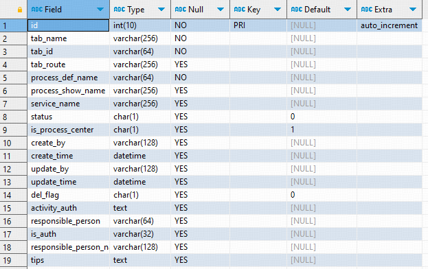

# 1 MySQL的安装配置和卸载

# 2 MySQL增删改查

## 2.1 对数据库的操作

## 2.2 对表结构的操作

### 2.2.1 为一个已经存在的表添加新的字段



```sql
-- 在数据库中的sys_process_tab表添加4个字段
ALTER TABLE `sys_process_tab` 
ADD COLUMN `explaination_file_id` varchar(255) DEFAULT NULL COMMENT '流程说明文件ID' AFTER `tips`,
ADD COLUMN `explaination_file_name` varchar(100) DEFAULT NULL COMMENT '流程说明文件名' AFTER `explaination_file_id`,
ADD COLUMN `flowsheet_file_id` varchar(255) DEFAULT NULL COMMENT '流程说明文件ID' AFTER `explaination_file_name`,
ADD COLUMN `flowsheet_file_name` varchar(100) DEFAULT NULL COMMENT '流程说明文件ID' AFTER `flowsheet_file_id`;
```

> `AFTER`关键字表示本条语句要在指定字段的后面（紧挨着）添加新字段。

