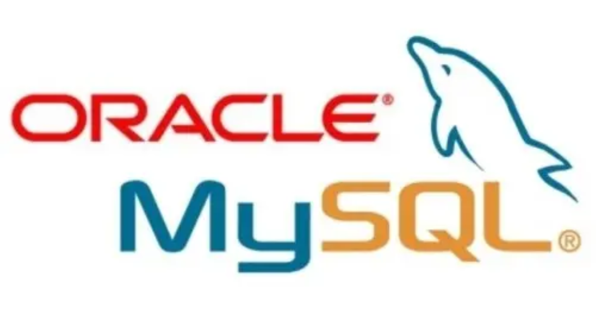

# MySQL数据库应用



## 零、MySQL中SQL语言的规则与规范

### （1）基本规则（必须遵守）

* 一条SQL语句**可以写成一行或多行**。为了提高可读性，一条SQL语句的各子句应该分行写，必要时应当使用缩进
* 每条命令都以**英文分号、\g或\G**结束
* 所有的SQL关键字都**既不能分行，也不能缩写**
* 关于标点符号
  * 必须保证所有的 `( )`、`' ' `和 `" "`都是成对出现的
  * 必须使用英文状态下的半角输入方式
  * 字符串和日期时间类型的数据可以使用单引号表示
  * 列的别名，尽量使用双引号，而且不建议省略`as`

### （2）大小写规范（建议遵守）

* MySQL**在Windows环境下是大小写不敏感的**
* MySQL**在Linux环境下是大小写敏感的**
  * 数据库名、表名、表的别名、变量名是严格区分大小写的
  * 关键字、函数名、列名（字段名）、列的别名（字段的别名）是忽略大小写的
* 推荐采用统一的书写规范
  * **数据库名、表名、表别名、字段名、字段别名**等&emsp;都小写
  * **SQL关键字、函数名、绑定变量**等&emsp;都大写

### （3）MySQL注释

```mysql
-- 这是一个单行注释
# 这其实也是一个单行注释（mysql特有的一种注释方式）
/*
    这是一个多行注释
    多行注释不能嵌套
*/
```
* `-- 注释内容` 注释中的`--`和注释的内容之间**必须有一个空格**，否则不会被识别为注释

### （4）命名规则

* 数据库、表名不得超过30个字符，变量名限制为29个
* 只能包含A-Z，a-z，0-9，_共63种字符
* 数据库名、表名、字段名等对象名中间不要包含空格
* 同一个MySQL软件中，数据库不能同名；同一个库中，表不能重名；同一个表中，字段不能重名
* 必须保证你的字段没有和保留字、数据库系统或常用方法冲突。如果坚持使用，需要在SQL语句中**使用 ` (着重号)引起来**
* 保持字段名和类型的一致性，在命名字段并为其指定数据类型的时候一定要保证一致性。（假如数据类型在一个表里是整数，那在另一个表里可就别变成字符型了） 

## 一、SELECT语句的使用

### 1.基本的SELECT语句`SELECT 字段1,字段2,... FROM 表名`

#### （1）关于SELECT语句

```mysql
SELECT 1; #没有任何子句
SELECT 1+1,2*3;

SELECT * FROM employees; -- 查找employees表中的全部信息

SELECT employee_id,last_name,salary
FROM employees; -- 查找employees表中特定的列（字段）
```

#### （2）列的别名


#### （3）去除重复行

#### （4）着重号

#### （5）查询函数

### 2.

## 二、SQL之DDL、DML、DCL使用

### （1）创建和管理表

### （2）增删改操作（数据处理）

## 三、MySQL数据类型和其它数据库对象

### （1）MySQL数据类型

### （2）约束

### （3）视图

### （4）存储过程与函数

### （5）变量、流程控制与游标

### （6）触发器

## 四、MySQL架构

## 五、索引及调优

## 六、事务

## 七、日志与备份