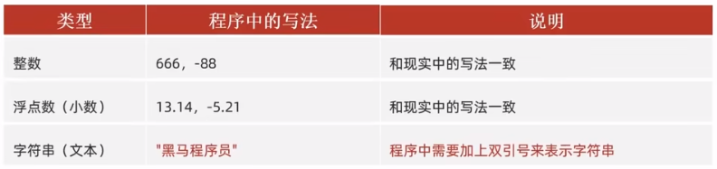
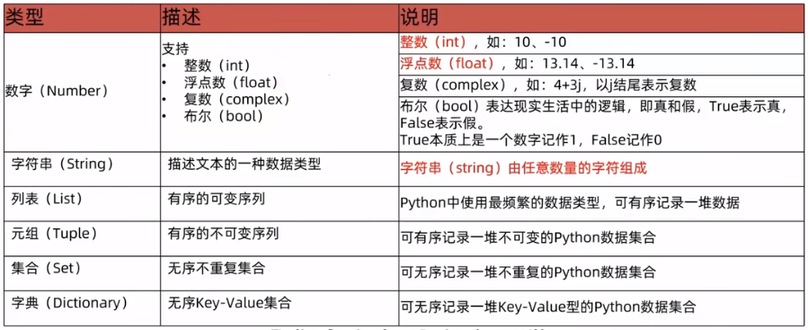

# 一、基础语法

## 1.Hello, Python

> 字面量：在代码中，被写下来的**固定的值**



> 注释

```python
"""
    打印 hello, world
    （多行注释）
"""
print("hello, world")
# 打印 hello, world （单行注释）
```

* 对于单行注释，Python 规范要求 `#` 和 `注释内容` 之间以一个空格隔开
* 多行注释一般用于解释整个 Python 代码文件、类或方法

> 变量


> 数据类型



> 数据类型转换


# 二、面向对象


# 三、高级

## 1.文件编程

## 2.异常

## 3.数据可视化

