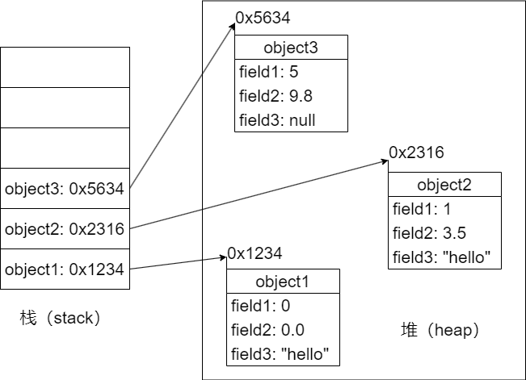

# Java Programming Language

## 一、Java基础语法

### 1.Hello, World

```java
public class Hello{
	public static void main(String[] args){
		System.out.println("Hello, World!");
	}
}
```

#### （1）注释

```java
//单行注释
/*
	多行注释
	多行注释不允许嵌套
*/
```

#### （2）标识符命名规则

* 只能由 **26个英文字母大小写、0-9、_或$** 组成，且不能以数字开头
* 不能是关键字或保留字，但是可以包含关键字或保留字
* Java严格区分大小写，不限制标识符的长度，但是标识符内不能包含空格

#### （3）标识符命名规范

* 包名：多单词组成时所字母都小写
* 类名、接口名：多单词组成时每个单词的首字符大写
* 变量名、属性名、方法名：多单词组成时，除第一个单词之外每一个单词的首字母都大写
* 常量名：每一个字母都大写，多单词时每个单词之间用`_`连接

### 2.数据与存储

#### （1）变量与常量

&emsp;&emsp;Java中的变量必须在声明之后使用，因为只有声明后这个变量才会在内存中被加载。局部变量声明之后不会被自动初始化，因此局部变量在使用之前必须先进行显式初始化（赋初值）。变量都是定义在其作用域内的，只在这个作用域内有效，其作用域就是声明这个变量时所在的大括号内。同一个作用域内不可以声明两个同名的变量，同一个变量不可以在同一个作用域内多次定义。

&emsp;&emsp;变量分为局部变量和成员变量，局部变量是定义在方法的形参列表或方法体内的变量；成员变量（属性）是定义在类的花括号`{ }`内部的变量。

> 成员变量&emsp;VS&emsp;局部变量

* 相同点
  * 定义变量的格式相同，**数据类型 变量名 = 变量值;**
  * 都要求先声明，后使用
  * 两种变量都有其对应的作用域
* 不同点
  * 在类中声明的位置不同——成员变量直接定义在类的`{ }`内；局部变量声明在方法内、方法形参、代码块内、构造器形参和构造器内
  * 关于权限修饰符——成员变量可以在声明时通过使用权限修饰符，指明其权限；局部变量不可以使用权限修饰符
  * 默认初始化值的情况——成员变量，根据其数据类型都有对应的默认初始化值；局部变量没有默认初始化值，我们在调用局部变量之前一定要显式赋值（形参在调用时赋值即可）
  * 在内存中加载的位置——非static的成员变量加载到堆空间中，static的成员变量加载到方法区；局部变量都加载到栈空间

> Java中的常量


#### （2）基本数据类型

> 整数类型：byte（1字节）、short（2字节）、int（4字节）、long（8字节）

&emsp;&emsp;int是Java中整型数据的默认存储方式，一个整型的立即数，在用于赋值的时候，默认其**地位和一个int型的变量是等价的**。可以通过在立即数值的最后加上后缀（-L或-l）来指定该整型立即数值的数据类型为long类型。

>浮点类型：float（4字节）、double（8字节）

&emsp;&emsp;double是Java中浮点型数据的默认存储方式，一个浮点型的立即数，在用于赋值的时候，默认其**地位和一个double型的变量是等价的**。可以通过在立即数值的最后加上后缀（F或f）来指定该浮点类型立即数值的数据类型为float类型。

 &emsp;&emsp;浮点型数据可以利用“e”作为科学计数法中的“10”后面跟“10”的次数，来使用科学计数法的表示数值。

> 字符型：char（2字节）

`char c1 = 'a';`

&emsp;&emsp;Java采用unicode编码，支持汉字、单位、数字等各种字符。表示字符常量的单引号内必须有且只有一个字符，该字符可以是一个空格，但是不能什么都没有，也不能有超过1个字符，否则编译报错。单引号中可以使用转义字符：‘\n’、‘\t’等。

> 布尔型：boolen（长度不确定）

&emsp;&emsp;boolean类型的变量只能取两个值之一：`true` 或 `false` 。boolean类型在内存中所占的存储空间大小并没有明确的规定。

#### （3）引用数据类型

&emsp;&emsp;引用类型的变量，包括&emsp;类、接口、数组等，只可能存储两类值：null 或 地址值。

#### （4）不同数据类型变量之间的运算

> 自动类型提升

**容量较小的数据类型**的数据与**容量较大的数据类型**的数据做运算时，运算的结果自动提升为容量较大的那个数据的数据类型。

容量（该数据类型的表示范围）从小到大排序：**（byte 、char、 short） < int < long < float < double** 

&emsp;&emsp;此处的容量大小是指**能够表示的数值范围的大小**，而不是在内存中占用的内存空间的大小。当byte、char、short三个类型的变量之间进行运算时，结果的类型都一定会是int，这三种类型各自同类型之间进行运算（即byte和byte、char和char、short和short）时也是这样的。

> 强制类型转换

```java
double doubleVar = 12.9;
int intVar = (int)doubleVar;
```

&emsp;&emsp;浮点型向整型进行强制类型转换，采用的是直接截取浮点数整数部分的方式（俗称“截断操作”），而不是四舍五入，转换之后数据的精度可能会降低，称为精度损失。变量向数值范围不够的数据强制类型转换，并不会造成编译报错。

#### （5）String（字符串）类型变量的使用

```java
String stringVar = "HelloWorld"; //习惯写法
String stringVar = new String("HelloWorld"); //完整写法
System.out.println(stringVar); //打印输出字符串
```

> 提取一个字符串中指定位置的字符

```java
char charVar_1 = stringVar.charAt(0);
char charVar_2 = stringVar.charAt(1);
char charVar_3 = stringVar.charAt(2);
char charVar_4 = stringVar.charAt(3);
char charVar_5 = stringVar.charAt(4);
```

&emsp;&emsp;字符串类型（String）实际上属于类类型的，也就属于引用类型。String类型值的双引号内可以有一个或多个字符，也可以什么都没有。String可以分别和8种基本的数据类型进行运算，但是都只能是字符串的拼接运算。

### 3.运算符


### 4.流程控制

#### （1）if-else分支

```java
//结构1
if(条件表达式){
	程序语句块1;
}

//结构2
if(条件表达式){
	程序语句块1;
}else{
	程序语句块2;
}

//结构3
if(条件表达式1){
	程序语句块1;
}else if(条件表达式2){
	程序语句块2;
}else{
	程序语句块3;
}
```

#### （2）switch-case分支

```java
switch(表达式){
	case 常量1: 当条件表达式的值为常量1时执行的语句;break;
	case 常量2: 当条件表达式的值为常量2时执行的语句;break;
	.
	.
	.
	case 常量N: 当条件表达式的值为常量1时执行的语句;break;
	default: 当条件表达式的值不是以上的任何一个常量值时执行的语句;
}
```

&emsp;&emsp;如果想要实现多选一的操作，那么应该在每一个case中都使用`break;`语句。

&emsp;&emsp;case关键字后面只能是表达式，**绝对不能写范围**。表达式的值只能是这6种类型之一：byte、short、char、int、枚举类型、String类型。JDK5.0开始枚举类型才允许作为表达式；JDK7.0开始String类型才允许作为表达式。如果结构中的多个case的执行语句相同，则可以考虑合并。同一个switch结构中不同的case下不可以重复定义同名的变量。

&emsp;&emsp;default结构是可选的，可以选择不写。

#### （3）for循环

```java
for(初始化条件;循环条件;迭代条件){
	循环体;
}
```

#### （4）while循环

```java
while(条件表达式){
	程序语句块;
}
```

#### （5）do-while循环

```java
do{
	循环体;
	迭代条件;
}while(循环条件);
//循环体至少会被执行一次
```

#### （6）特殊关键字

> break

&emsp;&emsp;用于switch-case结构和循环结构，作用是直接跳出所处的switch语句或立即结束当前循环。

> continue

&emsp;&emsp;仅用于循环结构，作用是立即结束当前循环并直接开始下一次循环。

### 5.数组

#### （1）关于Java数组

&emsp;&emsp;数组属于引用数据类型，数组的元素既可以是基本数据类型也可以是引用数据类型。创建数组对象会在内存中开辟一整块连续空间，而数组名中存储的是这块连续空间的首地址。Java数组的长度一旦确定，在之后执行的代码中就不能修改了。

| 按照维度                           | 按照数据类型                                                 |
| ---------------------------------- | ------------------------------------------------------------ |
| 一维数组、二维数组、三维数组...... | 基本数据类型元素的数组、引用数据类型元素的数组（即对象数组） |

#### （2）一维数组的使用

```java
int[] arrayVar;//声明

//声明并初始化
int[] arrayVar = new int[]{1123,3432,34343,23232};//静态初始化，数组的初始化和数据元素的赋值同时进行
int[] arrayVar = new int[4];//动态初始化，数组的初始化和数据元素的赋值分开进行
//声明并初始化操作，只有上面的两种情况是正确的，不能把两种方式混合在一起使用。
//数组一旦初始化完成，其长度就确定了，再也不能更改。

//调用数组指定位置的元素
arrayVar[0] = 10;
arrayVar[1] = 20;
arrayVar[2] = 30;
//数组的下标从 0 开始，到 “数组的长度-1” 结束。如果访问数组元素的角标超出 “数组的长度-1” 时，编译时不会报错，但是运行时会报错。

//数组有一个属性叫做length，表示当前这个数组的长度
System.out.println("arrayVar.length");//打印出数组的长度

//遍历数组
for(int i=0;i < arrayVar.length;i++){
	visit(arrayVar[i]);
}
```

#### （3）二维数组的使用

&emsp;&emsp;**数据元素的数据类型为数组的数组**称为二维数组。其本质上是一维数组A作为另一个一维数组B的元素而存在，从Java数组底层的运行机制来看，其实并不存在什么所谓的多维数组。

```java
int[][] arrayVar;//声明

//静态初始化：
int[][] arrayVar = new int[][]{{1,3,2,1},{3,42,1,2,23},{1,2},{2,5,5}}; // 正确

//动态初始化：
	//二维数组每个子数组的长度可以互不相同
	//二维数组在进行动态初始化时子数组的长度可以不指定，但是必须指定外层数组的数组长度
int[][] arrayVar = new int[3][];  //正确
int[][] arrayVar = new int[][4];  //错误

arrayVar[行下标];//调取外层数组元素
arrayVar[行下标][列下标];//调取内层数组元素
```

#### （4）Arrays工具类的使用

```java
import java.util.Arrays;

boolean equalsJudge = Arrarys.equals(arraysVar_1,arrayVar_2);
//比较两个数组是否相同，相同则返回true,不相同则返回false

String detials = Arrays.toString(arrayVar);
//输出指定数组内的所有元素：[arrayVar[0],arrayVar[1], ... ,arrayVar[arrayVar.length - 1]]
```

## 二、Java面向对象

### 1.类和对象

#### （1）类的设计

> 也就是对类的成员的设计

```java
class TestClass{
	//属性（成员变量、field、域、字段）
	String field1;
	int field2;
    double field3;

	//方法（成员方法、函数、method）
	public void method1(){
		System.out.println("这是方法1");
	}
	public void method2(){
		System.out.println("这是方法2");
	}
}
```

| 属性的数据类型                         | 默认初始化值      |
| -------------------------------------- | ----------------- |
| 整型（byte、short、int、long）         | 0                 |
| 浮点型（float、double）                | 0.0               |
| 字符型（char）                         | '0'（或'\u0000'） |
| 布尔型（boolean）                      | false             |
| 引用数据类型（类、接口、数组、字符串） | null              |

#### （2）类和对象的使用

```java
public class OOPTest{
	public static void main(String[] args){
		//创建TestClass的对象，即实例化TestClass类，也就是对TestClass类的实例化
		TestClass testObject = new TestClass();

		//访问TestClass类中的属性
		testObject.field1 = "Hello, Object";
		testObject.field2 = 20;

		//调用TestClass类中的方法
		testObject.method1();
		testObject.method2();
	}
}
```

#### （3）对象的内存解析



&emsp;&emsp;如果创建了同一个类的多个对象，那么**每个对象都独立的拥有一套类的非 static 属性**，不同对象的非static属性之间**互不影响**。对象变量中存放的是一个地址值，是引用数据类型，可以理解为是**指向存储在堆空间中的对象的实际存储位置的一个指针**。

#### （4）匿名对象的使用

```java
//在Java语言中，我们创建对象时可以不显式地赋给它一个变量名，即匿名对象。
//匿名对象只能调用一次，程序中出现的任意两个同类型的匿名对象都是不同的对象，彼此之间相互独立
public class OOPTest{
	public void static void main(String[] args){
		new TestClass().field1 = "你好，对象";
		new TestClass().field2 = 10;
		new TestClass().method1();
		new TestClass().method2();

		//这种用法在开发中使用较多
		testMethod(new TestClass());
	}

	//使用以下方法可以将同一个匿名对象调用多次，但是本质上是给匿名对象起了一个名，转化为了普通的 “引用类型局部变量”
	public void testMethod(TestClass testObject){
		//这里的testObject在本质上已经不再是匿名变量
		testObject.field1 = "Hello, Object";
		testObject.field2 = 20;
		testObject.method1();
		testObject.method2();
	}
}

class TestClass{
    String field1;
    int field2;
    public void method1(){
    }
    public void method2(){
    }
}
```

#### （5）this关键字的使用

&emsp;&emsp;`this` 关键字代表着 “当前对象” 或 “当前正在创建的对象（在构造器中使用时）”。可以用来调用类的**属性、方法和构造器**。

> this调用属性或方法

* 在类的方法中，我们可以使用 `this.属性` 或 `this.方法` 的方式，调用当前对象的属性或方法，但是**通常情况下我们都省略 “this.”**
  * 特殊情况下，当方法的形参和类的属性同名时，我们必须显式地使用 `this.变量` 的方式表明此变量是类的属性，而不是当前方法的形参。
* 在类的构造器中，我们可以使用 `this.属性` 或 `this.方法` 的方式，调用当前正在创建的对象的属性或方法，但是**通常情况下我们都省略 “this.”**
  * 特殊情况下，当构造器的形参和类的属性同名时，我们必须显式地使用 `this.变量` 的方式表明此变量是类的属性，而不是构造器的形参。

> this调用构造器

* 我们在类的构造器中，可以显式地使用 `this(形参列表)` 的方式，调用本类中形参列表符合的**其他构造器**
* 在构造器中**不能**通过 `this(形参列表)` 的方式**调用自己**（即构造器不能自己调自己）
* 如果通过 `this(形参列表)` 的方式逐层调用了当前类的多个构造器，那么依然**只创建了一个对象**
* 在创建对象的过程中，类中的每个构造器最多都只能被调用一次，如果一个类中有n个构造器，则最多有n-1个构造器中使用了 `this(形参列表)`
* 规定：语句 `this(形参列表);` **必须写在当前构造器中的首行**，也就是说，在构造器的内部**最多只能写一个 `this(形参列表)` 语句**，用来调用其他的构造器

### 2.方法的声明和使用

#### （1）方法的声明

```java
/*
	权限修饰符 返回值类型 方法名([形参列表]){
		方法体;
	}
*/
```

|        | 无返回值                   | 有返回值                         |
| ------ | -------------------------- | -------------------------------- |
| 无形参 | `void 方法名( ){ }`        | `返回值类型 方法名( ){ }`        |
| 有形参 | `void 方法名(形参列表){ }` | `返回值类型 方法名(形参列表){ }` |

* 权限修饰符
  * 4种权限修饰符 `private`、`缺省`、`protected`、`public`
  * 规定该方法在多大范围内能够被调用
* 返回值类型
  * 有返回值——在方法声明时指定返回值的类型，同时方法体中**需要使用 `return` 关键字来返回指定数据类型的数据变量、常量或结果为指定数据类型的表达式**，且必须保证**无论如何都会执行一条返回指定数据类型（或可以向指定数据类型进行自动类型提升）的变量或常量的return语句**，否则编译报错
  * 没有返回值——在方法声明时使用 `void` 来表示没有返回值；此时不需要写 `return` 语句，但是也可以在方法体内使用语句 ` return; `，用于结束当前方法
* 方法名：注意遵循**Java标识符的命名规则和规范**以及**见名知义**
* 形参列表
  * 方法可以声明0个、1个或多个形参
  * 格式：数据类型1 形参1,数据类型2 形参2,...
* 方法体：方法功能的具体体现

#### （2）方法的重载


