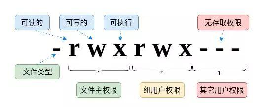

# Linux Operating System

## 1 System Mangement

### 1.1 Files and Directories

#### 1.1.1 file processing

```bash
ls -hali file_or_direc  # display the files and their attribute inside the pointed directory, or show the attributes of the pointed file
ls -hdli direc  # show the attribute of the pointed directory

cd direc  # enter the pointed directory
pwd  # show current location in the system

mkdir new_direc  # create a new name
rmdir direc  # delete an empty directory (current directory and non-empty directory are not allowed)

cp s_file d_direc  # copy the pointed file to d_direc
cp -r s_file_or_direc d_direc  # copy the pointed file or directory to d_direc
mv s_file d_direc  # move a file or a directory to d_direc
rm -rf file_or_direc  # delete a file or a directory with force

ln s_file hard_link  # create a hard link
ln -s s_file soft_link  # create a soft link
```

#### 1.1.2 file view commands

```bash
cat file_name  # Output file content
cat -n file_name  # Output file content and display numbers

more file_name  # output file content in a better way
less file_name  # output file content in a better way

head -n num  # Output the content of the first n lines of the file
tail -n num  # Output the content of the last n lines of the file
```

#### 1.1.3 permission change

```bash
chmod 755 file_or_direc  # Change the permission code
chown user_name file_or_direc  # Manipulate a file's user assignment
chgrp group_name file_or_direc  # Manipulate a file's group assignment
```

#### 1.1.4 to manipulate archive files

```bash
# .tar.gz
tar -zcvf archive_file_name.tar.gz direc  # compress direc into archive
tar -zxvf archive_file_name.tar.gz  # decompress the archive

# .tar.bz2
tar -jcvf archive_file_name.tar.bz2 direc  # compress direc into archive
tar -jxvf archive_file_name.tar.bz2  # decompress the archive

# .tar.xz
tar -pcvf archive_file_name.tar.xz direc  # compress direc into archive
tar -pxvf archive_file_name.tar.xz  # decompress the archive
```

#### 1.1.5 notes

* We can ...

### 1.2 User and group management

&emsp;&emsp;The Linux operating system is a multi user operating system, where each user is different from each other, having what they can and cannot do. 
&emsp;&emsp;The root user is the system administrator and he is almost omnipotent. 

#### 1.2.1 configuration files

> /etc/passwd: the users' master infomation file

`username:password_mark:UID:GID:user's explanation:user_home_dir:default_shell_after_login`
```bash
root:x:0:0:the root user:/root:/bin/bash
x41v3r:x:1001:1001:my normal user account:/home/x41v3r:/bin/zsh
```

> /etc/shadow: the user shadow file, storing the users' encrypted passwords

`username:encrypted_passsword::::::`

```bash
root:$6$9w5Td6lg$bgpsy3olsq9WwWvS5Sst2W3ZiJpuCGDY.4w4MRk3ob/i85fl38RH15wzVoomff9isV1PzdcXmixzhnMVhMxbvO:15775:0:99999:7:::
x41v3r:$6$zQf30TmlyIOz2enA$/NvEU1mdeSUbFDsxAo54kFwS07s5LwjJJGGJ37/Agy2RwteDLlnlxx3PginJeWBSfJIMv6SVeF/2/ivHVOFCq/:19507:0:99999:7:::
```

> /etc/group: dadasdas

> /etc/gshadow: dsadas

#### 1.2.2 management commands

> user management commands

```bash
useradd -m username  # create a user and create a home directory for this user

passwd  # set the password for onself

passwd username  # set a password for the specific user(root only)
passwd -l username  # lock a user(root only)
passwd -u username  # unlock a user(root only)


```

### 1.3 Authorization Management

#### 1.3.1 the permission code



|                 |                       r-4                        |                               w-2                                |             x-1              |
| :-------------: | :----------------------------------------------: | :--------------------------------------------------------------: | :--------------------------: |
|   for a file    |          allow reading of file content           |                allow modification of file content                | allow execution of the file  |
| for a directory | allow viewing the list of files in the directory | allow creation, deletion, and movement of files in the directory | allow entry to the directory |

#### 1.3.2

