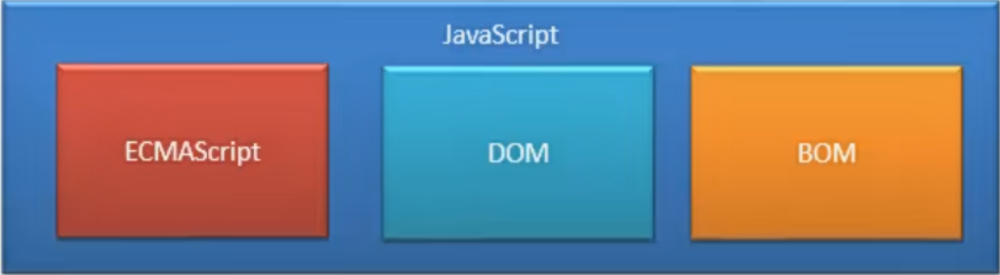

# |Web前端开发

 

| 结构 | 表现 |    行为    |
| :--: | :--: | :--------: |
| HTML | CSS  | JavaScript |
* 伯纳斯 · 李于1994年创立万维网联盟（W3C）
* 这为网页的开发制定了统一的标准规范，这也是现行的Web开发标准
* 我们现在编写的网页都需要遵循W3C的这个标准规范

## 一、HTML5

> 超文本标记语言：用于描述网站页面的结构

### 1.基本结构

```html
<!DOCTYPE html> <!-- 文档声明，告诉浏览器网页html的版本，这种写法就表明是html5标准 -->
<html> <!-- html的根标签，网页的所有内容都要写在根标签内 -->
  <head> <!-- 网页的头部，内部的内容一般不会显示在浏览器中，用于帮助浏览器或搜索引擎来解析网页 -->
      <meta charset="utf-8"/> <!-- meta用于设置元数据 这里指定浏览器解析网页的字符集为utf-8 -->
      <title>This is the first webpage.</title> <!-- title标签 网页标签内的显示内容 -->
  </head>
  <body><!-- 网页主体 所有需要显示的网页内容都写在body内-->
      <!-- 我是一个注释，不会显示在浏览器中 -->
      <p>Hello,World</p>
  </body>
</html>
```
* 标签一般成对出现，但是存在一些自结束标签
  * 完整标签&emsp;`<p>内容</p>`
  * 自结束标签&emsp;``或``（**这两种写法都对**）
* HTML只有多行注释，**注释标签不允许进行嵌套**，否则外层注释会提前结束
* 除注释外，直接写在body标签中的内容都会在页面中（以规定的样式和布局）被显示出来
* 在开始标签和自结束标签中可以设置属性（一个名值对），可以用于设置标签内容如何显示以及标签的功能和定位
  * 绝对**不可以在结束标签中设置属性**
  * 属性和标签名或其它属性之间应该**使用空格隔开**
  * 标签的属性必须符合 W3C 标准的规定，属性名和属性值都是**不能瞎写**的
  * 属性值必须写在双引号内（**也可以写在单引号内，但是必须写在一对够匹配上的引号之内，不能单引号匹配双引号**）
  * 也**存在不具有属性值的属性**，只写一个属性名即可发挥作用

* 文档声明的写法是固定的，HTML5的文档声明就是“`<!DOCTYPE html>`”，尖括号内的“html”**不可以写成“html5”**，大小写随意
* HTML5**大小写不敏感**，真的很随意啊，一般来说怎么写都行
* 在html中**标签和元素是同义词**：标签就是元素，元素就是标签
* title标签的内容还会*作为搜索结果中**超链接大标题上的文字**显示出来*

### 2.实体

> &emsp;&emsp;在html中有些时候我们不能直接书写一些特殊符号，比如：多个连续的空格、字母两侧的大于号和小于号。在HTML源代码中连续的多个空格，无论有多少个，**在默认情况下都会被浏览器自动解析成一个**。
```html
<!--
  如果必须在网页中使用这些特殊符号，那么就需要使用html中的实体（转义字符）。
  实体的格式：
    &实体名;
-->
&nbsp;  <!-- 一个空格 -->
&gt;  <!-- 大于号 -->
&lt;  <!-- 小于号 -->
&copy;  <!-- 版权符号 -->
```

### 3.meta标签

> meta元素用于设置网页**元数据**，元数据不是给用户看的，而是给浏览器提供的网页解析信息
* charset——指定字符集
* content的前置属性
  * name——元数据的名字
  * http-equiv——用于设定网页重定向
* content——对应名字的元数据的值或http-equiv属性的参数设置，必须和name属性或http-equiv属性同时设定
```html
<meta charset="UTF-8"/><!-- 指定网页字符集 -->
<meta name="keywords" content="HTML5,前端"/><!-- 元数据名为“keywords”，为网页设定关键字，便于搜索引擎的搜索；可以同时为网页设置多个keyword，各个keyword之间用英文逗号隔开。 -->
<meta name="description" content="这是一个非常不错的网站"/><!-- 元数据名为“description”，用于设置对网站的一个描述，这个描述会显示在搜索引擎的搜索结果的描述信息之中。 -->
<meta http-equiv="refresh" content="3;url=https://www.baidu.com"/><!-- 设置访问到该网页之后，3秒内刷新并跳转到指定的url -->
```

### 4.语义化标签

```html
<!-- 标题标签 -->
<h1>一级标题</h1>
<h2>二级标题</h2>
<h3>三级标题</h3>
<h4>四级标题</h4>
<h5>五级标题</h5>
<h6>六级标题</h6>
<!-- h1 ~ h6共六级标题
从h1到h6重要性递减，h1最重要（重要性仅次于title标签），h6最不重要
一般情况下一个页面中只会有一个h1，且标题标签只会使用到h1~h3
-->
<!-- 标题标签属于块元素 -->

<!-- hgroup标签 -->
<hgroup>
  <h1>主标题</h1>
  <h2>副标题</h2>
</hgroup><!-- 用于将标题标签分组 -->

<!-- p标签 -->
<p>p标签中的内容就表示一个段落</p>
<!-- p标签属于块元素 -->

<!-- em标签：表示对语音语调的一个加重，属于行内元素-->
<p>今天天气<em>真</em>不错</p>

<!-- strong标签：表示对重要内容的强调，属于行内元素 -->
<p>你今天必须<strong>完成作业<strong>！</p>

<!-- blockquote标签 表示一个长引用，属于块元素 -->

<!-- q标签 表示一个短引用，属于行内元素 -->

<!-- br标签 表示换行，属于行内元素 -->
<br/>

<!-- header标签 表示网页的头部，属于块元素 -->
<header>这是网页的头部</header>
<!-- 一个网页中可以有多个头部，因为网页中的很多部分都可以有头部 -->

<!-- main标签 表示网页的主体部分，属于块元素 -->
<main>这是网页的主体部分</main>
<!-- 一个网页中只可以有一个主体部分，一个网页只能有一个main标签 -->

<!-- footer标签 表示网页的底部，属于块元素 -->
<footer>这是网页的底部</footer>
<!-- 一个网页中可以有多个底部，因为网页中的很多部分都可以有底部 -->

<!-- nav标签 表示网页中的导航，属于块元素 -->
<nav></nav>

<!-- aside标签 表示和主体相关但是又不属于主体的内容，属于块元素 -->
<aside></aside>

<!-- article标签 表示一个独立的文章，属于块元素 -->
<article></article>

<!-- section标签 表示一个独立的区块，属于块元素 -->
<section></section>
<!-- 用以上语义化标签表示都不太合适的时候，使用section标签，实际语义为"其它" -->

<!-- div标签 没有语义，用来表示一个区块，属于块元素 -->
<div></div>
<!-- 目前使用最广泛的布局元素 -->

<!-- span标签 没有语义，一般用于在网页中选中文字，属于行内元素 -->
<span></span>
```
* 以上用于页面布局的标签在显示效果上几乎没有任何区别。在网页中**HTML专门负责网页的结构**，网页的**样式由CSS负责进行调整**，所以在使用html标签时，应该**重点关注的是标签的语义，而并非它所显示出来的样式**。
* 语义化标签分为两类：
  * 块元素（block element）—— 在页面中**独占一行**的元素，一般用于对网页进行布局，
  * 行内元素（inline element）—— 在页面中**不会独占一行**的元素，也称为“内联元素”，主要用来包裹文字
* 一般情况下**会在块元素中放置行内元素**，但是**不会在行内元素中放置块元素**
  * 块元素中基本上什么都能放，但是**p元素中绝对不能存放任何的块元素**
  * 行内元素中一般不能放块元素，但是**a元素中却可以嵌套除它自身外的任何HTML元素**
* 浏览器在解析网页时，会**自动对网页中不符合规范的内容进行修正**（这种修正**是对已经加载到内存中的数据进行修正**，并不会修改HTML文件的内容和网页源代码），如：
  * 标签写在了根元素之外
  * p元素中嵌套了块元素
  * 根元素html内出现了除head和body以外的子元素
* 虽然html的布局标签的种类很多，但是**目前最为常用的布局标签仍然是div和span**

### 5.HTML列表

> html中的列表一共有3种
* 有序列表（ol标签，自动添加序号）
```html
<ol>
  <li>第一项</li>
  <li>第二项</li>
  <li>第三项</li>
</ol>
```
* 无序列表（ul标签，无序号，常用）
```html
<ul>
  <li>结构</li>
  <li>样式</li>
  <li>行为</li>
</ul>
```
* 定义列表（dl标签）
  * 使用dt来表示定义的内容
  * 使用dd对内容进行解释说明
```html
<dl>
  <dt>结构</dt>
  <dd>表示网页的结构，用来规定哪里是标题，哪里是段落</dd>
  <dt>表现</dt>
  <dd>由CSS负责实现，调整网页的样式</dd>
  <dt>行为</dt>
  <dd>由JavaScript负责实现，用于和用户进行交互</dd>
</dl>
```
* 说明：
  * html列表之间是可以相互嵌套的
  * html中最常用的是无序列表

### 6.超链接

> 超链接让我们可以**从一个页面跳转到其它页面**，或者是**跳转到当前页面的其它位置**
* 超链接a标签的属性
  * href&emsp;指定跳转的目标路径
    * 可以是一个外部网站的地址url
    * 也可以写一个内部页面的地址
  * target&emsp;设置跳转的方式
    * _self&emsp;从当前标签页打开目标页面，是**target属性的默认值**
    * _blank&emsp;新建一个浏览器标签页，并从新的标签页打开目标页面
```html
<a href="https://www.baidu.com">百度一下，你就知道</a>
<a href="./index.html">网站主页</a>

<a href="https://www.baidu.com" target="_self">超链接内容</a>
<a href="https://www.baidu.com" target="_blank">超链接内容</a>

<!-- 将超链接标签的href属性设置为 #，点击超链接之后会回到当前页面的顶部 -->
<a href="#">回到顶部</a>

<!-- 为目标标签设定id属性，将超链接a标签的href属性设置为 #id，点击这个超链接之后自动跳转到指定id的目标元素位置 -->
<a href="#text">查看页面中的文本信息</a>
<a href="#bottom">去底部</a>
<p id="text">fjadskflahgafjkvn好看v布瑞比v额v和南部i能否v反馈肯定就来南京卡死你反抗军的就爱看愤怒恐惧打死你付款NSA的看法福农卡丹凤街看看电视剧尽快发你等级ask能否撒旦你可否火女恐惧不放假啊发生的你尽快发你卡的时间艰苦奋斗法国法术攻击力估计肯定是反过来扣税的股份的公司的功夫倒是广泛大使馆地方官方的说法teiphnureangieaneiubnsfjvdsjkvbdsfhbjgasfgjkhnaasfjkas</p>
<a id="bottom" href="#">回到顶部</a>
```
* 超链接a标签属于行内元素，但是**在a标签中可以嵌套除它自身外的任何HTML元素**
* id属性**区分大小写，且不能以数字开头**，如果为同一个HTML文件中的多个不同的元素设置了相同的id属性，那么只有最靠前的那个会生效
* 在开发中我们可以将 “#” 作为超链接的路径的占位符使用，或者也可以写成如下的形式（推荐）：
```html
<!-- 此时点击这个超链接，什么也不会发生 -->
<a href="javascript:;">空的超链接</a>
```

### 7.替换元素

> **img、内联框架、audio和video**都属于替换元素，具有介于块元素和行内元素之间的性质

#### （1）图片标签

* ``&emsp;用于向当前页面引入一个外部图片
* 属性：
  * src&emsp;指定要引入的图片的位置路径
  * alt&emsp;对图片的描述，即鼠标在该图片上悬停时显示的信息。这个描述默认不会显示，但是有些浏览器会在图片无法加载时显示。搜索引擎会根据alt属性的内容来识别图片，如果不写alt属性，那么该图片就不会被搜索引擎所收录。
  * width&emsp;图片的宽度
  * height&emsp;图片的高度
* 注意事项：
  * width和height属性的单位是像素
  * PC端web界面一般不建议修改图片大小，需要多大的图片就裁多大；移动端经常需要对图片进行缩放，所以**一般采取 “大图缩小” 的做法**
  * 如果只修改了width和height中的一个，另一个会默认按照原来的高宽比例缩放；如果两个属性都进行了修改，那么图片的大小就会严格按照设定的数值进行大小的调整，这样会破坏掉图片的显示比例，所以一般只设width和height中的一个
```html
<!-- 引入一个本地图片 -->


<!-- 引入一个外部网站的图片 -->


<!-- 通过base64引入一个图片 -->

```

#### （2）内联框架

* `<iframe />`&emsp;用于向网页中引入一个外部网页
* 属性：
  * src&emsp;指定引入
  * weigh和height&emsp;设置内联框架的高度和宽度（像素）
  * frameborder&emsp;设置内联框架是否有边框，只有0和1这两个属性值
    * 0——无边框
    * 1——有边框
* 内联框架中的内容无法被搜索引擎爬取，所以其实很少使用
```html
<iframe src="https://www.qq.com" frameborder="0" weight="800" height="500"> 
```

#### （3）音视频播放

* 音频标签&emsp;`<audio />`
* 视频标签&emsp;`<video />`
* 属性：
  * src&emsp;引入的外部音视频文件的位置url
  * controls&emsp;没有属性值，音视频文件引入时，默认情况下不允许用户自己控制播放停止，我们可以**给标签加上controls属性使得用户可以控制音视频文件的播放停止**
  * autoplay&emsp;没有属性值，若设置了autoplay，则音视频在打开页面时会自动播放，但是目前大部分浏览器都**不会允许自动播放**，这个属性一般不会起作用
  * loop&emsp;没有属性值，如果设置了loop属性，音视频会循环播放
* 示例代码：
```html
<audio src="./sources/music.mp3" controls/>

<!-- 下面写法可以在浏览器支持的情况下正常显示，在浏览器不支持的情况下显示提示文字 -->
<audio controls>
  对不起，您的浏览器不支持播放音频，请升级浏览器！
  <source src="./sources/music.mp3"/>
<audio/>

<!-- 这种写法还可以指定多个音频文件，优先使用最靠前的文件，在该文件不兼容的情况下自动依次使用后面的其他格式的文件 -->
<audio controls>
  <source src="./sources/music.mp3"/>
  <source src="./sources/music.ogg"/>
<audio/>

<video src="./sources/movie.mp4" contorls/>

<!-- 下面写法可以在浏览器支持的情况下正常显示，在浏览器不支持的情况下显示提示文字 -->
<video controls>
  对不起，您的浏览器不支持播放视频，请升级浏览器！
  <source src="./sources/movie.mp4"/>
<video/>

<!-- 这种写法还可以指定多个视频文件，优先使用最靠前的文件，在该文件不兼容的情况下自动依次使用后面的其他格式的文件 -->
<video controls>
  <source src="./sources/movie.webm"/>
  <source src="./sources/movie.mp4"/>
<video/>
```

### 8.表格与表单

#### （1）表格

#### （2）表单

## 二、CSS3

> **层叠样式表**：用于控制页面中元素的样式

### 1.关于CSS

> 网页实际上是一个**多层的结构**，通过CSS可以为网页的每一层分别设置样式  
> 而最终我们能看到的只是网页最上边的一层  
> 总之，CSS的作用就是**设置网页中元素的样式**

#### （1）CSS编写的位置

* 内联样式表：在标签内部通过style属性来设置元素的样式
  * 问题：
    * 内联样式只能对一个标签生效，如果希望影响到多个元素，就必须在每一个元素中都复制一遍
    * 当样式发生变化时，我们必须一个一个地修改，非常不方便
    * 多条样式会写到同一行中，不能格式化，不便于程序的编写和阅读
  * 注意：在实际开发时**不要使用内联样式**
```html
<p style="color:red;font-size:200px;">明天，你好</p>
```
* 内部样式表：将样式编写到head中的style标签里，通过CSS选择器来选中元素并为其设置各种样式
  * 优点：可以同时为多个标签设置样式，并且修改时只需修改一处即可全部应用，方便对样式进行复用
  * 问题：内部样式表只能对一个网页起作用，它里边的样式不能跨页面进行复用
```html
<!DOCTYPE html>
<html>
	<head>
		<meta charset="UTF-8">
		<title>Document</title>
   
        <!-- 内部CSS代码，设置在style标签内 -->
        <style>
          p{
            color:green;
          }
        </style>
	
    </head>
	<body>
      <p>明天，你好</p>
      <p>今天天气真不错！</p>
      <p>落霞与孤鹜齐飞，秋水共长天一色。</p>
	</body>
</html>
```
* 外部样式表：将CSS样式写到一个外部的CSS文件中，然后通过link标签来引入外部的CSS文件  
  * 优点：任何网页都可以对其进行引用，使样式可以在不同的页面之间进行复用
  * 这是层叠样式表使用的最多实践
  * 将样式编写到外部的CSS文件中，这样还可以充分利用浏览器的缓存机制，从而加快网页的加载速度，提高用户体验
```html
<!-- HTML文件 -->
<!DOCTYPE html>
<html>
<head>
  <meta charset="UTF-8">
  <title>Document</title>
  <link rel="stylesheet" href="./css/style.css"/>
  <!-- 引入css目录下的style.css文件 -->
</head>
<body>
  <p>明天，你好</p>
  <p>今天天气真不错！</p>
  <p>落霞与孤鹜齐飞，秋水共长天一色。</p>
</body>
</html>
```
```css
/* style.css文件 */
p{
  color:tomato;
  font-size:50px;
}
```

#### （2）CSS的基本语法

* CSS的基本语法：`选择器 声明块`
  * 选择器：通过选择器可以选中页面中的指定元素，比如**选择器p**的作用就是选中页面中的所有p元素
  * 声明块：通过声明块来指定要为元素设置的样式
    * 声名块由一个一个的声明组成
    * 声明是一个名值对结构，一个样式名对应一个样式值，名和值之间以英文冒号`:`连接
    * 声明块中的每个声明都以英文分号`;`结尾，最后一个声明可以不写分号，但是**最好也写上分号**，这样不容易出错
* CSS注释
```css
/*
  这是CSS中的注释
*/
```

### 2.选择器

#### （1）常用选择器

* 元素选择器：根据标签名来选中指定的元素
  * 语法：`标签名{}`
  * 例子：
    * `p{ }`&emsp;选中页面中的所有p元素
    * `h1{ }`&emsp;选中页面中的所有h1元素
    * `div{ }`&emsp;选中页面中的所有div元素
* ID选择器：根据元素的id属性值**选中一个元素**
  * 语法：`#id属性值{}`
  * 例子：
    * `#box{ }`&emsp;选中页面中id属性为box的元素
    * `#red{ }`&emsp;选中页面中id属性为red的元素
  * 注意：页面元素的id不能重复，一个元素只能是一个id
* 类选择器：根据元素的class属性值**选中一组元素**
  * class属性是一个标签的属性，它和id类似，不同的是class可以重复使用，可以通过class属性来为元素分组
  * 语法：`.class属性值{ }`
  * 例子：
    * `.blue{ }`&emsp;选中页面中class属性为blue的所有元素
    * `.red{ }`&emsp;选中页面中class属性为red的所有元素
  * 一个元素可以设置多个class属性值，都写在双引号内，不同的属性值之间用空格隔开
* 通配选择器：选中页面中的所有元素
  * 语法：`*{ }`

#### （2）复合选择器

* 交集选择器：选中同时符合多个条件的元素
  * 语法：`选择器1选择器2选择器3选择器4{ }`
  * 例子：
    * `div.red{ }`
    * `div#box1{ }`
    * `.a.b.c{ }`
  * 交集选择器中如果有元素选择器，则**必须使用元素选择器开头**，且元素选择器好像最多也只能有一个
* 选择器分组（并集选择器）：同时选中多个选择器对应的元素
  * 语法：`选择器1,选择器2,选择器3,选择器4{ }`
  * 例子：
    * `h1,span,div{ }`
    * `#b1,.pss,h1,span,div.red{ }`
* 一般**不推荐在选择器中使用id选择器和其它选择器复合**，因为仅仅使用id选择器就可以唯一确定某个元素了，根本不需要和其它选择器复合

#### （3）父子兄弟选择器（关系选择器）

```html
<!doctype html>
<html>
  <head>
    <meta charset="UTF-8">
    <title>关系选择器</title>
  </head>
  <body>

    <div>
      <p>
        我是div中的p元素
        <span>我是p元素中的span</span>
      </p>
      <span>我是div中的span元素</span>
      <span>我是div中的span元素</span>
      <span>我是div中的span元素</span>
      <span>我是div中的span元素</span>
    </div>

    <span>我是div元素外的span元素</span>

  </body>
</html>
```
> 元素之间的关系
* 父元素：直接包含子元素的元素叫做父元素
* 子元素：直接被父元素包含的元素是子元素
* 祖先元素：直接或间接包含后代元素的元素叫做祖先元素，一个元素的父元素也是它的祖先元素
* 后代元素：直接或间接被祖先元素包含的元素叫做后代元素，子元素也是后代元素
* 兄弟元素：拥有相同父元素的元素是兄弟元素
> 选择器的写法
* 子元素选择器：选中指定父元素的指定子元素
  * 语法：`父元素 > 子元素`
* 后代元素选择器：指定元素内的指定后代元素
  * 语法：`祖先 后代`
* 兄弟选择器（选择下一个兄弟）
  * 语法：`前一个 + 后一个`
```html
<style>
  p + span{
    color: green;
  }
  /*
  在同一个父元素下的多个子元素中
  选定p元素后面的第一个span元素（只会对p元素后边紧挨的第一个span元素生效，中间不能有其它任何元素，必须是紧挨着的，且只有第一个会生效）
   */
</style>
```
* 兄弟选择器（选择下边所有的指定兄弟）
  * 语法：
```html
<style>
  p ~ span{
    color: green;
  }
  /*
  在同一个父元素下的多个子元素中
  选定p元素后面所有的span元素（对p元素后面的所有span兄弟元素都会生效）
   */
</style>
```
> 混合使用

#### （4）属性选择器

```html
<!DOCTYPE html>
<html>
  <head>
    <meta charset="UTF-8"/>
    <title>属性选择器</title>
    <style>
      /* 选中设置了title属性的p元素 */
      p[title]{
        
      }

      /* 选中设置了title属性，且属性值为asd的p元素 */
      p[title=asd]{

      }

      /* 选中设置了title属性，且属性值以asd开头的p元素 */
      p[title^=asd]{

      }

      /* 选中设置了title属性，且属性值以asd结尾的p元素 */
      p[title$=asd]{

      }

      /* 选中设置了title属性，且属性值中含有asd（任意位置）的p元素 */
      p[title*=asd]{

      }
</style>
  </head>
  <body>
    <p title="asd">asdfghjkzxcvbnmqwertyui</p>
    <p title="asdfg">asdfghjkzxcvbnmqwertyui</p>
    <p title="asdfghjkl">asdfghjkzxcvbnmqwertyui</p>
    <p title="fdsgdgdfasd">asdfghjkzxcvbnmqwertyui</p>
    <p title="fsadfsdaasdfsagasf">asdfghjkzxcvbnmqwertyui</p>
    <p>asdfghjkzxcvbnmqwertyui</p>
    <p>asdfghjkzxcvbnmqwertyui</p>
    <p>asdfghjkzxcvbnmqwertyui</p>
  </body>
</html>
```

#### （5）伪类选择器

> 伪类：不存在的类、特殊的类
* 伪类用来描述一个元素的特殊状态
    * 一般情况下使用英文冒号`:`开头
* 根据所有子元素进行排序
  * `:first-child`&emsp;第一个子元素
  * `:last-child`&emsp;最后一个子元素
  * `:nth-child(num)`&emsp;第num个子元素
      * n&emsp;第1到正无穷个元素全部选中
      * 2n或even&emsp;所有偶数位的元素
      * 2n+1或odd&emsp;所有奇数位的元素
* 在子元素中的同类型元素中进行排序
    * `span:first-of-type`&emsp;子元素中的第一个span元素
    * `span:last-of-type`&emsp;子元素中的最后一个span元素
    * `span:nth-of-type(num)`&emsp;子元素中第num个span元素
      * 特殊值与上述同理
* `:not()`&emsp;否定伪类，将符合条件的元素从选择器中去除
> 超链接伪类
* `a:link`&emsp;表示没有被访问过的链接
* `a:visited`&emsp;表示访问过的链接
* `a:hover`&emsp;表示上方有鼠标移入的链接
* `a:active`&emsp;表示被鼠标点击的链接
* 注意事项
  * 超链接伪类只能用于a标签，想也知道的
  * 由于隐私的原因，所以visited这个伪类只能修改链接的颜色，链接的其它属性都按照link伪类的设置显示出来
  * hover和active，在相关事件发生时，会覆盖掉之前设置的任何样式，显示他们各自设置的样式
  * 超链接的这个几个伪类，同时写时的顺序问题

#### （6）伪元素选择器

> 伪元素：表示页面中一些特殊的并不存在的元素（特殊的位置）
* 伪元素，使用&emsp;**::**&emsp;开头
```html
<!DOCTYPE html>
<html>
	<head>
		<meta charset="utf-8">
		<title>伪元素选择器</title>
		<style>
			p{
				font-size: 30px;
			}

      /* 选中p中的第一个字母 */
      p::first-letter{
        font-size:100px
      }
      /* 选中p中的第一行，这第一行的范围可能会随着浏览器的变化而变化 */
      p::first-line{
        background-color: yellow;
      }
      /* 选中p中被鼠标选中的部分 */
      p::selection{
        background-color: yellowgreen;
      }

      /* 选中 元素内容的开头 和 开始标签 之间（缝）的位置 */
      div::before{
        content: 'hello';
        font-size: 10px;
        color: red;
      }
      /* 选中 元素内容的末尾 和 结束标签 之间的（缝）位置 */
      div::after{
        content: 'hello';
        font-size: 100px;
        color: green;
      }
      /* 这两个选择器应用的很多 */
      /* content属性用于给选中的这两个位置设置内容，使得其设置的样式有意义 */
		</style>
	</head>
	<body>
		<p>
			Lorem ipsum dolor sit amet consectetur adipisicing elit. Deserunt, atque nostrum? Corrupti excepturi facilis nisi aliquam at, voluptatum optio maiores cupiditate repudiandae sint natus maxime architecto ea, ad culpa. Sit!
		</p>
	</body>
</html>
```

### 3.一些基础知识

#### （1）继承

&emsp;&emsp;我们为一个元素设置了一个样式，同时这个样式也会自动应用到它的**后代元素**（只要是这个元素内的元素，都会被应用这个样式）上。  
&emsp;&emsp;继承的设计是为了方便我们的开发，利用继承我们可以将一些通用的样式统一设置到共同的祖先元素上，这样只需设置一次即可使得所有的元素都具有该样式。

```html
<!DOCTYPE html>
<html>
  <head>
    <meta chatset="UTF-8">
    <style>
      p{
        color:yellowgreen;
      }
      div{
        color:green;
      }
    </style>
  </head>
  <body>
    <div>
      这是div标签
      <span>这是div标签内的span标签</span>
    </div>
    <p>
      这是p标签
      <span>这是p标签内的span标签</span>
    </p>
  </body>
</html>
```
* 并不是所有的样式都会被继承，**背景相关、布局相关等**这些样式都不会被继承

#### （2）选择器的权重

> &emsp;&emsp;样式的冲突：当我们通过不同的选择器，选中相同的元素，并且为同样的样式设置不同的值时，就发生了冲突。发生冲突时，应用哪个样式由选择器的权重（优先级）决定。
* 选择器的权重（从做到右递减）：内联样式（1000） > id选择器（100） > 类和伪类选择器（10） > 元素选择器（1） > 通配选择器（0） > 继承的样式（没有优先级）
  * 优先级高的样式会覆盖掉优先级低的样式，并显示出来。
  * 交集选择器，比较优先级时，我们需要**将所有选择器的优先级进行相加运算**，最后优先级越高，则越优先显示；分组选择器是单独计算的。
  * 选择器优先级的累加不会超过其最大数量级，类选择器的优先级在累加之后再高也不会超过id选择器的优先级。
  * 选择器写得越具体，优先级越高
  * 如果优先级计算后相等，则**优先使用编写位置相对靠下的样式**
  * 我们可以在某一个样式值的后边添加一个`!important`（和样式值之间用一个空格隔开），则此时该样式会获取到最高的优先级，甚至超过内联选择器的优先级。但是这种方式一定要**慎用**！

#### （3）属性值单位

> 长度单位
* 像素：组成屏幕上图像的最小的发光点
  * 不同屏幕的大小是不同的，像素越小则则屏幕的显示效果越清晰
  * 所以，同样的200px在不同的设备下显示效果是不一样的
* 百分比：设置属性相对余其父元素属性的百分比
  * 设置百分比，可以使得子元素跟随其父元素的改变而自动改变
* em：相对于该元素自身的字体大小（默认为16px）的倍数
  * 1em = 1 * font-size
  * em会根据字体大小的改变而改变
* rem：相对于html根元素的字体大小的倍数
  * 与该元素自身的字体大小无关
> 颜色单位：在CSS中，我们可以直接使用颜色名来设置各种颜色，但是在CSS中直接使用颜色名是极其不方便的
* RGB值：通过三种颜色不同的浓度来调配出不同的颜色
  * R-red，G-green，B-blue
  * 每一种颜色的范围都在0~255（0%~100%）之间
  * 语法 `RGB(红色,绿色,蓝色)`
* RGBA：就是在RGB的基础上增加了一个a，表示 不透明度
  * 1-完全不透明，0-完全透明，.5-半透明
  * 语法 `RGBA(红色,绿色,蓝色,不透明度)`
* 十六进制的RGB值
  * 语法：#红素绿色蓝色
  * 颜色浓度：00~ff
  * 如果颜色恰好两位两位重复，那么可以进行简写
    * #aabbcc——#abc
    * #ffff00——#ff0
* HSL/HSLA值：
  * H-色相（0~360），S-饱和度（0%~100%），L-亮度（0%~100%）
  * 语法：`HSL(hue,saturation,lightness)`

### 4.布局

#### （1）文档流（normal flow）

> 网页是一个多层的结构，一层摞着一层
* 通过CSS可以分别为每一层来设置样式，作为用户来讲只能看到最顶上的一层
* 这些层中最底下的一层，我们称为 “文档流” ，文档流是网页的基础，我们所创建的元素**默认都是在文档流中进行排列的**
* 对于我们来说，元素主要有两个状态
  * 在文档流中
  * 不在文档流中（脱离文档流）

* 文档流中的元素分类

  * 块元素
    * 在页面中独占一行（无论宽度如何，都会独占一行）
    * 默认宽度是父元素的全部（会把它的父元素撑满）
    * 默认高度是被内容（子元素）撑开

  * 行内元素
    * 不会独占一行，只占自身的大小
    * 在页面中自左向右水平排列，如果一行之中不能容纳下所有的行内元素，则行内元素会自动换到下一行继续自左向右排列（和我们的书写习惯一致）
    * 行内元素的默认宽度和高度都是被内容撑开

#### （2）盒子模型（盒模型、框模型）


> CSS将页面中的所有元素都设置为了（看作是）一个矩形盒子
* 将元素设置为矩形的盒子后，对页面的布局操作就变成了**将不同的盒子摆放到不同的位置**
* 每一个盒子都由四个部分组成：内容区、内边距、边框、外边距
> 内容区（content，元素中所有的子元素和文本内容都在内容区中排列）
* 内容区的大小由width和height两个元素来设置
  * width&emsp;设置内容区的宽度
  * height&emsp;设置内容区的高度

> 边框（border，边框的大小会也影响到整个盒子的大小）

* 设置边框时至少需要设置三个样式，**缺一不可**
  * `border-width`&emsp;边框的宽度，其实这个可以不写，因为它会有一个默认值，一般都是3个像素
    * 写4个值（之间用空格隔开）：分别对应设置&emsp;**上、右、下、左（从上边开始顺时针旋转）**&emsp;各自的边框宽度
    * 写3个值（之间用空格隔开）：分别对应设置&emsp;**上、左右、下**&emsp;的边框宽度，左右边框设置成相同的宽度
    * 写2个值（之间用空格隔开）：分别对应设置&emsp;**上下、左右**&emsp;的边框宽度，左右边框设置成相同的宽度，上下边框设置成相同的宽度
    * 写1个值：将四个方向的边框都设置成相同的宽度
  * `border-color`&emsp;指定边框的颜色（`border-color`也可以省略不写，如果省略了则自动使用同一个声明块下的`color`的颜色值），同样可以用来分别指定四个边的颜色，规则同上
  * border-style&emsp;指定边框的样式（这个绝对不能省略，因为其默认值是none，表示没有边框），同样可以用来分别指定四个边的样式，规则亦同上
    * solid&emsp;实线
    * dotted&emsp;点状虚线
    * dashed&emsp;虚线
    * double&emsp;双线
* 对于边框的宽度，除了borde r-width还有一组border-xxx-width，xxx可以是top、right、bottm和left。当然，这对于border-color和border-style同样适用
* border简写属性：通过该属性可以同时设置边框的所有相关样式，并且没有顺序要求
  * `border: 10px orange solid`（三个值的顺序是任意的）
  * 除了border以外还有四个border-xxx（border-top、border-left、border-bottom和border-right），分别对用设置四条边的样式
  * 也可以为border-xxx只设置一个值——none，表示去掉指定的边框
```html
<html>
  <head>
    <style>
    .box{
      /* 设置content区的样式 */
      width:200px;
      height:200px;

      /* 设置border的样式 */
      border-width:10px;
      border-color:red;
      border-style:solid;

      /* 边框以内的部分，包括内边距和内容区，背景颜色 */
      background-color:#bfa;
    }
    </style>
  </head>
  <body>
    <div class="box">asdfghjkl</div>
  </body>

</html>
```
> 内边距（padding，内容区和边框之间的距离）
* 一共有4个方向的内边距
  * padding-top
  * padding-right
  * padding-bottom
  * padding-left
* 内边距的设置会影响到盒子的大小
* 背景颜色会延申到内边距上
* 内边距的简写属性，可以同时指定四个方向的内边距，规则和border-width一样

```html

```

>  外边距（margin，盒子之间的距离）

* 到这了

> 注意事项

* 一个盒子的可见框（边框和边框以内的内容）的大小由内容区、内边距和边框共同决定的。所以在计算盒子的大小时，需要将这三个区域的大小加到一起计算
* 


#### （3）浮动

### 5.定位

### 6.字体

### 7.表格与表单

## 三、JavaScript

> JavaScript脚本语言：用于响应用户的操作、处理前端验证和实现动态的网页效果

### 1.JavaScript语言概述

> JavaScript诞生于1995年，主要是用于处理网页中的前端验证  
> 所谓前端验证，就是指检查用户输入的内容是否符合一定的规则，比如用户名的长度、密码的长度、邮箱的格式等
* 一个完整的JavaScript实现应该由以下三个部分组成
  * ECMAScript&emsp;浏览器对ECMAScript标准的实现
  * DOM&emsp;文档对象模型，用于操作网页
  * BOM&emsp;浏览器对象模型，用于操作浏览器
  
* JavaScript语言的特点
  * 属于解释型语言
  * 有着类似于C和 Java的语法结构 
  * 动态语言
  * 基于原型的面向对象

#### （1）HelloWorld

```html
<!DOCTYPE html>
<html>
	<head>
		<meta charset="utf-8">
		<title></title>
		<script type="text/javascript">
			alert("HelloWorld");//提示窗口
			document.write("HelloWorld");//向body中输出一个内容
			console.log("你猜我在哪出来呢？");//向控制台输出一个内容
		</script>
	</head>
	<body>
	</body>
</html>
```

#### （2）编写的位置

> 写在标签的onclick属性中
* 编写在HTML标签的onclick属性中，点击时执行代码
```html
<button onclick="alert('点我干嘛？');">点我一下</button>
```
* 将js代码写在超链接的href属性中，当点击超链接时，会执行js代码
```html
<a href="javascript:alert('谁让你点我的？');"></a>
<!-- 可以通过将href属性值设置为"javascript:;"，表示点击之后什么也不做 -->
```
* 虽然可以写在标签的属性中，但是他们属于结构与行为的耦合，不方便维护，不推荐使用
> 写在head标签中的script标签中
```html
<html>
  <head>
    <script type="text/javascript">
      alert('欢迎打开我们的网页！');
    </script>
  </head>
</html>
```
> 写在外部js文件中，然后通过head标签中的script标签引入
```html
<html>
  <head>
    <script type="text/script" src="./js/script.js"></script>
  </head>
</html>
```
```javascript
alert("我是外部js文件中的alert语句");
```
* 可以在不同文件中被同时引用，也可以利用浏览器的缓存机制，推荐使用这种方式
* script标签一旦用于引入外部文件了，就不能在里面编写代码了，即便写了浏览器也会忽略。
  * 如果需要，则可以创建一个新的script标签，来编写内部javascript代码
  * 在前边的script标签代码会比在它后边的script标签代码先执行

#### （3）基本语法

* javascript严格区分大小写
* javascript每条语句都以分号&emsp;`;`&emsp;结尾
  * 如果不写分号，浏览器会自动添加，但是这会消耗一些系统资源
  * 而且有些时候浏览器会加错分号，所以在开发中**分号必须写**
* javascript会自动忽略多个空格和换行，所以我们可以利用空格和换行对代码进行格式化
* javascript中的注释
```javascript
/*
  多行注释
*/
// 单行注释
```

### 2.JS的数据和数据类型

#### （1）字面量和变量

* 字面量，一些不可改变的值，其实就是常量
* 变量，可以用来保存字面量，而且变量的值是可以任意改变的，更加方便我们的使用，所以在开发中都是通过变量去保存一个字面量，而很少直接使用字面量

* 声明变量

```javascript
var a;//声明并为变量赋值之后才能使用
console.log(a);

var b = 100;
console.log(b);
```

* 数据类型指的是字面量的类型，共有六种数据类型
  * string&emsp;字符串
  * number&emsp;数值
  * boolean&emsp;布尔值
  * null&emsp;空值
  * undefined&emsp;未定义
  * object&emsp;对象

* 其中String、Number、Boolean、Null、Undefined属于基本数据类型，而Object属于引用数据类型

#### （2）标识符

> 在JS中所有可以由我们自主命名的都可以称为是标识符

* 变量名、函数名、属性名等都属于标识符
* 标识符的命名规则
  * 可以且仅可以含有字母、数字、`_`和`$`
  * 不能以数字开头
  * 标识符不能是ES中的关键字或保留字
* 命名规范：一般都采用小驼峰命名法
* JS底层保存标识符时，实际上采用的是Unicode编码，所以理论上讲，utf-8中的内容都可以作为标识符。也就是说可以用中文作为标识符，但是不建议把中文作为标识符来使用，因为这样会被人笑死的哈哈哈哈~~

#### （3）字符串

* Js中的字符串字面量需要使用一对引号引起来
* 双引号引`" "`和单引号`‘ ’`都可以，但是不要混合使用
* 引号不能嵌套：双引号里面不能放双引号、单引号内不能放单引号
  * 但是单引号内能放双引号，双引号内也能放单引号

```javascript
var str = "hello"
console.log(str);

str = "fdasfdas"fdasfdasfdas"fdsafdas";(n)
str = "fadsfdasf'fdsafdas'fdsafdas";(y)
str = 'fdsafdasf"fdsafdasfdas"dsafdas';(y)
str = "fdasfdsafda \"sfdsafdas\" fds";(y)//使用转义字符
```

* 转义字符&emsp;`\`
  * `\"`&emsp;一个双引号
  * `\'`&emsp;一个单引号
  * `\n`&emsp;换行符
  * `\t`&emsp;制表符
  * `\\`&emsp;一个反斜杠

#### （4）Number

* JS中的所有数值都是Number类型，包括整数和浮点数
* JS中number类型可以表示的范围
  * 如果要表示的数字超过了最大值，则会返回一个`Infinity`，表示正无穷
  * 如果要表示的数字小于了最小值，则会返回一个`-Infinity`，表示负无穷
  * 这里的超出范围并不是javascript的number类型变量的表示范围，而是浏览器在网页中所能显示的范围

```javascript
console.log(Number.MAX_VALUE);
//最大值：1.7976931348623157e+308

console.log(-Number.MAX_VALUE);
//最小值：-1.7976931348623157e+308
```

* `Infinity`是一个字面量，表示的意思就是number类型数据中的”无穷“，即一个超出了表示范围的值
  * `typeof Infinity = number`

```javascript
console.log(Infinity);//正无穷
console.log(-Infinity);//负无穷
```

* `NaN`是一个特殊的数字，表示Not A Number，也是一个字面量
  * `typeof NaN = number`

```javascript
var a = "hello" * "hello";//变量a的值就是 NaN
```

* 大于零的最小值

```javascript
console.log(Number.MIN_VALUE);
// 5e-34
```

* JS中的整数运算基本可以保证精确
* 使用JS进行浮点数运算，可能得到一个不精确的结果，所以千万不要使用JS进行对精确度要求较高的运算

#### （5）布尔值（Boolean）

* 布尔值只有两个
  * true
  * false

```javascript
var bool = true;//这不能加引号
console.log(typeof bool);//返回"boolean"
```

#### （6）null和Undefined

* Null（空值）类型的值只有一个，就是`null`
  * 专门用来表示一个为空的对象

```javascript
var a = null;
console.log(typeof a);//返回值为"object"
```

* Undefined（未定义）类型的值也只有一个，就是`undefined`
  * 当我们声明一个变量，但是并不给变量赋值时，他的值就是`undefined`

```javascript
var b;
console.log(typeof b);//返回值为"undefined"
```

#### （7）强制类型转换


### 3.JS运算符


typeof运算符：检查一个变量的类型

语法：`typeof 变量名`


### 4.JS流程控制


### 5.JS面向对象


### 6.JS数组


### 7.正则表达式


### 8.DOM


### 9.事件


### 10.定时器


### 11.JSON