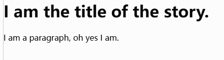
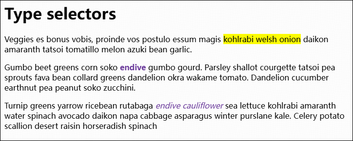
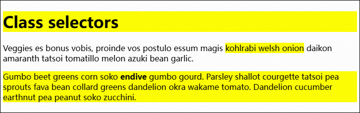
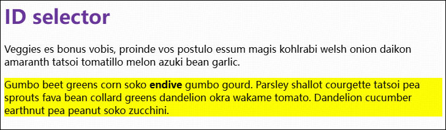

# 1 HTML

## 1.1 Getting started with HTML

&emsp;&emsp;HTML (HyperText Markup Language) is the code that is used to structure a web page and its content. 

## 1.2 What's in the head? Metadata in HTML

&emsp;&emsp;The HTML head is the contents of the `<head>` element.

```html
<head>
    <meta charset="utf-8" />  <!-- specify the document's character encoding -->
    <meta name="author" content="Chris Mills" />  <!-- add an author  -->
    <meta name="description" content="The MDN Web Docs Learning Area aims to provide complete beginners to the Web with all they need to know to get started with developing websites and applications." />  <!-- add a description -->

    <title>My test page</title>  <!-- add a title -->
</head>
```

Notes:

* `utf-8` is a universal character set that includes pretty much any character from any human language. (This means that the web page will be able to handle displaying any language.)
* 

## 1.3 HTML text fundamentals

### 1.3.1 Headings and paragraphs

&emsp;&emsp;In HTML, each paragraph has to be wrapped in a <p> element, like so:

```html
<p>I am a paragraph, oh yes I am.</p>
```

Each heading has to be wrapped in a heading element:

```html
<h1>I am the title of the story.</h1>
```

> &emsp;&emsp;There are six heading elements: h1, h2, h3, h4, h5, and h6. Each element represents a different level of content in the document; `<h1>` represents the main heading, `<h2>` represents subheadings, `<h3>` represents sub-subheadings, and so on.



### 1.3.2 Lists

### 1.3.3 Emphasis and importance

## 1.4 

# 2 CSS

## 2.1 Getting started with CSS

&emsp;&emsp;CSS (Cascading Style Sheets) is the code that styles web content.

### 2.1.1 Applying CSS to HTML

&emsp;&emsp;There are three methods to apply CSS to a document: with an external stylesheet, with an internal stylesheet, and with inline styles.

&emsp;&emsp;An external stylesheet contains CSS in a separate file with a `.css` extension. 

> This is the most common and useful method of bringing CSS to a document. We can link a single CSS file to multiple web pages, styling all of them with the same CSS stylesheet.

Reference an external CSS stylesheet from an HTML <link> element:

```html
<!doctype html>
<html lang="en-GB">
    <head>
        <meta charset="utf-8" />
        <title>My CSS experiment</title>
        <link rel="stylesheet" href="styles.css" />
    </head>
    <body>
        <h1>Hello World!</h1>
        <p>This is my first CSS example</p>
    </body>
</html>
```

The CSS stylesheet file might look like this:

```css
h1 {
    color: blue;
    background-color: yellow;
    border: 1px solid black;
}

p {
    color: red;
}
```

### 2.1.2

## 2.2 CSS selectors

### 2.2.1 Type, class, and ID selectors

&emsp;&emsp;A **type selector** is sometimes referred to as a tag name selector or element selector because it selects an HTML tag/element in the document. 

```html
<h1>Type selectors</h1>
<p>
  Veggies es bonus vobis, proinde vos postulo essum magis
  <span>kohlrabi welsh onion</span> daikon amaranth tatsoi tomatillo melon azuki
  bean garlic.
</p>

<p>
  Gumbo beet greens corn soko <strong>endive</strong> gumbo gourd. Parsley
  shallot courgette tatsoi pea sprouts fava bean collard greens dandelion okra
  wakame tomato. Dandelion cucumber earthnut pea peanut soko zucchini.
</p>

<p>
  Turnip greens yarrow ricebean rutabaga <em>endive cauliflower</em> sea lettuce
  kohlrabi amaranth water spinach avocado daikon napa cabbage asparagus winter
  purslane kale. Celery potato scallion desert raisin horseradish spinach
</p>
```

```css
body {
  font-family: sans-serif;
}

span {
  background-color: yellow;
}

strong {
  color: rebeccapurple;
}

em {
  color: rebeccapurple;
}
```



&emsp;&emsp;The case-sensitive **class selector** starts with a dot `.` character. It will select everything in the document with that class applied to it. 

```html
<h1 class="highlight">Class selectors</h1>
<p>
  Veggies es bonus vobis, proinde vos postulo essum magis
  <span class="highlight">kohlrabi welsh onion</span> daikon amaranth tatsoi
  tomatillo melon azuki bean garlic.
</p>

<p class="highlight">
  Gumbo beet greens corn soko <strong>endive</strong> gumbo gourd. Parsley
  shallot courgette tatsoi pea sprouts fava bean collard greens dandelion okra
  wakame tomato. Dandelion cucumber earthnut pea peanut soko zucchini.
</p>
```

```css
body {
  font-family: sans-serif;
}

.highlight {
  background-color: yellow;
}
```



&emsp;&emsp;The case-sensitive **ID selector** begins with a `#` rather than a `.` character, but is used in the same way as a class selector. It can select an element that has the `id` set on it. (However, an ID can be used only once per page, and elements can only have a single id value applied to them. )

```html
<h1 id="heading">ID selector</h1>
<p>
  Veggies es bonus vobis, proinde vos postulo essum magis kohlrabi welsh onion
  daikon amaranth tatsoi tomatillo melon azuki bean garlic.
</p>

<p id="one">
  Gumbo beet greens corn soko <strong>endive</strong> gumbo gourd. Parsley
  shallot courgette tatsoi pea sprouts fava bean collard greens dandelion okra
  wakame tomato. Dandelion cucumber earthnut pea peanut soko zucchini.
</p>
```

```css
body {
  font-family: sans-serif;
}

#one {
  background-color: yellow;
}

h1#heading {
  color: rebeccapurple;
}
```



### 2.2.2 Attribute selectors

### 2.2.3 Pseudo-classes and pseudo-elements

### 2.2.4 Combinators

## 2.3 Cascade, specificity, and inheritance

## 2.4 Cascade layers

### 2.2.4 The box model

### 2.2.5 

# 3 JavaScript

&emsp;&emsp;JavaScript is a programming language that adds interactivity to the website.

# 4 TypeScript

# 5 Node.js

# 6 

## 6.1 jQuery

## 6.2 bootstrap

## 6.3 less

# 7 Vue

# questions

<a href="https://github.com/turbio/bracey.vim/issues/21" >bracey build</a>

<a href="https://blog.csdn.net/m0_52172586/article/details/142930356" >npm to slow</a>
