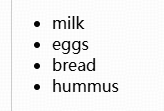
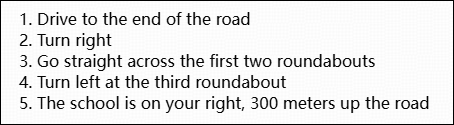
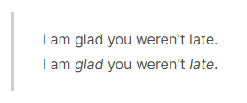
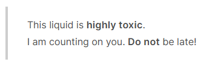

# 1 HTML

## 1.1 Getting started with HTML

&emsp;&emsp;HTML (HyperText Markup Language) is the code that is used to structure a web page and its content. 

## 1.2 What's in the head? Metadata in HTML

&emsp;&emsp;The HTML head is the contents of the `<head>` element.

```html
<head>
    <meta charset="utf-8" />  <!-- specify the document's character encoding -->
    <meta name="author" content="Chris Mills" />  <!-- add an author  -->
    <meta name="description" content="The MDN Web Docs Learning Area aims to provide complete beginners to the Web with all they need to know to get started with developing websites and applications." />  <!-- add a description -->

    <title>My test page</title>  <!-- add a title -->
</head>
```

Notes:

* `utf-8` is a universal character set that includes pretty much any character from any human language. (This means that the web page will be able to handle displaying any language.)

## 1.3 HTML text fundamentals

### 1.3.1 Headings and paragraphs

&emsp;&emsp;In HTML, each heading has to be wrapped in a heading element, like so:

```html
<h1>I am the title of the story.</h1>
```

Each paragraph has to be wrapped in a `<p>` element:

```html
<p>I am a paragraph, oh yes I am.</p>
```


> &emsp;&emsp;There are six heading elements: h1, h2, h3, h4, h5, and h6. Each element represents a different level of content in the document; `<h1>` represents the main heading, `<h2>` represents subheadings, `<h3>` represents sub-subheadings, and so on.

### 1.3.2 Lists

&emsp;&emsp;**Unordered lists** are used to mark up lists of items for which *the order of the items doesn't matter*. For example:

```html
milk
eggs
bread
hummus
```

Every unordered list starts off with a `<ul>` element—this wraps around all the list items:

```html
<ul>
    milk
    eggs
    bread
    hummus
</ul>
```

The last step is to wrap each list item in a `<li>` (list item) element:

```html
<ul>
    <li>milk</li>
    <li>eggs</li>
    <li>bread</li>
    <li>hummus</li>
</ul>
```



&emsp;&emsp;**Ordered lists** are lists in which the order of the items does matter. 

For example, there is a set of directions:

```html
Drive to the end of the road
Turn right
Go straight across the first two roundabouts
Turn left at the third roundabout
The school is on your right, 300 meters up the road
```

The markup structure is the same as for unordered lists, except that we have to wrap the list items in an `<ol>` element, rather than `<ul>`:

```html
<ol>
    <li>Drive to the end of the road</li>
    <li>Turn right</li>
    <li>Go straight across the first two roundabouts</li>
    <li>Turn left at the third roundabout</li>
    <li>The school is on your right, 300 meters up the road</li>
</ol>
```



### 1.3.3 Emphasis and importance

&emsp;&emsp;In written language we tend to stress words by putting them in italics. 



In HTML we use the `<em>` (emphasis) element  to mark up such instances.

```html
<p>I am <em>glad</em> you weren't <em>late</em>.</p>
```

&emsp;&emsp;To emphasize important words, we tend to stress them in spoken language and **bold** them in written language.



 In HTML we use the `<strong>` (strong importance) element to mark up such instances. 

```html
<p>This liquid is <strong>highly toxic</strong>.</p>
<p>I am counting on you. <strong>Do not</strong> be late!</p>
```

## 1.4 Creating hyperlinks


## 1.5 Advanced text formatting


# 2 CSS

## 2.1 Getting started with CSS

&emsp;&emsp;CSS (Cascading Style Sheets) is the code that styles web content.

## 2.2 CSS selectors

### 2.2.1 Type, class, and ID selectors

&emsp;&emsp;A **type selector** is sometimes referred to as a tag name selector or element selector because it selects an HTML tag/element in the document. 


