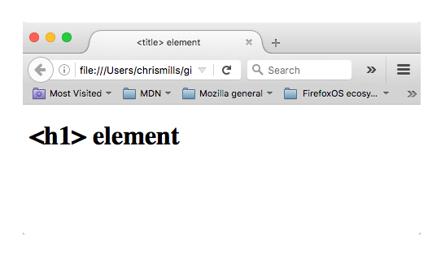

# 1 HTML

## 1.1 Getting started with HTML

&emsp;&emsp;HTML (HyperText Markup Language) is the code that is used to structure a web page and its content.

```html
<!doctype html>
<html lang="en-US">
    <head>
        <meta charset="utf-8" />
        <title>My test page</title>
    </head>
    <body>
        <p>This is my page</p>
    </body>
</html>
```

## 1.2 What's in the head?

&emsp;&emsp;The HTML head is the contents of the `<head>` element. Unlike the contents of the `<body>` element (which are displayed on the page when loaded in a browser), the head's content is not displayed on the page.

### 1.2.1 Adding a title

```html
<!doctype html>
<html lang="en-US">
    <head>
        <meta charset="utf-8" />
        <title> &lt;title&gt; element </title>
    </head>
    <body>
        <h1> &lt;h1&gt; element </h1>
    </body>
</html>
```



### 1.2.2 Metadata: the `<meta>` element

&emsp;&emsp;Metadata is data that describes data, and HTML has an "official" way of adding metadata to a document — the `<meta>` element. 

#### Specifying the document's charcter encoding

## 1.3 HTML text fundamentals

### 1.3.1 Headings and paragraphs

In HTML, each paragraph has to be wrapped in a `<p>` element, like so:

```html
<p>I am a paragraph, oh yes I am.</p>
```

Each heading has to be wrapped in a heading element:

```html
<h1>I am the title of the story.</h1>
```

There are six heading elements: h1, h2, h3, h4, h5, and h6. 

> Each element represents a different level of content in the document:  
> &emsp;&emsp;`<h1>` represents the main heading, `<h2>` represents subheadings, `<h3>` represents sub-subheadings, and so on.

### 1.3.2 Lists

#### Unordered

&emsp;&emsp;Unordered lists are used to mark up lists of items for which the order of the items doesn't matter.

&emsp;&emsp;For example, there is a shopping list:

```html
milk
eggs
bread
hummus
```

&emsp;&emsp;Every unordered list starts off with a `<ul>` element—this wraps around all the list items:

```html
<ul>
    milk
    eggs
    bread
    hummus
</ul>
```

&emsp;&emsp;The last step is to wrap each list item in a `<li>` (list item) element:

```html
<ul>
    <li>milk</li>
    <li>eggs</li>
    <li>bread</li>
    <li>hummus</li>
</ul>
```


#### Ordered

### 1.3.3 Emphasis and importance

#### Emphasis

&emsp;&emsp;In written language we tend to stress words by putting them in italics. 


#### Strong importance

# 2 CSS

# 3 JavaScript


