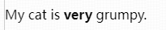
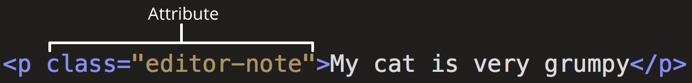
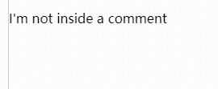
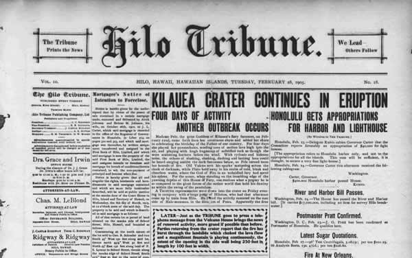

# 1 Getting strarted with HTML

## 1.1 What is HTML?

&emsp;&emsp;HTML (HyperText Markup Language) is the code that is used to structure a web page and its content.

## 1.2 Anatomy of an HTML element


### 1.2.1 Nesting elements

&emsp;&emsp;Elements can be placed within other elements. This is called **nesting**.

&emsp;&emsp;If we wanted to state that our cat is **very** grumpy, we could wrap the word "very" in a `<strong>` element, which means that the word is to have strong(er) text formatting:

```html
<p>My cat is <strong>very</strong> grumpy.</p>
```



### 1.2.2 Void elements

&emsp;&emsp;Not all elements follow the pattern of **an opening tag, content, and a closing tag**. Some elements consist of a single tag, which is typically used to insert/embed something in the document. 

&emsp;&emsp;Such elements are called **void elements**:

```html
<br/>
<input type="text"/>
```

## 1.3 Attributes

&emsp;&emsp;Elements can also have attributes. Attributes look like this:



## 1.4 Anatomy of an HTML document

```html
<!doctype html>
<html lang="en-US">
    <head>
        <meta charset="utf-8" />
        <title>My test page</title>
    </head>
    <body>
        <p>This is my page</p>
    </body>
</html>
```

Here we have:

* `<!doctype html>`: The doctype. (HTML5)
* `<html></html>`: This element wraps all the content on the page, which is sometimes known as the root element.
* `<head></head>`: This includes keywords and a page description that would appear in search results, CSS to style content, character set declarations, and more. 

## 1.5 Character references: including special characters in HTML

| Literal character | Character reference equivalent |
|:-----------------:|:------------------------------:|
| `<`	            | `&lt;`                         |
| `>`               | `&gt;`                         |
| `"`               | `&quot;`                       |
| `'`               | `&apos;`                       |
| `&`               | `&amp;`                        |

## 1.6 HTML comments

&emsp;&emsp;To write an HTML comment, wrap it in the special markers `<!--` and `-->`. For example:

```html
<p>I'm not inside a comment</p>

<!-- <p>I am!</p> -->
```



# 2 HTML head: Metadata in HTML

## 2.1 What is the head?

&emsp;&emsp;The head of an HTML document is the part that **is not displayed** in the web browser when the page is loaded.

```html
<!doctype html>
<html lang="en-US">
    <head>
        <meta charset="utf-8" />
        <title>My test page</title>
    </head>
    <body>
        <p>This is my page.</p>
    </body>
</html>
```

&emsp;&emsp;It contains information such as the page `<title>`, links to CSS (if we choose to style our HTML content with CSS), links to custom favicons, and other metadata (data about the HTML, such as the author, and important keywords that describe the document). 

## 2.2 Adding a title

&emsp;&emsp;We've already seen the `<title>` element in action — this can be used to add a title to the document.

## 2.3 Metadata: the `<meta>` element

&emsp;&emsp;Metadata is the data that describes data, and HTML has an "official" way of adding metadata to a document — the `<meta>` element. 

> Of course, the other stuff we are talking about in this section (2 HTML Head: Metadata in HTML) could also be thought of as metadata too.

### 2.3.1 Specifying our document's character encoding

&emsp;&emsp;In the example we saw above, this line was included:

```html
<meta charset="utf-8" />
```

&emsp;&emsp;This element specifies the document's character encoding — the character set that the document is permitted to use.

> utf-8 is a universal character set that includes pretty much any character from any human language. 

### 2.3.2 Adding an author and description


## 2.4 Adding custom icons


# 3 HTML text fundamentals

&emsp;&emsp;One of HTML's main jobs is to give text structure so that a browser can display an HTML document the way its developer intends.

## 3.1 The basics: headings and paragraphs

Most structured text consists of headings and paragraphs, such as the newspaper bellow:



Structured content makes the reading experience easier and more enjoyable.

In HTML, each paragraph has to be wrapped in a `<p>` element, like so:

```html
<p>I am a paragraph, oh yes I am.</p>
```

Each heading has to be wrapped in a heading element:

```html
<h1>I am the title of the story.</h1>
```

# 4 Creating hyperlinks

# 5 

```html

```
