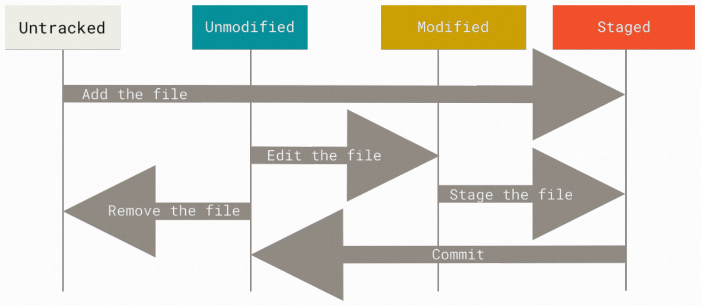

# 1 Induction to Git

# 2 Git basics

## 2.1 Getting a Git repository

### 2.1.1 Initializing a repository in an existing directory

```bash
cd /home/user/my_project

git init  # this creates a new subdirectory named ".git" that contains all of the necessary repository files — a Git repository skeleton.

echo "# repository_name" > README.md
git add *

git commit -m "Initial project version" # this commits the changes to the local repository
```

### 2.1.2 Cloning an existing repository

```bash
git clone https://github.com/libgit2/libgit2
```

## 2.2 Recording Changes to the Repository

&emsp;&emsp;Each file in the working directory can be in one of two states: **tracked** or **untracked**. 

* Tracked files are files that were in the last snapshot; they can be unmodified, modified, or staged. *In short, tracked files are files that Git knows about*. 
* Untracked files are everything else — any files in the working directory that were not in the last snapshot and are not in the staging area



#### Checking the status of our files

```bash
git status
```

#### 

## 2.3 Viewing the commit history

```bash
git log
```


```bash
git reset --soft HEAD~1  # undo the nearest commit and keep the modification
git reset --hard HEAD~1  # undo the commit and give up the modification
```


