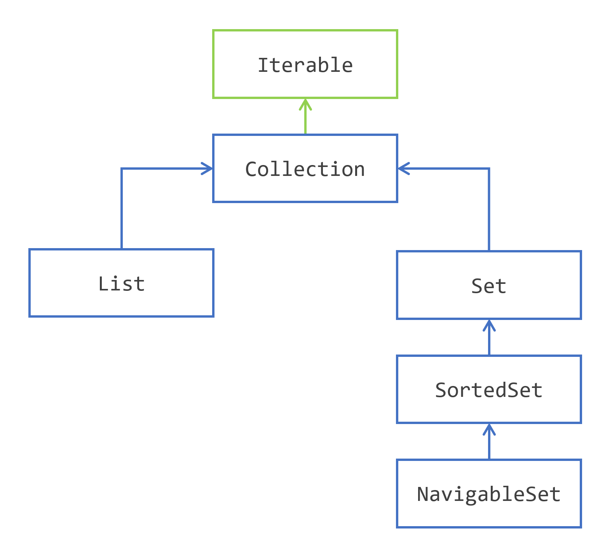

# 1 Running the first Java application

# 2 Java language basics

## 2.1 Creating variables and naming them

### 2.1.1 Variables

The Java programming language defines the following kinds of variables:

* Instance Variables (Non-Static Fields)
* Class Variables (Static Fields)
* Local Variables
* Parameters

### 2.1.2 Naming variables

The rules and conventions for naming variables can be summarized as follows:

* Variable names are case-sensitive.

### 2.1.3 Creating Primitive Type Variables

#### Pirmitive Types

| | |
|:---:|:-----|
| `byte` | |
|     | |
|     | |
|     | |
|     | |
|     | |
|     | |
|     | |

#### Initializing a Variable with a Default Value

## 2.2 Creating arrays

# 3 Classes and objects

## 3.1 

# 4 

# 15 The collections framework

&emsp;&emsp;The Collections Framework is an implementation of the concepts on *how to store, organize, and access data in memory* that were developed long before the invention of Java.

&emsp;&emsp;The Collections Framework was first introduced in Java SE 2, in 1998 and was rewritten twice since then:

* in Java SE 5 when generics were added;
* in Java 8 when lambda expressions were introduced, along with default methods in interfaces.

These two are the most important updates of the Collections Framework that have been made so far. But in fact, almost every version of the JDK has its set of changes to the Collections Framework.

## 15.1 the Collection interface hierarchy

&emsp;&emsp;The Collections Framework is divided in several hierarchies of interfaces and classes.

## 15.2 Methods that handle individual elements

&emsp;&emsp;`add(element)`: adds an element in the collection. This method returns a `boolean` in case the operation failed. 

&emsp;&emsp;`remove(element)`: removes the given element from the collection. This method also returns a boolean, because the operation may fail, too. 

