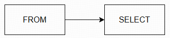

# 1 Introduction to MySQL

# 2 CRUD (create, read, update, delete)

## 2.1 Querying data

&emsp;&emsp;The `SELECT` statement is used to select data from one or more tables.

To write a SELECT statement in MySQL, this is the syntax:

```sql
SELECT select_list
FROM table_name;
```

In this syntax:

* First, specify one or more columns after the `SELECT` keyword (If the "select_list" has multiple columns, each column must be separated by a comma `,`);
* Second, specify the table from which to retrieve data after the `FROM` keyword.

&emsp;&emsp;When executing the `SELECT` statement, MySQL evaluates the `FROM` clause before the `SELECT` clause:



### 2.1.1 ORDER BY

&emsp;&emsp;To sort the rows in the result set, add the `ORDER BY` clause to the `SELECT` statement.

The following illustrates the syntax of the `ORDER BY` clause:

```sql
SELECT 
   select_list
FROM 
   table_name
ORDER BY 
   column1 [ASC|DESC], 
   column2 [ASC|DESC],
   ...;
```

The `ASC` stands for ascending and the `DESC` stands for descending. By default, the `ORDER BY` clause uses `ASC`.

When executing the `SELECT` statement with an `ORDER BY` clause, MySQL always evaluates the `ORDER BY` clause after the `FROM` and `SELECT` clauses:


### 2.1.2 WHERE


